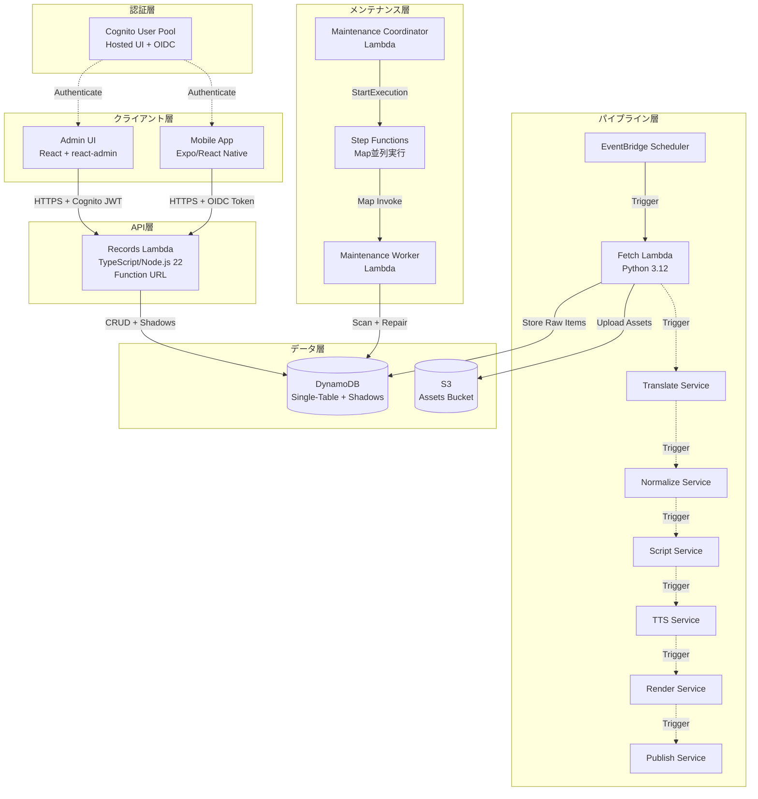
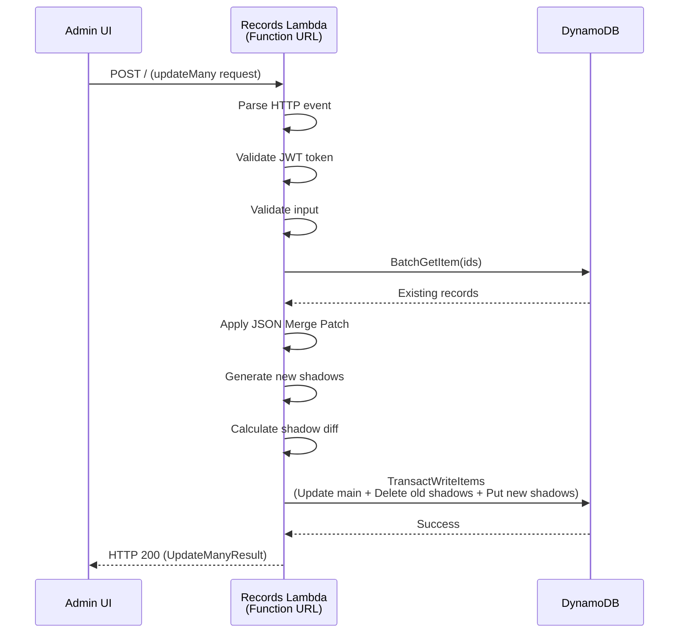
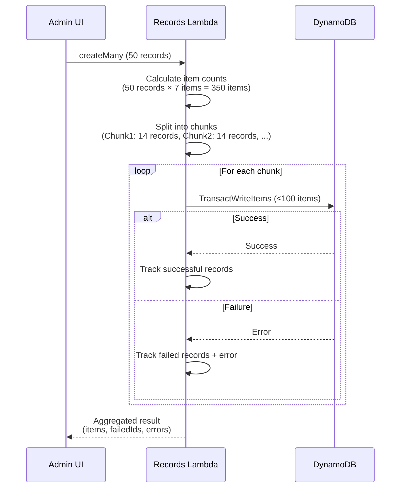
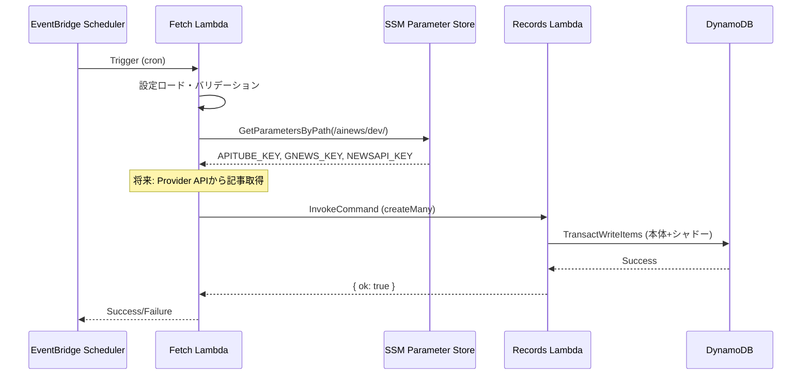
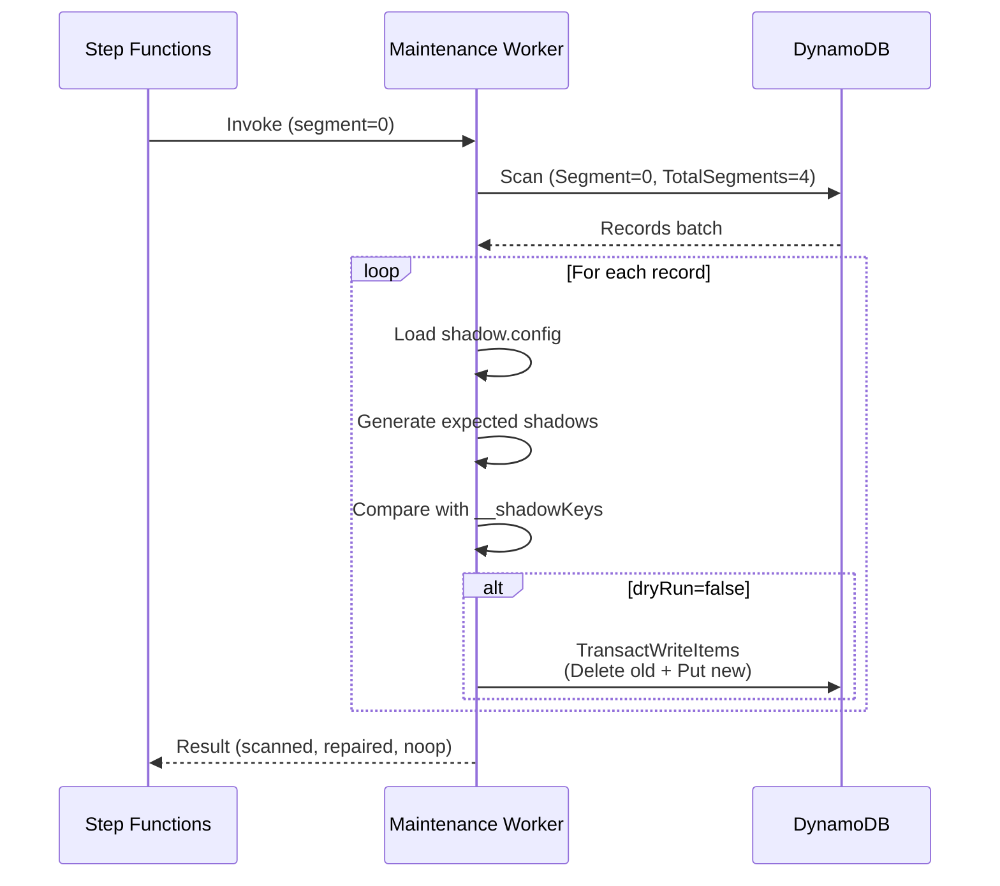
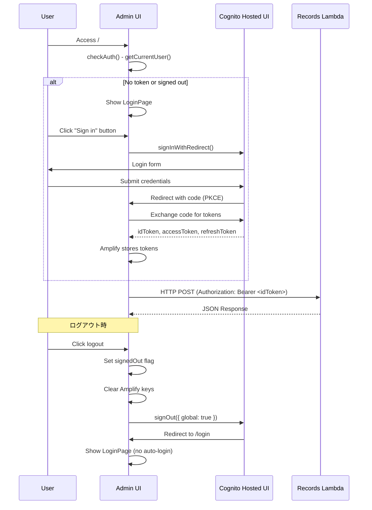
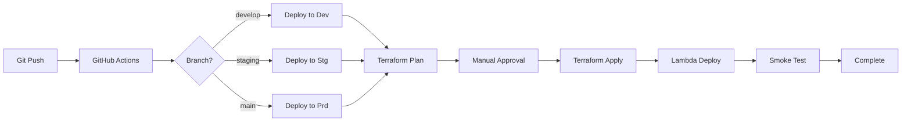

# 設計書

## 概要

AIニュース自動配信パイプラインは、マイクロサービスアーキテクチャに基づき、以下の主要コンポーネントで構成されます：

- **データ層**: DynamoDB Single-Table設計による動的シャドー管理
- **API層**: Lambda Function URL (HTTP API) + Records Lambda
- **認証層**: Cognito User Pool + Hosted UI / OIDC
- **クライアント層**: React管理画面 + Expo/React Nativeモバイルアプリ
- **パイプライン層**: 多段階処理（fetch → translate → normalize → script → TTS → render → publish）
- **メンテナンス層**: シャドー整合性修復（Coordinator + Worker + Step Functions）
- **インフラ層**: Terraform IaC（multi-workspace対応）

本設計は、要件1〜12をすべて満たし、スケーラビリティ、保守性、セキュリティを重視します。

**コスト最適化**: AppSync を Lambda Function URL に置き換えることで、未使用時のコストを完全にゼロにします（ストレージ費用を除く）。

### 設計の強み

本システムは、DynamoDBの特性を活かしながらreact-adminの期待する動作を実現する、独自の設計アプローチを採用しています。

#### 1. Single-Table設計 + 動的シャドーレコード

**利点:**
- **GSI不要**: シャドーレコードによる柔軟なソート・検索（追加コストなし）
- **コスト最適化**: 未使用時は完全にゼロコスト（ストレージ費用のみ）
- **スキーマ柔軟性**: shadow.config.jsonでフィールドを動的に追加可能
- **パフォーマンス**: Query最適化により取得レコード数を最小化

**実装の工夫:**
- idフィールドは本体レコード（SK = id#{ULID}）として兼用し、冗長なシャドーを削減
- ソートフィールドと一致するフィルター条件を自動検出してKeyConditionExpressionに含める

#### 2. react-admin完全準拠のAPI設計

**利点:**
- **10操作完全対応**: getList, getOne, getMany, getManyReference, create, update, updateMany, delete, deleteMany, createMany
- **nextTokenページネーション**: DynamoDBのネイティブなページネーションを活用
- **無限スクロール**: クライアント側フィルタリングによる件数変動に対応
- **後方互換性**: 既存の単純なフィルター形式も引き続きサポート

**実装の工夫:**
- RPC スタイルの単一エンドポイント（POST /）でシンプルな実装
- Lambda Function URL（AppSync不要）でコスト削減

#### 3. 高度なフィルター検索機能

**利点:**
- **7種類の演算子**: eq, lt, lte, gt, gte, starts, ends
- **4種類の型**: string, number, date, boolean
- **拡張フィールド構文**: `フィールド名:オペレータ:型` で直感的な指定
- **Query最適化**: ソートフィールドと一致する条件を自動検出して最適化
- **DynamoDB制限の回避**: メモリ内フィルタリングでends演算子などをサポート

**実装の工夫:**
- 2段階フィルタリング（DynamoDB Query + メモリ内フィルタリング）
- 重複除去処理（同じレコードに対する複数のシャドーレコード対応）
- 型安全なTypeScript実装

#### 4. セキュリティとコスト最適化

**利点:**
- **最小権限の原則**: Lambda関数ごとに独立したIAMロール
- **認証統合**: Cognito Hosted UI + JWT検証
- **コスト最適化**: Lambda Function URL、ARM64アーキテクチャ、環境変数でのシャドー設定
- **型安全性**: TypeScriptによる型定義とエラーハンドリング

**実装の工夫:**
- AWSマネージドポリシー（CloudWatch Logs、X-Ray）とカスタムポリシー（DynamoDB、SSM、Lambda Invoke）の使い分け
- shadow.config.jsonを環境変数として設定（SSM不要でコスト削減）

### AWSサービスマッピング

| 機能                 | AWSサービス                          | 用途                                   |
| -------------------- | ------------------------------------ | -------------------------------------- |
| HTTP API             | AWS Lambda Function URL              | クライアント向けAPI                    |
| 認証                 | Amazon Cognito                       | ユーザー認証・認可                     |
| データベース         | Amazon DynamoDB                      | Single-Table設計                       |
| オブジェクトストレージ | Amazon S3                            | 音声・動画・画像保存                   |
| CDN                  | Amazon CloudFront                    | 静的アセット配信                       |
| コンピュート         | AWS Lambda (Node.js 22 ARM64)        | ビジネスロジック実行                   |
| オーケストレーション | AWS Step Functions                   | パイプライン・メンテナンス制御         |
| スケジューラ         | Amazon EventBridge Scheduler         | 定期実行トリガー                       |
| 翻訳                 | Amazon Translate                     | 多言語翻訳                             |
| 音声合成             | Amazon Polly                         | テキスト→音声変換                      |
| 動画処理             | AWS Elemental MediaConvert           | 音声→動画変換                          |
| パラメータ管理       | AWS Systems Manager Parameter Store  | API Key等の機密情報管理                |
| ログ                 | Amazon CloudWatch Logs               | Lambda実行ログ                         |
| メトリクス           | Amazon CloudWatch Metrics            | パフォーマンス監視                     |
| トレーシング         | AWS X-Ray                            | 分散トレーシング                       |
| IaC                  | Terraform                            | インフラストラクチャ管理               |
| CI/CD                | GitHub Actions + OIDC                | 自動デプロイ                           |
| ホスティング         | AWS Amplify Hosting                  | Admin UI静的ホスティング               |

## アーキテクチャ

### システム構成図



### レイヤー責務

| レイヤー         | 責務                                                                 |
| ---------------- | -------------------------------------------------------------------- |
| クライアント層   | ユーザーインターフェース、認証フロー、HTTP API呼び出し               |
| 認証層           | ユーザー認証・認可、JWT/IDトークン発行                               |
| API層            | HTTP リクエスト処理、入力検証、CRUD操作実行                          |
| パイプライン層   | ニュース取得、多段階処理、中間成果物管理                             |
| メンテナンス層   | シャドー整合性検証・修復、並列処理オーケストレーション               |
| データ層         | レコード永続化、シャドー管理、アセット保存                           |
| インフラ層       | リソースプロビジョニング、環境管理、IAM権限設定                      |

### プロジェクト構造

```
ainews-pipeline/
├── .github/
│   └── workflows/
│       ├── ci.yml                    # Lint + Test
│       └── cd-dev.yml                # Dev環境デプロイ
│
├── packages/                         # 共通ライブラリ（pnpm workspace）
│   ├── core/                         # コアライブラリ
│   │   ├── src/
│   │   │   ├── dynamodb/             # DynamoDB操作
│   │   │   ├── s3/                   # S3操作
│   │   │   ├── ssm/                  # SSM操作
│   │   │   ├── ulid/                 # ULID生成
│   │   │   ├── logger/               # 構造化ログ
│   │   │   └── errors/               # エラー定義
│   │   ├── package.json
│   │   └── tsconfig.json
│   │
│   ├── shadows/                      # シャドー管理ライブラリ
│   │   ├── src/
│   │   │   ├── generator.ts          # シャドーSK生成
│   │   │   ├── differ.ts             # 差分計算
│   │   │   ├── config.ts             # 設定読み込み（ファイル/SSM両対応）
│   │   │   └── types.ts              # 型定義
│   │   ├── package.json
│   │   └── tsconfig.json
│   │
│   └── api-types/                    # HTTP API型定義（共通）
│       ├── src/
│       │   └── index.ts              # TypeScript型定義
│       ├── package.json
│       └── tsconfig.json
│
├── functions/                        # Lambda関数
│   ├── records/                      # Records Lambda（CRUD）
│   │   ├── src/
│   │   │   ├── handler.ts            # エントリーポイント（HTTP対応）
│   │   │   ├── operations/
│   │   │   │   ├── getMany.ts
│   │   │   │   ├── getList.ts
│   │   │   │   ├── createMany.ts
│   │   │   │   ├── updateMany.ts
│   │   │   │   └── deleteMany.ts
│   │   │   └── utils/
│   │   │       ├── validation.ts
│   │   │       ├── pagination.ts
│   │   │       ├── filter.ts
│   │   │       └── auth.ts           # Cognito JWT検証
│   │   ├── __tests__/
│   │   ├── package.json
│   │   ├── tsconfig.json
│   │   └── esbuild.config.js
│   │
│   ├── pipeline/                     # パイプライン関数群
│   │   ├── fetch/                    # ニュース取得
│   │   │   ├── src/
│   │   │   │   ├── handler.ts
│   │   │   │   └── providers/
│   │   │   │       ├── apitube.ts
│   │   │   │       ├── gnews.ts
│   │   │   │       └── newsapi.ts
│   │   │   ├── __tests__/
│   │   │   └── package.json
│   │   │
│   │   ├── translate/                # 翻訳（AWS Translate）
│   │   │   ├── src/
│   │   │   │   └── handler.ts
│   │   │   └── package.json
│   │   │
│   │   ├── normalize/                # テキスト正規化
│   │   │   ├── src/
│   │   │   │   └── handler.ts
│   │   │   └── package.json
│   │   │
│   │   ├── script/                   # 音声スクリプト生成
│   │   │   ├── src/
│   │   │   │   └── handler.ts
│   │   │   └── package.json
│   │   │
│   │   ├── tts/                      # 音声合成（Amazon Polly）
│   │   │   ├── src/
│   │   │   │   └── handler.ts
│   │   │   └── package.json
│   │   │
│   │   ├── render/                   # 動画レンダリング（MediaConvert）
│   │   │   ├── src/
│   │   │   │   └── handler.ts
│   │   │   └── package.json
│   │   │
│   │   └── publish/                  # 配信（S3 + CloudFront）
│   │       ├── src/
│   │       │   └── handler.ts
│   │       └── package.json
│   │
│   └── maintenance/                  # メンテナンス関数群
│       ├── coordinator/
│       │   ├── src/
│       │   │   └── handler.ts
│       │   └── package.json
│       │
│       └── worker/
│           ├── src/
│           │   └── handler.ts
│           └── package.json
│
├── apps/                             # クライアントアプリ
│   ├── admin/                        # React管理画面
│   │   ├── src/
│   │   │   ├── main.tsx
│   │   │   ├── App.tsx
│   │   │   ├── auth/
│   │   │   ├── dataProvider/
│   │   │   ├── api/
│   │   │   ├── resources/
│   │   │   └── components/
│   │   ├── public/
│   │   ├── package.json
│   │   ├── vite.config.ts
│   │   └── .env.example
│   │
│   └── mobile/                       # Expo/React Native
│       ├── src/
│       │   ├── App.tsx
│       │   ├── screens/
│       │   └── api/
│       ├── package.json
│       └── app.json
│
├── infra/                            # Terraform IaC
│   ├── backend.tf
│   ├── providers.tf
│   ├── variables.tf
│   ├── terraform.tfvars
│   ├── envs/
│   │   ├── dev.tfvars
│   │   ├── stg.tfvars
│   │   └── prd.tfvars
│   ├── main.tf
│   └── modules/
│       ├── core/                     # コアインフラ
│       │   ├── dynamodb/
│       │   ├── s3/
│       │   ├── cloudfront/
│       │   └── cognito/
│       ├── api/                      # API層
│       │   ├── lambda-records/
│       │   └── lambda-function-url/
│       ├── pipeline/                 # パイプライン層
│       │   ├── step-functions/
│       │   ├── lambda-fetch/
│       │   ├── lambda-translate/
│       │   ├── lambda-normalize/
│       │   ├── lambda-script/
│       │   ├── lambda-tts/
│       │   ├── lambda-render/
│       │   ├── lambda-publish/
│       │   └── eventbridge/
│       ├── maintenance/              # メンテナンス層
│       │   ├── step-functions/
│       │   ├── lambda-coordinator/
│       │   └── lambda-worker/
│       └── monitoring/               # 監視層
│           ├── cloudwatch/
│           └── xray/
│
├── config/                           # 設定ファイル
│   ├── shadow.config.json            # シャドー設定
│   └── pipeline.config.json          # パイプライン設定
│
├── docs/                             # ドキュメント
│   ├── architecture.md
│   ├── api.md
│   └── deployment.md
│
├── .gitignore
├── .prettierrc
├── eslint.config.js
├── pnpm-workspace.yaml
├── package.json
├── tsconfig.base.json
├── vitest.config.ts
└── README.md
```

## コンポーネントとインターフェース

### 1. DynamoDB Single-Table設計

#### テーブル構造

**テーブル名**: `ainews-{env}-records`

| 属性 | 型     | 説明                                           |
| ---- | ------ | ---------------------------------------------- |
| PK   | String | リソース名（例: `articles`, `tasks`）          |
| SK   | String | レコードID（ULID）またはシャドーキー           |
| data | Map    | 実データ + 内部メタ情報（`__shadowKeys`）      |
| ttl  | Number | TTL（オプション、Unix timestamp）              |

#### シャドーレコード形式

**本体レコード**:
- `id#<ULID>`: 本体レコード（SK = id値、idソート用として兼務）

**必須シャドー（ハードコード）**:
- `name#<escaped_value>#id#<ULID>`: 名前ソート用
- `createdAt#<ISO8601>#id#<ULID>`: 作成日時ソート用
- `updatedAt#<ISO8601>#id#<ULID>`: 更新日時ソート用

**オプションシャドー（JSON設定）**:
- `priority#<20digit_number>#id#<ULID>`: 優先度ソート用
- `category#<escaped_string>#id#<ULID>`: カテゴリソート用
- `dueDate#<ISO8601>#id#<ULID>`: 期限日ソート用

**設計上の最適化**:
- `id`フィールドは本体レコードのSK（`id#<ULID>`）として既に存在するため、別途シャドーレコードを作成しない
- `sort.field='id'`の場合、本体レコードを直接クエリすることで、冗長なシャドーレコードを削減

#### エスケープルール

| 型       | フォーマット                                     | 例                                   |
| -------- | ------------------------------------------------ | ------------------------------------ |
| string   | `#` → `##`, スペース → `#`                       | `"Tech News"` → `"Tech#News"`        |
| number   | 20桁ゼロ埋め                                     | `123` → `"00000000000000000123"`     |
| datetime | UTC ISO 8601固定長                               | `"2025-11-12T10:00:00.000Z"`         |


#### シャドー設定（shadow.config.json）

```json
{
  "$schemaVersion": "2.0",
  "resources": {
    "articles": {
      "sortDefaults": { "field": "updatedAt", "order": "DESC" },
      "shadows": {
        "priority": { "type": "number" },
        "category": { "type": "string" },
        "status": { "type": "string" }
      }
    },
    "tasks": {
      "sortDefaults": { "field": "createdAt", "order": "DESC" },
      "shadows": {
        "status": { "type": "string" },
        "dueDate": { "type": "datetime" }
      }
    }
  }
}
```

#### データ例

**本体レコード**:
```json
{
  "PK": "articles",
  "SK": "id#01HZXY123456789ABCDEFGHIJK",
  "data": {
    "id": "01HZXY123456789ABCDEFGHIJK",
    "name": "AI News Today",
    "category": "tech",
    "priority": 10,
    "status": "published",
    "createdAt": "2025-11-12T10:00:00.000Z",
    "updatedAt": "2025-11-12T12:00:00.000Z",
    "__shadowKeys": [
      "name#AI#News#Today#id#01HZXY123456789ABCDEFGHIJK",
      "createdAt#2025-11-12T10:00:00.000Z#id#01HZXY123456789ABCDEFGHIJK",
      "updatedAt#2025-11-12T12:00:00.000Z#id#01HZXY123456789ABCDEFGHIJK",
      "priority#00000000000000000010#id#01HZXY123456789ABCDEFGHIJK",
      "category#tech#id#01HZXY123456789ABCDEFGHIJK",
      "status#published#id#01HZXY123456789ABCDEFGHIJK"
    ]
  }
}
```


**シャドーレコード（例: updatedAtソート用）**:
```json
{
  "PK": "articles",
  "SK": "updatedAt#2025-11-12T12:00:00.000Z#id#01HZXY123456789ABCDEFGHIJK",
  "data": {}
}
```

### 2. Records Lambda HTTP API

#### API エンドポイント

**Lambda Function URL**: `https://<function-url-id>.lambda-url.<region>.on.aws/`

#### API 設計スタイル

**MongoDB 風 API**: 単一エンドポイント `POST /` で全操作を処理

- MongoDB 風の operation 名を使用（`find`, `insertOne`, `updateOne`, `deleteOne` など）
- react-admin 色を排除し、汎用的な API 設計
- 実装がシンプルで、他のクライアント（モバイルアプリ、スクリプトなど）でも使いやすい

#### リクエスト形式

すべてのリクエストは `POST` メソッドで、JSON ボディを送信します。

```typescript
// 共通リクエスト形式（MongoDB 風）
interface MongoDBStyleRequest {
  operation: string;    // MongoDB 風の operation 名
  database: string;     // データベース名（例: "ainews"）
  collection: string;   // コレクション名（例: "articles", "tasks"）
  params: any;          // operation ごとのパラメータ
}

// API操作タイプ（MongoDB 風）
type ApiOperation =
  // Query operations
  | 'find'                // リスト取得（フィルター・ソート・ページネーション）
  | 'findOne'             // 単一レコード取得
  | 'findMany'            // 複数レコード取得（ID指定）
  | 'findManyReference'   // 参照レコード取得（外部キー）
  // Mutation operations
  | 'insertOne'           // 単一レコード作成
  | 'updateOne'           // 単一レコード更新
  | 'updateMany'          // 複数レコード一括更新
  | 'deleteOne'           // 単一レコード削除
  | 'deleteMany'          // 複数レコード一括削除
  | 'insertMany';         // 複数レコード一括作成

// find リクエスト（リスト取得）
POST /
Content-Type: application/json
Authorization: Bearer <cognito-jwt-token>

{
  "operation": "find",
  "database": "ainews",
  "collection": "articles",
  "params": {
    "filter": { "category": "tech", "status": "published" },
    "options": {
      "sort": { "updatedAt": "desc" },
      "limit": 50
    }
  }
}

// findOne リクエスト（単一レコード取得）
POST /
{
  "operation": "findOne",
  "database": "ainews",
  "collection": "articles",
  "params": {
    "filter": { "id": "01HZXY123456789ABCDEFGHIJK" }
  }
}

// findMany リクエスト（複数レコード取得）
POST /
{
  "operation": "findMany",
  "database": "ainews",
  "collection": "articles",
  "params": {
    "filter": { "id": { "in": ["01HZXY123", "01HZXY456"] } }
  }
}

// findManyReference リクエスト（参照レコード取得）
POST /
{
  "operation": "findManyReference",
  "database": "ainews",
  "collection": "articles",
  "params": {
    "target": "userId",
    "id": "01HZXY123",
    "filter": { "status": "published" },
    "options": {
      "sort": { "createdAt": "desc" },
      "limit": 20
    }
  }
}

// insertOne リクエスト（単一レコード作成）
POST /
{
  "operation": "insertOne",
  "database": "ainews",
  "collection": "articles",
  "params": {
    "document": { "name": "New Article", "category": "tech", "status": "draft" }
  }
}

// insertOne リクエスト（ID指定あり）
// 注: idが指定されている場合はそれを優先し、ULIDの自動生成は行わない
POST /
{
  "operation": "insertOne",
  "database": "ainews",
  "collection": "articles",
  "params": {
    "document": { "id": "01HZXY123456789ABCDEFGHIJK", "name": "Imported Article", "category": "tech" }
  }
}

// insertMany リクエスト（複数レコード一括作成）
POST /
{
  "operation": "insertMany",
  "database": "ainews",
  "collection": "articles",
  "params": {
    "documents": [
      { "name": "Article 1", "category": "tech" },
      { "name": "Article 2", "category": "business" },
      { "id": "01HZXY999999999999999999", "name": "Article 3 with ID", "category": "tech" }
    ]
  }
}

// updateOne リクエスト（単一レコード更新）
POST /
{
  "operation": "updateOne",
  "database": "ainews",
  "collection": "articles",
  "params": {
    "filter": { "id": "01HZXY123" },
    "update": { "set": { "status": "published", "priority": 10 } }
  }
}

// updateMany リクエスト（複数レコード一括更新）
POST /
{
  "op": "updateMany",
  "resource": "articles",
  "params": {
    "ids": ["01HZXY123", "01HZXY456"],
    "data": { "status": "published" }
  }
}

// delete リクエスト
POST /
{
  "op": "delete",
  "resource": "articles",
  "params": {
    "id": "01HZXY123"
  }
}

// deleteMany リクエスト
POST /
{
  "op": "deleteMany",
  "resource": "articles",
  "params": {
    "ids": ["01HZXY123", "01HZXY456", "01HZXY789"]
  }
}
```

#### レスポンス形式

```typescript
// 成功レスポンス
interface ApiSuccessResponse<T> {
  success: true;
  data: T;
}

// エラーレスポンス
interface ApiErrorResponse {
  success: false;
  error: {
    code: string;
    message: string;
    statusCode: number;
    details?: unknown;
  };
}

// getList レスポンス（成功）
{
  "success": true,
  "data": {
    "items": [
      { "id": "01HZXY123", "name": "Article 1", "category": "tech" },
      { "id": "01HZXY456", "name": "Article 2", "category": "tech" }
    ],
    "pageInfo": {
      "hasNextPage": true,
      "hasPreviousPage": false
    },
    "nextToken": "eyJQSyI6ImFydGljbGVzIiwiU0siOiJ1cGRhdGVkQXQjMjAyNS0xMS0xMlQxMDowMDowMC4wMDBaI2lkIzAxSFpYWTEyMyJ9",
    "total": 150  // オプション
  }
}

// getOne レスポンス（成功）
{
  "success": true,
  "data": {
    "id": "01HZXY123",
    "name": "Article 1",
    "category": "tech",
    "status": "published",
    "createdAt": "2025-11-12T10:00:00.000Z",
    "updatedAt": "2025-11-12T12:00:00.000Z"
  }
}

// getMany レスポンス（成功）
{
  "success": true,
  "data": [
    { "id": "01HZXY123", "name": "Article 1", "category": "tech" },
    { "id": "01HZXY456", "name": "Article 2", "category": "business" }
  ]
}

// getManyReference レスポンス（成功）
{
  "success": true,
  "data": {
    "items": [
      { "id": "01HZXY789", "name": "Article 3", "userId": "01HZXY123" }
    ],
    "pageInfo": {
      "hasNextPage": false,
      "hasPreviousPage": false
    },
    "nextToken": null,
    "total": 1
  }
}

// create レスポンス（成功）
{
  "success": true,
  "data": {
    "id": "01HZXY123",
    "name": "New Article",
    "category": "tech",
    "status": "draft",
    "createdAt": "2025-11-12T10:00:00.000Z",
    "updatedAt": "2025-11-12T10:00:00.000Z"
  }
}

// createMany レスポンス（成功）
{
  "success": true,
  "data": {
    "items": [
      { "id": "01HZXY123", "name": "Article 1", "category": "tech" }
    ],
    "failedIds": ["temp-id-2"],
    "errors": [
      {
        "id": "temp-id-2",
        "code": "VALIDATION_ERROR",
        "message": "Missing required field: name"
      }
    ]
  }
}

// update レスポンス（成功）
{
  "success": true,
  "data": {
    "id": "01HZXY123",
    "name": "Article 1",
    "status": "published",
    "priority": 10,
    "updatedAt": "2025-11-12T12:00:00.000Z"
  }
}

// updateMany レスポンス（成功）
{
  "success": true,
  "data": {
    "items": [
      { "id": "01HZXY123", "name": "Article 1", "status": "published" },
      { "id": "01HZXY456", "name": "Article 2", "status": "published" }
    ],
    "failedIds": [],
    "errors": []
  }
}

// delete レスポンス（成功）
{
  "success": true,
  "data": {
    "id": "01HZXY123"
  }
}

// deleteMany レスポンス（成功）
{
  "success": true,
  "data": {
    "deletedIds": ["01HZXY123", "01HZXY456"],
    "failedIds": [],
    "errors": []
  }
}

// エラーレスポンス
{
  "success": false,
  "error": {
    "code": "INVALID_FILTER",
    "message": "Invalid sort field: invalidField",
    "statusCode": 400,
    "details": { "field": "invalidField" }
  }
}
```

#### CORS 設定

Lambda Function URL で CORS を有効化：

```hcl
resource "aws_lambda_function_url" "records" {
  cors {
    allow_origins     = ["*"]  # 本番環境では特定のドメインに制限
    allow_methods     = ["POST"]
    allow_headers     = ["content-type", "authorization", "x-amz-date", "x-api-key", "x-amz-security-token"]
    expose_headers    = ["content-type", "x-amzn-requestid"]
    allow_credentials = false
    max_age           = 86400  # 24時間
  }
}
```

**重要**: Lambda Function URLのCORS設定を使用するため、Lambda関数のハンドラーではCORSヘッダーを設定しません。両方で設定するとヘッダーが重複してCORSエラーが発生します。

#### リソースベースポリシー（aws_lambda_permission）

Lambda Function URLを使用する場合、**必ず**リソースベースポリシーを設定する必要があります。これを設定しないと、クライアントからのHTTPリクエストが403 Forbiddenエラーになります。

```hcl
# infra/modules/api/lambda-records/main.tf

# Lambda Function URL
resource "aws_lambda_function_url" "records" {
  function_name      = aws_lambda_function.records.function_name
  authorization_type = "NONE"  # 認証はCognito JWTで実装

  cors {
    allow_origins     = ["*"]  # 本番環境では特定のドメインに制限
    allow_methods     = ["POST"]
    allow_headers     = ["content-type", "authorization", "x-amz-date", "x-api-key", "x-amz-security-token"]
    expose_headers    = ["content-type", "x-amzn-requestid"]
    allow_credentials = false
    max_age           = 86400  # 24時間
  }
}

# リソースベースポリシー（必須）
# Function URLからのInvokeを許可
resource "aws_lambda_permission" "allow_function_url" {
  statement_id           = "AllowFunctionURLInvoke"
  action                 = "lambda:InvokeFunctionUrl"
  function_name          = aws_lambda_function.records.function_name
  principal              = "*"
  function_url_auth_type = "NONE"
}
```

**重要なポイント:**
- `aws_lambda_permission`リソースは`aws_lambda_function_url`と**セットで必須**
- `action`は`lambda:InvokeFunctionUrl`を指定（通常の`lambda:InvokeFunction`ではない）
- `function_url_auth_type = "NONE"`を指定（認証はアプリケーション層で実装）
- このリソースがないと、Function URLへのアクセスが403エラーになる

**トラブルシューティング:**
- 403エラーが発生する場合、まず`aws_lambda_permission`が設定されているか確認
- AWS CLIで確認: `aws lambda get-policy --function-name ainews-dev-records`
- Terraform出力で確認: `terraform state show aws_lambda_permission.allow_function_url`


### 3. Records Lambda（TypeScript）

#### 構成

- **ランタイム**: Node.js 22 (ARM64)
- **バンドラー**: esbuild（完全バンドル、CJS出力）
- **エントリーポイント**: `functions/records/src/handler.ts`
- **出力**: `functions/records/dist/handler.cjs`
- **公開方法**: Lambda Function URL (HTTPS)
- **認証**: Cognito JWT トークン検証（クライアント側で Authorization ヘッダーに含める）

#### 主要モジュール

```
functions/records/src/
├── handler.ts              # Lambda エントリーポイント（HTTP対応）
├── config.ts               # シャドー設定取得（SSMキャッシュ付き）
├── operations/              # react-admin 完全準拠の10操作
│   ├── getList.ts          # Query + Filter + BatchGetItem実装
│   ├── getOne.ts           # GetItem実装
│   ├── getMany.ts          # BatchGetItem実装
│   ├── getManyReference.ts # Query + Filter実装（外部キー）
│   ├── create.ts           # PutItem + シャドー生成（ID指定時は優先、未指定時はULID生成）
│   ├── createMany.ts       # TransactWriteItems実装（各レコードでID指定可能）
│   ├── update.ts           # UpdateItem + シャドー更新
│   ├── updateMany.ts       # JSON Merge Patch + TransactWriteItems
│   ├── delete.ts           # DeleteItem + シャドー削除
│   └── deleteMany.ts       # TransactWriteItems実装
├── utils/
│   ├── dynamodb.ts         # DynamoDBクライアント
│   ├── errors.ts           # エラーコード定義
│   ├── validation.ts       # 入力検証
│   ├── filter.ts           # フィルター条件構築
│   ├── pagination.ts       # nextToken エンコード/デコード
│   └── auth.ts             # Cognito JWT検証（aws-jwt-verify使用）
└── types/
    └── index.ts            # TypeScript型定義
```

**注意:** `shadows/`ディレクトリは削除され、`@ainews/shadows`パッケージを使用します。`config.ts`はSSMキャッシュ最適化のためのラッパーモジュールです。

#### 認証・認可

Records Lambda は `aws-jwt-verify` を使用した完全な JWT 署名検証を実装しています。

**検証項目:**
- 署名検証（JWKS を使用した RSA 署名検証）
- 有効期限（exp）
- 発行時刻（iat）
- 発行者（iss）
- オーディエンス（aud、`COGNITO_CLIENT_ID` が指定されている場合）
- token_use（'id' トークンのみ許可）

**認証フロー:**
1. クライアント（Admin UI / Mobile App）が Cognito から JWT トークンを取得
2. クライアントが HTTP リクエストの `Authorization` ヘッダーに `Bearer <token>` を含める
3. Records Lambda が `aws-jwt-verify` でトークンを検証
4. 検証成功時、JWT ペイロード（`sub`, `email` など）をログに記録
5. 検証失敗時、HTTP 401 Unauthorized エラーを返す

**開発環境での認証無効化:**

開発環境では `DISABLE_AUTH=true` を設定することで認証をスキップできます。

**テナント境界（TODO）:**

現在、テナント境界の実装は未完了です。将来的には以下を実装予定：
- レコードに `userId` フィールドを追加
- Query / Scan 時に `userId = <JWT.sub>` をフィルタに強制適用
- 他のユーザーのレコードへのアクセスを防止

**getList 操作の詳細**:
- `filter`: 拡張フィールド構文（`フィールド名:オペレータ:型`）で検索条件を指定
- `sort`: ソート対象フィールドとソート順を指定（シャドーキーを使用）
- `pagination`: ページ番号、1ページあたりの件数、次ページトークンを指定
- フィルター処理は2段階で実行:
  1. **DynamoDB Query最適化**: ソートフィールドと一致するフィルター条件をKeyConditionExpressionに含める
  2. **メモリ内フィルタリング**: 取得した本体レコードに対してすべてのフィルター条件を適用
- シャドーレコード除外は常に適用される

**フィルター演算子:**
- `eq`: 等価（デフォルト）
- `lt`: 未満
- `lte`: 以下
- `gt`: より大きい
- `gte`: 以上
- `starts`: 前方一致
- `ends`: 後方一致

**フィルターフィールド構文の例:**
```typescript
// 基本的な等価比較（従来の形式も互換性維持）
filter: { "status": "published" }  // status = "published"

// 拡張構文
filter: {
  "name:starts": "AI",                          // name が "AI" で始まる
  "priority:gte:number": 5,                     // priority >= 5
  "createdAt:lt:date": "2025-11-12T00:00:00.000Z",  // createdAt < 指定日時
  "isPublished:eq:boolean": true,               // isPublished = true
  "category:eq": "tech",                        // category = "tech"
  "description:ends": "news"                    // description が "news" で終わる
}
```

**Query最適化の例:**
```typescript
// ケース1: ソートフィールドとフィルター条件が一致（最適化あり）
sort: { field: "priority", order: "DESC" }
filter: { "priority:gte:number": 5, "status": "published" }
// → DynamoDB Query: SK >= "priority#00000000000000000005#id#"
// → メモリフィルタ: status = "published"

// ケース2: ソートフィールドとフィルター条件が異なる（最適化なし）
sort: { field: "createdAt", order: "DESC" }
filter: { "priority:gte:number": 5, "status": "published" }
// → DynamoDB Query: SK begins_with "createdAt#"
// → メモリフィルタ: priority >= 5 AND status = "published"
```

**create / createMany 操作の詳細**:
- **ID生成ロジック**: 
  - リクエストデータに `id` フィールドが含まれている場合、その値を優先して使用
  - `id` フィールドが未指定の場合、ULID を自動生成
  - 用途: 外部システムからのデータインポート時に既存IDを保持可能
- **タイムスタンプ**: `createdAt` と `updatedAt` を現在時刻（ISO 8601形式）で自動設定
- **シャドー生成**: shadow.config.json に基づき、全ての必須・オプションシャドーレコードを生成
- **トランザクション**: メインレコードとシャドーレコードを PutItem（create）または TransactWriteItems（createMany）で一括保存


#### 処理フロー（updateMany例）



#### エラーハンドリング

| エラーコード     | 発生条件                                | HTTPステータス |
| ---------------- | --------------------------------------- | -------------- |
| CONFIG_ERROR     | 環境変数未設定、shadow.config読み込み失敗 | 500            |
| INVALID_FILTER   | sort.fieldが無効なシャドー名、またはfilter条件が不正 | 400            |
| INVALID_TOKEN    | nextTokenデコード失敗                   | 400            |
| ITEM_NOT_FOUND   | 指定IDのレコードが存在しない            | 404            |
| PARTIAL_FAILURE  | TransactWriteItemsの一部が失敗          | 207            |
| VERSION_CONFLICT | 楽観ロック競合                          | 409            |

#### バルク操作のチャンク分割設計

**実装状況**: ✅ **完了** - `createMany`、`updateMany`、`deleteMany` の3操作すべてでチャンク分割を実装済み

**背景**: DynamoDBのTransactWriteItemsは最大100アイテムまでしか処理できません。シャドーレコードを含むバルク操作では、この制限に容易に到達します。

**設計原則**:
1. **動的チャンクサイズ計算**: 各レコードのアイテム数（メイン + シャドー）を考慮
2. **部分成功サポート**: 1つのチャンクが失敗しても、他のチャンクは処理を継続
3. **詳細なエラー報告**: 成功・失敗したレコードを個別に追跡
4. **パフォーマンス最適化**: 可能な限り大きなチャンクサイズを使用
5. **タイムアウト対策**: Lambda実行時間制限（15分）を考慮した警告ログ出力

**チャンクサイズ計算アルゴリズム**:

```typescript
/**
 * バルク操作のチャンクサイズを計算する
 * 
 * @param records - 処理対象のレコード配列
 * @param getItemCount - 各レコードのアイテム数を計算する関数
 * @returns チャンク配列（各チャンクは100アイテム以下）
 */
function calculateChunks<T>(
  records: T[],
  getItemCount: (record: T) => number
): T[][] {
  const chunks: T[][] = [];
  let currentChunk: T[] = [];
  let currentItemCount = 0;

  for (const record of records) {
    const itemCount = getItemCount(record);
    
    // 単一レコードが100アイテムを超える場合はエラー
    if (itemCount > 100) {
      throw new Error(`Single record exceeds 100 items: ${itemCount}`);
    }
    
    // 現在のチャンクに追加すると100を超える場合、新しいチャンクを開始
    if (currentItemCount + itemCount > 100) {
      chunks.push(currentChunk);
      currentChunk = [record];
      currentItemCount = itemCount;
    } else {
      currentChunk.push(record);
      currentItemCount += itemCount;
    }
  }
  
  // 最後のチャンクを追加
  if (currentChunk.length > 0) {
    chunks.push(currentChunk);
  }
  
  return chunks;
}
```

**操作別のアイテム数計算**:

| 操作 | アイテム数計算式 | 例 |
| --- | --- | --- |
| createMany | 1（メイン） + シャドー数 | 1 + 6 = 7アイテム |
| updateMany | 1（メイン） + 削除シャドー数 + 追加シャドー数 | 1 + 3 + 4 = 8アイテム |
| deleteMany | 1（メイン） + シャドー数 | 1 + 6 = 7アイテム |

**処理フロー（createMany例）**:



**エラーハンドリング戦略**:

1. **チャンクレベルの失敗**: 1つのチャンクが失敗しても、他のチャンクは処理を継続
2. **レコードレベルの追跡**: 各レコードの成功・失敗を個別に記録
3. **詳細なエラー情報**: 失敗したレコードのID、エラーコード、エラーメッセージを返却
4. **ログ出力**: チャンク数、各チャンクのアイテム数、処理時間をCloudWatch Logsに記録

**パフォーマンス考慮事項**:

- **Lambda実行時間**: 最大15分の制限内で処理を完了
- **DynamoDB WCU**: 大量のバルク操作はWCUを消費するため、スロットリングに注意
- **メモリ使用量**: 大量のレコードを一度にメモリに保持しないよう、ストリーミング処理を検討
- **並列処理**: 現在は順次処理だが、将来的には並列処理を検討（ただし、DynamoDBのスロットリングに注意）

**制限事項**:

- 単一レコードが100アイテムを超える場合（メイン + シャドー）は処理不可
- 例: シャドーフィールドが99個以上ある場合（現実的には発生しない）
- この場合は、VALIDATION_ERRORエラーを返す

**実装詳細**:

共通ユーティリティとして以下を実装:
- `functions/records/src/utils/chunking.ts`: チャンク分割ロジック（`calculateChunks`, `executeChunks`）
- `functions/records/src/utils/bulkOperations.ts`: バルク操作共通ユーティリティ（ログ出力、タイムアウト計算）

各操作での実装:
- `createMany`: アイテム数 = 1 + シャドー数
- `updateMany`: アイテム数 = 1 + 削除シャドー数 + 追加シャドー数
- `deleteMany`: アイテム数 = 1 + シャドー数


### 4. Fetch Lambda（TypeScript）

#### 構成

- **ランタイム**: Node.js 22 (ARM64)
- **言語**: TypeScript（ESM、esbuildバンドル）
- **エントリーポイント**: `functions/fetch/src/handler.ts`
- **デプロイ構成**: `functions/fetch` workspace（モノレポ）
- **呼び出し形式**: 直接Lambda実行（AppSync経由なし）
- **依存関係**: `@aws-sdk/client-ssm`, `@aws-sdk/client-lambda`, `aws-sdk-client-mock`, `vitest`

#### 処理フロー



#### 環境変数

| 変数                   | 説明                                              | 例                     |
| ---------------------- | ------------------------------------------------- | ---------------------- |
| ENV                    | 環境識別子                                        | dev / stg / prd        |
| REGION                 | AWS Region                                        | us-east-1              |
| PARAM_PATH             | SSM Parameter Storeルートパス（正規化・fallback禁止） | /ainews/dev/key/       |
| RECORDS_FUNCTION_NAME  | Records Lambda関数名                              | ainews-dev-records     |
| RECORDS_FUNCTION_URL   | Records Lambda Function URL                       | https://xxx.lambda-url.us-east-1.on.aws/ |
| LOG_LEVEL              | ログレベル                                        | debug / info / warn / error |

#### NewsAPIプロバイダー設計

**概要**: NewsAPI（https://newsapi.org/）を使用してニュース記事を取得するプロバイダー実装

**APIエンドポイント**: `https://newsapi.org/v2/top-headlines`

**認証**: APIキー（HTTPヘッダー: `X-Api-Key`）

**レート制限**:
- 無料プラン: 100リクエスト/日
- 開発者プラン: 500リクエスト/日
- ビジネスプラン: 250,000リクエスト/日

**インターフェース実装**:

```typescript
export interface NewsProvider {
  name: string;
  fetchArticles(options?: FetchOptions): Promise<Partial<Article>[]>;
}

export interface FetchOptions {
  limit?: number;        // 取得する記事の最大数（デフォルト: 20）
  category?: string;     // カテゴリフィルター（business, tech, health, etc.）
  language?: string;     // 言語フィルター（ISO 639-1コード、デフォルト: en）
  query?: string;        // 検索キーワード
  page?: number;         // ページ番号（ページネーション用）
}
```

**エラーハンドリング**:

| HTTPステータス | エラーコード | 処理 |
|---------------|-------------|------|
| 401 | UNAUTHORIZED | API_KEY_MISSINGエラーをスロー、CloudWatchにログ出力 |
| 429 | TOO_MANY_REQUESTS | RATE_LIMIT_EXCEEDEDエラーをスロー、次回実行まで待機 |
| 500 | INTERNAL_SERVER_ERROR | PROVIDER_ERRORエラーをスロー、リトライなし |
| Network Error | - | NETWORK_ERRORエラーをスロー、CloudWatchにログ出力 |

**レスポンスマッピング**:

NewsAPI記事フォーマット → Article型への変換:

```typescript
{
  // NewsAPI
  title: "AI breakthrough...",
  description: "Scientists have...",
  url: "https://...",
  publishedAt: "2025-01-15T10:30:00Z",
  source: { name: "TechCrunch" }
}
↓
{
  // Article型
  name: "AI breakthrough...",
  category: "tech",
  status: "draft",
  createdAt: "2025-01-15T10:30:00Z",
  updatedAt: "2025-01-15T10:30:00Z"
}
```

**ページネーション**:

- NewsAPIは`page`と`pageSize`パラメータをサポート
- デフォルト: `pageSize=20`, `page=1`
- 最大: `pageSize=100`
- 大量データ取得時は複数ページを順次取得

**実装ファイル**:

- `functions/fetch/src/providers/newsapi.ts` - NewsAPIプロバイダー実装
- `functions/fetch/src/providers/types.ts` - プロバイダーインターフェース定義
- `functions/fetch/src/__tests__/providers/newsapi.test.ts` - ユニットテスト


### 5. Maintenance Lambda（Coordinator + Worker）

#### Coordinator Lambda

**役割**: Step Functions実行を開始するオーケストレーター

**入力ペイロード**:
```json
{
  "resource": "articles",
  "segments": 4,
  "dryRun": true,
  "pageLimit": 100,
  "note": "manual check"
}
```

**処理フロー**:
1. 入力検証（resource名がALLOW_RESOURCESに含まれるか）
2. Step Functions実行開始（`ainews-{env}-maint-sfn`）
3. 実行ARNを返却

#### Worker Lambda

**役割**: DynamoDBをスキャンしてシャドー整合性を修復

**入力ペイロード**:
```json
{
  "resource": "articles",
  "segment": 0,
  "totalSegments": 4,
  "dryRun": true,
  "pageLimit": 100,
  "runId": "repair-2025-11-12T10:00:00.000Z"
}
```

**処理フロー**:



#### Step Functions定義

```json
{
  "Comment": "Maintenance workflow with parallel segment processing",
  "StartAt": "MapSegments",
  "States": {
    "MapSegments": {
      "Type": "Map",
      "ItemsPath": "$.segments",
      "MaxConcurrency": 8,
      "Iterator": {
        "StartAt": "InvokeWorker",
        "States": {
          "InvokeWorker": {
            "Type": "Task",
            "Resource": "arn:aws:lambda:us-east-1:123456789012:function:ainews-dev-maint-worker",
            "End": true
          }
        }
      },
      "End": true
    }
  }
}
```

### 6. Admin UI（React + react-admin）

#### 技術スタック

- **フレームワーク**: React 19 + Vite
- **UI ライブラリ**: react-admin 5 + MUI 6
- **HTTP クライアント**: fetch API / axios
- **認証**: Amplify Auth (Cognito Hosted UI)
- **状態管理**: react-admin内部状態 + React Query (オプション)

#### ディレクトリ構造

```
admin/src/
├── main.tsx                # エントリーポイント（Amplify設定 + BrowserRouter）
├── App.tsx                 # react-admin <Admin>コンポーネント
├── authProvider.ts         # Amplify v6 Auth統合（Hosted UI + PKCE）
├── dataProvider.ts         # react-admin data provider（HTTP API統合）
├── components/
│   └── LoginPage.tsx       # Hosted UIリダイレクトボタン
└── resources/
    ├── articles.tsx        # Articlesリソース（List/Create/Edit/Show）
    └── tasks.tsx           # Tasksリソース（List/Create/Edit/Show）
```

**実装の特徴:**
- **単一ファイルリソース**: 各リソース（articles, tasks）のList/Create/Edit/Showを1ファイルで管理
- **Amplify v6**: `@aws-amplify/auth`パッケージを使用した最新の認証実装
- **ログアウト改善**: グローバルサインアウト + 自動再ログイン防止機構
- **nextTokenページネーション**: DynamoDBのnextTokenベースの無限スクロール対応


#### 認証フロー



**ログアウト改善のポイント:**
1. **グローバルサインアウト**: `signOut({ global: true })`でCognitoセッションを完全に破棄
2. **自動再ログイン防止**: `localStorage.setItem('ainews.signedOut', '1')`フラグで明示的なログアウトを記録
3. **Amplifyキークリア**: `amplify-signin-with-hostedUI`等のキーを明示的に削除
4. **checkAuth改善**: ログアウトフラグがある場合は即座に拒否し、自動ログインを試みない

#### 環境変数（.env）

```env
# Records Lambda Function URL
VITE_RECORDS_API_URL=https://xxxxx.lambda-url.us-east-1.on.aws/

# Cognito設定
VITE_COGNITO_USER_POOL_ID=us-east-1_xxxxxxxxx
VITE_COGNITO_USER_POOL_CLIENT_ID=xxxxxxxxxxxxxxxxxxxxxxxxxx
VITE_COGNITO_REGION=us-east-1

# 開発環境のみ: 認証無効化（テスト用）
VITE_DISABLE_AUTH=false
```

**Amplify設定（main.tsx）:**
```typescript
import { Amplify } from 'aws-amplify';

Amplify.configure({
  Auth: {
    Cognito: {
      userPoolId: import.meta.env.VITE_COGNITO_USER_POOL_ID,
      userPoolClientId: import.meta.env.VITE_COGNITO_USER_POOL_CLIENT_ID,
      loginWith: {
        oauth: {
          domain: `ainews-${import.meta.env.VITE_ENV}-admin.auth.${import.meta.env.VITE_COGNITO_REGION}.amazoncognito.com`,
          scopes: ['openid', 'email', 'profile'],
          redirectSignIn: [window.location.origin],
          redirectSignOut: [window.location.origin + '/login'],
          responseType: 'code',
        },
      },
    },
  },
});
```


### 7. Mobile App（Expo/React Native）

#### 技術スタック

- **フレームワーク**: Expo 54 / React Native 0.81
- **認証**: react-oidc-context (OIDC + PKCE)
- **HTTP クライアント**: fetch API / axios
- **ナビゲーション**: React Navigation 6

#### 認証設定

```typescript
// apps/mobile/App.tsx
const cognitoAuthConfig = {
  authority: "https://cognito-idp.us-east-1.amazonaws.com/us-east-1_xxxxxxxxx",
  client_id: "xxxxxxxxxxxxxxxxxxxxxxxxxx",
  redirect_uri: "exp://localhost:8081",
  response_type: "code",
  scope: "openid profile email",
  post_logout_redirect_uri: "exp://localhost:8081",
};
```

#### 画面構成

```
apps/mobile/src/
├── App.tsx                 # OIDC Provider + Navigation
├── screens/
│   ├── LoginScreen.tsx     # OIDC サインイン
│   ├── ArticleListScreen.tsx
│   └── ArticleDetailScreen.tsx
└── api/
    ├── client.ts           # HTTP client設定
    └── operations.ts       # API操作
```


### 8. パイプライン処理サービス

各ステージは独立したLambda関数またはサービスとして実装します（将来拡張）。

| ステージ    | 入力                     | 出力                         | 保存先          |
| ----------- | ------------------------ | ---------------------------- | --------------- |
| fetch       | News API                 | 生記事JSON                   | DynamoDB + S3   |
| translate   | 生記事JSON               | 翻訳済みテキスト             | DynamoDB        |
| normalize   | 翻訳済みテキスト         | 正規化テキスト               | DynamoDB        |
| script      | 正規化テキスト           | 音声スクリプト               | DynamoDB        |
| TTS         | 音声スクリプト           | 音声ファイル（MP3/WAV）      | S3              |
| render      | 音声ファイル + メタデータ | 動画ファイル（MP4）          | S3              |
| publish     | 動画ファイル             | 配信URL + ステータス更新     | DynamoDB + CDN  |

#### ステータス管理

各記事レコードは `data.pipelineStatus` フィールドでステージ進行を管理：

```json
{
  "pipelineStatus": {
    "currentStage": "translate",
    "stages": {
      "fetch": { "status": "completed", "completedAt": "2025-11-12T10:00:00.000Z" },
      "translate": { "status": "in_progress", "startedAt": "2025-11-12T10:05:00.000Z" },
      "normalize": { "status": "pending" },
      "script": { "status": "pending" },
      "tts": { "status": "pending" },
      "render": { "status": "pending" },
      "publish": { "status": "pending" }
    }
  }
}
```


## データモデル

### Article（記事）

```typescript
interface Article {
  id: string;                    // ULID
  name: string;                  // タイトル
  category: string;              // カテゴリ（tech, business, etc.）
  priority: number;              // 優先度（0-100）
  status: string;                // draft, published, archived
  sourceUrl?: string;            // 元記事URL
  rawContent?: string;           // 生コンテンツ
  translatedContent?: string;    // 翻訳済みコンテンツ
  normalizedContent?: string;    // 正規化コンテンツ
  script?: string;               // 音声スクリプト
  audioUrl?: string;             // 音声ファイルURL
  videoUrl?: string;             // 動画ファイルURL
  publishedUrl?: string;         // 配信URL
  pipelineStatus?: PipelineStatus;
  createdAt: string;             // ISO 8601
  updatedAt: string;             // ISO 8601
  __shadowKeys?: string[];       // 内部メタ（GraphQLレスポンスでは除外）
}

interface PipelineStatus {
  currentStage: string;
  stages: {
    [stageName: string]: {
      status: 'pending' | 'in_progress' | 'completed' | 'failed';
      startedAt?: string;
      completedAt?: string;
      errorMessage?: string;
    };
  };
}
```


### Task（タスク）

```typescript
interface Task {
  id: string;                    // ULID
  name: string;                  // タスク名
  status: string;                // todo, in_progress, done
  dueDate?: string;              // ISO 8601
  assignee?: string;             // 担当者ID
  description?: string;          // 説明
  createdAt: string;             // ISO 8601
  updatedAt: string;             // ISO 8601
  __shadowKeys?: string[];       // 内部メタ
}
```

### Shadow Configuration

```typescript
interface ShadowConfig {
  $schemaVersion: string;        // "2.0"
  resources: {
    [resourceName: string]: {
      sortDefaults: {
        field: string;           // デフォルトソートフィールド
        order: 'ASC' | 'DESC';   // デフォルトソート順
      };
      shadows: {
        [fieldName: string]: {
          type: 'string' | 'number' | 'datetime';
        };
      };
    };
  };
}
```


## フィルター処理の詳細設計

### フィルターフィールド構文のパース

フィルターフィールド名は `フィールド名:オペレータ:型` の形式で指定されます。

```typescript
interface ParsedFilterField {
  field: string;           // 実際のフィールド名
  operator: FilterOperator; // 演算子
  type: FilterType;        // データ型
}

type FilterOperator = 'eq' | 'lt' | 'lte' | 'gt' | 'gte' | 'starts' | 'ends';
type FilterType = 'string' | 'number' | 'date' | 'boolean';

/**
 * フィルターフィールド名をパースする
 * 
 * @param fieldKey - フィルターフィールド名（例: "priority:gte:number"）
 * @returns パース結果
 */
function parseFilterField(fieldKey: string): ParsedFilterField {
  const parts = fieldKey.split(':');
  
  if (parts.length === 1) {
    // "status" → { field: "status", operator: "eq", type: "string" }
    return { field: parts[0], operator: 'eq', type: 'string' };
  }
  
  if (parts.length === 2) {
    // "priority:gte" → { field: "priority", operator: "gte", type: "string" }
    return { field: parts[0], operator: parts[1] as FilterOperator, type: 'string' };
  }
  
  if (parts.length === 3) {
    // "priority:gte:number" → { field: "priority", operator: "gte", type: "number" }
    // "isPublished:eq:boolean" → { field: "isPublished", operator: "eq", type: "boolean" }
    return { field: parts[0], operator: parts[1] as FilterOperator, type: parts[2] as FilterType };
  }
  
  throw new Error(`Invalid filter field syntax: ${fieldKey}`);
}
```

### Query最適化ロジック

ソートフィールドと一致するフィルター条件を検出し、DynamoDB QueryのKeyConditionExpressionに含めます。

```typescript
/**
 * Query最適化が可能かチェックする
 * 
 * @param sortField - ソート対象フィールド
 * @param parsedFilters - パース済みフィルター条件
 * @returns 最適化可能なフィルター条件（なければnull）
 */
function findOptimizableFilter(
  sortField: string,
  parsedFilters: Array<{ parsed: ParsedFilterField; value: unknown }>
): { parsed: ParsedFilterField; value: unknown } | null {
  // Query可能な演算子
  const queryableOperators: FilterOperator[] = ['eq', 'lt', 'lte', 'gt', 'gte', 'starts'];
  
  // ソートフィールドと一致し、Query可能な演算子を持つフィルターを探す
  return parsedFilters.find(
    f => f.parsed.field === sortField && queryableOperators.includes(f.parsed.operator)
  ) || null;
}

/**
 * 最適化されたKeyConditionExpressionを構築する
 * 
 * @param sortField - ソート対象フィールド
 * @param optimizableFilter - 最適化可能なフィルター条件
 * @returns KeyConditionExpression
 */
function buildOptimizedKeyCondition(
  sortField: string,
  optimizableFilter: { parsed: ParsedFilterField; value: unknown } | null
): string {
  if (!optimizableFilter) {
    // 最適化なし: 前方一致のみ
    return `PK = :pk AND begins_with(SK, :skPrefix)`;
  }
  
  const { operator, type } = optimizableFilter.parsed;
  const value = optimizableFilter.value;
  
  // 値をシャドーSK形式にエンコード
  const encodedValue = encodeShadowValue(value, type);
  const skValue = `${sortField}#${encodedValue}#id#`;
  
  // 演算子に応じたKeyConditionExpressionを生成
  switch (operator) {
    case 'eq':
      return `PK = :pk AND begins_with(SK, :skValue)`;
    case 'gt':
      return `PK = :pk AND SK > :skValue`;
    case 'gte':
      return `PK = :pk AND SK >= :skValue`;
    case 'lt':
      return `PK = :pk AND SK < :skValue`;
    case 'lte':
      return `PK = :pk AND SK <= :skValue`;
    case 'starts':
      // 文字列の前方一致: エンコード後の値で前方一致
      return `PK = :pk AND begins_with(SK, :skValue)`;
    default:
      return `PK = :pk AND begins_with(SK, :skPrefix)`;
  }
}
```

### メモリ内フィルタリング

DynamoDBから取得した本体レコードに対して、すべてのフィルター条件を適用します。

```typescript
/**
 * レコードが単一のフィルター条件に一致するかチェックする
 * 
 * @param record - チェック対象レコード
 * @param parsed - パース済みフィルター条件
 * @param value - フィルター値
 * @returns 一致する場合true
 */
function matchesFilter(
  record: Record<string, unknown>,
  parsed: ParsedFilterField,
  value: unknown
): boolean {
  const fieldValue = record[parsed.field];
  
  // フィールドが存在しない場合は不一致
  if (fieldValue === undefined || fieldValue === null) {
    return false;
  }
  
  // 型変換
  const typedFieldValue = convertType(fieldValue, parsed.type);
  const typedFilterValue = convertType(value, parsed.type);
  
  // 演算子に応じた比較
  switch (parsed.operator) {
    case 'eq':
      return typedFieldValue === typedFilterValue;
    case 'lt':
      return typedFieldValue < typedFilterValue;
    case 'lte':
      return typedFieldValue <= typedFilterValue;
    case 'gt':
      return typedFieldValue > typedFilterValue;
    case 'gte':
      return typedFieldValue >= typedFilterValue;
    case 'starts':
      return String(typedFieldValue).startsWith(String(typedFilterValue));
    case 'ends':
      return String(typedFieldValue).endsWith(String(typedFilterValue));
    default:
      return false;
  }
}

/**
 * レコードがすべてのフィルター条件に一致するかチェックする（AND条件）
 * 
 * @param record - チェック対象レコード
 * @param parsedFilters - パース済みフィルター条件の配列
 * @returns すべての条件に一致する場合true
 */
function matchesAllFilters(
  record: Record<string, unknown>,
  parsedFilters: Array<{ parsed: ParsedFilterField; value: unknown }>
): boolean {
  return parsedFilters.every(f => matchesFilter(record, f.parsed, f.value));
}

/**
 * 型変換ヘルパー
 */
function convertType(value: unknown, type: FilterType): string | number | Date | boolean {
  switch (type) {
    case 'string':
      return String(value);
    case 'number':
      return Number(value);
    case 'date':
      return new Date(String(value));
    case 'boolean':
      // 文字列 "true"/"false" または boolean値を処理
      if (typeof value === 'boolean') return value;
      return String(value).toLowerCase() === 'true';
    default:
      return String(value);
  }
}
```

### getList処理フロー（フィルター拡張版）

```typescript
async function getList(resource: string, params: GetListParams): Promise<GetListResult> {
  // 1. フィルター条件をパース
  const parsedFilters = Object.entries(params.filter || {}).map(([key, value]) => ({
    parsed: parseFilterField(key),
    value
  }));
  
  // 2. Query最適化が可能かチェック
  const optimizableFilter = findOptimizableFilter(params.sort.field, parsedFilters);
  
  // 3. DynamoDB Queryでシャドーレコードを取得
  const keyCondition = buildOptimizedKeyCondition(params.sort.field, optimizableFilter);
  const shadowRecords = await dynamodb.query({
    TableName: TABLE_NAME,
    KeyConditionExpression: keyCondition,
    // ... その他のパラメータ
  });
  
  // 4. シャドーレコードからレコードIDを抽出
  const recordIds = shadowRecords.map(s => extractIdFromSK(s.SK));
  
  // 5. 重複を除去してBatchGetItemで本体レコードを取得
  // 注: 同じレコードに対して複数のシャドーレコードが存在する場合があるため
  const uniqueRecordIds = Array.from(new Set(recordIds));
  const mainRecords = await batchGetItems(uniqueRecordIds);
  
  // 6. シャドーの順序でレコードを並べる（重複を除去しながら）
  const recordMap = new Map(mainRecords.map(r => [r.id, r]));
  const seenIds = new Set();
  const orderedRecords = recordIds
    .filter(id => {
      if (seenIds.has(id)) return false;
      seenIds.add(id);
      return true;
    })
    .map(id => recordMap.get(id))
    .filter(r => r !== undefined);
  
  // 7. メモリ内でフィルタリング
  const filteredRecords = orderedRecords.filter(record => 
    matchesAllFilters(record, parsedFilters)
  );
  
  // 8. ページネーション適用
  const paginatedRecords = applyPagination(filteredRecords, params.pagination);
  
  return {
    items: paginatedRecords,
    pageInfo: { /* ... */ },
    nextToken: /* ... */
  };
}
```

## エラーハンドリング

### Records Lambda エラー戦略

#### 1. 入力検証エラー

```typescript
// 例: sort.fieldが無効
if (!validShadowFields.includes(sortField)) {
  throw new ValidationError('INVALID_FILTER', `Invalid sort field: ${sortField}`);
}

// 例: filter条件が不正
if (filter && typeof filter !== 'object') {
  throw new ValidationError('INVALID_FILTER', 'Filter must be an object');
}

// 例: filter条件に予約語が含まれる
const reservedFields = ['__shadowKeys', 'PK', 'SK'];
if (filter && Object.keys(filter).some(key => reservedFields.includes(key))) {
  throw new ValidationError('INVALID_FILTER', 'Filter cannot include reserved fields');
}
```

#### 2. DynamoDB エラー

```typescript
try {
  await dynamodb.transactWriteItems(params);
} catch (error) {
  if (error.name === 'TransactionCanceledException') {
    // 楽観ロック競合
    throw new ConflictError('VERSION_CONFLICT', 'Record was modified by another request');
  }
  throw error;
}
```

#### 3. 部分失敗ハンドリング

```typescript
// createMany で一部が失敗した場合
const result: CreateManyResult = {
  items: successfulItems,
  failedIds: failedIds,
  errors: errors.map(e => ({
    id: e.id,
    code: e.code,
    message: e.message
  }))
};
return result;
```


### Fetch Lambda エラー戦略

```typescript
// 設定バリデーション
if (!paramPath || paramPath.includes('//') || paramPath.endsWith('/')) {
  throw new Error('CONFIG_ERROR: invalid PARAM_PATH');
}

// SSM読み取り
try {
  const params = await ssmClient.send(new GetParametersByPathCommand({
    Path: paramPath,
    WithDecryption: true,
    Recursive: true
  }));
  
  if (!params.Parameters?.find(p => p.Name?.endsWith('APITUBE_KEY'))) {
    throw new Error('CONFIG_ERROR: missing APITUBE_KEY');
  }
} catch (error) {
  logger.error('Failed to load SSM parameters', { error });
  throw error;
}

// Records Lambda呼び出し
try {
  const response = await lambdaClient.send(new InvokeCommand({
    FunctionName: recordsFunctionName,
    Payload: JSON.stringify({
      op: 'createMany',
      resource: 'articles',
      data: [{ data: { name: 'healthcheck', source: 'fetch-lambda' } }]
    })
  }));
  
  if (response.StatusCode !== 200) {
    throw new Error(`INVOKE_ERROR: records lambda returned status ${response.StatusCode}`);
  }
} catch (error) {
  logger.error('Failed to invoke records lambda', { error });
  throw error;
}
```

### Maintenance Worker エラー戦略

```typescript
// dryRun=true の場合は修復をスキップ
if (dryRun) {
  logger.info(`[DRY RUN] Would repair record ${id}`);
  return { repaired: false, noop: false };
}

// 実際の修復
try {
  await dynamodb.transactWriteItems(repairActions);
  return { repaired: true, noop: false };
} catch (error) {
  logger.error(`Failed to repair record ${id}:`, error);
  throw error;
}
```


## テスト戦略

### 1. ユニットテスト

#### Records Lambda（Vitest）

```typescript
// functions/records/src/__tests__/shadows/generator.test.ts
describe('Shadow Generator', () => {
  it('should generate correct shadow SK for string field', () => {
    const sk = generateShadowSK('name', 'Tech News', '01HZXY123');
    expect(sk).toBe('name#Tech#News#id#01HZXY123');
  });

  it('should generate correct shadow SK for number field', () => {
    const sk = generateShadowSK('priority', 123, '01HZXY123');
    expect(sk).toBe('priority#00000000000000000123#id#01HZXY123');
  });

  it('should generate correct shadow SK for datetime field', () => {
    const sk = generateShadowSK('createdAt', '2025-11-12T10:00:00.000Z', '01HZXY123');
    expect(sk).toBe('createdAt#2025-11-12T10:00:00.000Z#id#01HZXY123');
  });
});
```

#### Fetch Lambda（Vitest + aws-sdk-client-mock）

```typescript
// functions/fetch/src/__tests__/handler.test.ts
import { mockClient } from 'aws-sdk-client-mock';
import { SSMClient, GetParametersByPathCommand } from '@aws-sdk/client-ssm';
import { LambdaClient, InvokeCommand } from '@aws-sdk/client-lambda';

const ssmMock = mockClient(SSMClient);
const lambdaMock = mockClient(LambdaClient);

describe('Fetch Lambda Handler', () => {
  beforeEach(() => {
    ssmMock.reset();
    lambdaMock.reset();
  });

  it('should load SSM parameters and invoke records lambda', async () => {
    // SSMモック設定
    ssmMock.on(GetParametersByPathCommand).resolves({
      Parameters: [
        { Name: '/ainews/dev/APITUBE_KEY', Value: 'test-key-1' },
        { Name: '/ainews/dev/GNEWS_KEY', Value: 'test-key-2' },
        { Name: '/ainews/dev/NEWSAPI_KEY', Value: 'test-key-3' }
      ]
    });

    // Lambdaモック設定
    lambdaMock.on(InvokeCommand).resolves({
      StatusCode: 200,
      Payload: new TextEncoder().encode(JSON.stringify({ ok: true })) as any
    });

    await handler({ /* event */ });

    // 呼び出し検証
    expect(ssmMock.commandCalls(GetParametersByPathCommand)).toHaveLength(1);
    expect(lambdaMock.commandCalls(InvokeCommand)).toHaveLength(1);
  });

  it('should throw error for invalid PARAM_PATH', async () => {
    process.env.PARAM_PATH = '//ainews/dev';
    
    await expect(handler({})).rejects.toThrow('CONFIG_ERROR: invalid PARAM_PATH');
    
    // SSM/Lambdaが呼ばれないことを確認
    expect(ssmMock.commandCalls(GetParametersByPathCommand)).toHaveLength(0);
    expect(lambdaMock.commandCalls(InvokeCommand)).toHaveLength(0);
  });
});
```

#### テスト対象

**Records Lambda**:
- シャドー生成ロジック（generator.ts）
- シャドー差分計算（differ.ts）
- JSON Merge Patch適用（updateMany.ts）
- nextToken エンコード/デコード（pagination.ts）
- 入力検証（validation.ts）

**Fetch Lambda**:
- 設定ロード・バリデーション（handler.ts）
- SSMパラメータ読み取り（正常系・異常系）
- Records Lambda呼び出し（正常系・異常系）
- エラーハンドリング（CONFIG_ERROR, INVOKE_ERROR）


### 2. 統合テスト

#### AppSync + Lambda統合（手動/スクリプト）

```bash
# getList リクエストテスト（ソートのみ）
curl -X POST https://xxxxx.lambda-url.us-east-1.on.aws/ \
  -H "Content-Type: application/json" \
  -H "Authorization: Bearer <jwt-token>" \
  -d '{
    "op": "getList",
    "resource": "articles",
    "params": {
      "sort": {"field": "updatedAt", "order": "DESC"},
      "pagination": {"perPage": 10}
    }
  }'

# getList リクエストテスト（フィルター付き）
curl -X POST https://xxxxx.lambda-url.us-east-1.on.aws/ \
  -H "Content-Type: application/json" \
  -H "Authorization: Bearer <jwt-token>" \
  -d '{
    "op": "getList",
    "resource": "articles",
    "params": {
      "filter": {"category": "tech", "status": "published"},
      "sort": {"field": "updatedAt", "order": "DESC"},
      "pagination": {"perPage": 10}
    }
  }'
```

#### DynamoDB統合テスト

```typescript
// functions/records/src/__tests__/integration/dynamodb.test.ts
describe('DynamoDB Integration', () => {
  beforeAll(async () => {
    // テスト用テーブル作成
  });

  it('should create record with shadows', async () => {
    const result = await createMany('articles', [{ name: 'Test', priority: 10 }]);
    expect(result.items).toHaveLength(1);
    
    // シャドーレコードの存在確認
    const shadows = await queryShadows('articles', 'priority');
    expect(shadows).toContainEqual(expect.objectContaining({
      SK: expect.stringContaining('priority#00000000000000000010')
    }));
  });
});
```


### 3. E2Eテスト

#### Admin UI（Playwright/Cypress）

```typescript
// admin/e2e/articles.spec.ts
test('should create and list articles', async ({ page }) => {
  // ログイン
  await page.goto('/');
  await page.click('text=Login');
  // Cognito Hosted UI でログイン
  await page.fill('input[name=username]', 'testuser');
  await page.fill('input[name=password]', 'TestPass123!');
  await page.click('button[type=submit]');
  
  // 記事作成
  await page.goto('/articles/create');
  await page.fill('input[name=name]', 'Test Article');
  await page.selectOption('select[name=category]', 'tech');
  await page.click('button[type=submit]');
  
  // リスト表示確認
  await page.goto('/articles');
  await expect(page.locator('text=Test Article')).toBeVisible();
});
```

### 4. パフォーマンステスト

#### 負荷テスト（Artillery/k6）

```yaml
# load-test.yml
config:
  target: 'https://xxxxx.lambda-url.us-east-1.on.aws/'
  phases:
    - duration: 60
      arrivalRate: 10
  http:
    headers:
      Authorization: 'Bearer <test-jwt-token>'
      Content-Type: 'application/json'
scenarios:
  - name: 'getList request'
    flow:
      - post:
          url: '/'
          json:
            op: 'getList'
            resource: 'articles'
            input:
              pagination:
                perPage: 50
```


## セキュリティ設計

### 1. 認証・認可

#### Cognito User Pool設定

```hcl
# infra/modules/cognito_userpool/main.tf
resource "aws_cognito_user_pool" "main" {
  name = "${var.project}-${var.env}-userpool"
  
  password_policy {
    minimum_length    = 8
    require_lowercase = true
    require_uppercase = true
    require_numbers   = true
    require_symbols   = false
  }
  
  auto_verified_attributes = ["email"]
  
  schema {
    name                = "email"
    attribute_data_type = "String"
    required            = true
    mutable             = false
  }
}
```

#### Lambda Function URL 認証設定

```hcl
# infra/modules/lambda_function/main.tf
resource "aws_lambda_function_url" "records" {
  function_name      = aws_lambda_function.records.function_name
  authorization_type = "NONE"  # 認証はLambda内でCognito JWTを検証
  
  cors {
    allow_origins     = ["*"]  # 本番環境では特定ドメインに制限
    allow_methods     = ["POST", "OPTIONS"]
    allow_headers     = ["content-type", "authorization"]
    allow_credentials = false
    max_age           = 86400
  }
}

output "records_function_url" {
  value       = aws_lambda_function_url.records.function_url
  description = "Records Lambda Function URL"
}
```

**認証フロー**:
1. クライアントが Cognito から JWT トークンを取得
2. クライアントが `Authorization: Bearer <token>` ヘッダーで Lambda を呼び出し
3. Lambda 内で JWT トークンを検証（Cognito公開鍵を使用）
4. 検証成功後、リクエストを処理


### 2. IAM権限設計（最小権限の原則）

本システムでは、各Lambda関数に独立したIAMロールを割り当て、最小権限の原則に従います。CloudWatch LogsとX-Rayには、AWSマネージドポリシーを使用し、ビジネスロジック固有の権限（DynamoDB、SSM、Lambda Invoke）にはカスタムポリシーを使用します。

#### Records Lambda IAMロール

**ロール名**: `ainews-{env}-records-lambda-role`

**アタッチされるポリシー**:
1. **AWSマネージドポリシー**:
   - `arn:aws:iam::aws:policy/service-role/AWSLambdaBasicExecutionRole` (CloudWatch Logs)
   - `arn:aws:iam::aws:policy/AWSXRayDaemonWriteAccess` (X-Ray)

2. **カスタムインラインポリシー**: DynamoDBアクセス

```hcl
# infra/modules/api/lambda-records/main.tf
resource "aws_iam_role" "records_lambda" {
  name = "ainews-${var.env}-records-lambda-role"
  
  assume_role_policy = jsonencode({
    Version = "2012-10-17"
    Statement = [{
      Effect = "Allow"
      Principal = { Service = "lambda.amazonaws.com" }
      Action = "sts:AssumeRole"
    }]
  })
  
  tags = {
    Environment = var.env
    ManagedBy   = "terraform"
    Purpose     = "records-lambda"
  }
}

# AWSマネージドポリシー: CloudWatch Logs
resource "aws_iam_role_policy_attachment" "records_basic_execution" {
  role       = aws_iam_role.records_lambda.name
  policy_arn = "arn:aws:iam::aws:policy/service-role/AWSLambdaBasicExecutionRole"
}

# AWSマネージドポリシー: X-Ray
resource "aws_iam_role_policy_attachment" "records_xray" {
  role       = aws_iam_role.records_lambda.name
  policy_arn = "arn:aws:iam::aws:policy/AWSXRayDaemonWriteAccess"
}

# カスタムポリシー: DynamoDBアクセス
resource "aws_iam_role_policy" "records_dynamodb" {
  name = "dynamodb-access"
  role = aws_iam_role.records_lambda.id

  policy = jsonencode({
    Version = "2012-10-17"
    Statement = [{
      Effect = "Allow"
      Action = [
        "dynamodb:GetItem",
        "dynamodb:PutItem",
        "dynamodb:UpdateItem",
        "dynamodb:DeleteItem",
        "dynamodb:Query",
        "dynamodb:Scan",
        "dynamodb:BatchGetItem",
        "dynamodb:TransactWriteItems"
      ]
      Resource = "arn:aws:dynamodb:${var.region}:${data.aws_caller_identity.current.account_id}:table/ainews-${var.env}-records"
    }]
  })
}
```

**Records Lambdaが持つ権限**:
- ✅ DynamoDB: 特定テーブル（`ainews-{env}-records`）への読み書き
- ✅ CloudWatch Logs: ログ出力
- ✅ X-Ray: トレーシング
- ❌ S3: アクセス不可
- ❌ SSM: アクセス不可
- ❌ Lambda Invoke: 他のLambda関数呼び出し不可

#### Fetch Lambda IAMロール

**ロール名**: `ainews-{env}-fetch-lambda-role`

**アタッチされるポリシー**:
1. **AWSマネージドポリシー**:
   - `arn:aws:iam::aws:policy/service-role/AWSLambdaBasicExecutionRole` (CloudWatch Logs)
   - `arn:aws:iam::aws:policy/AWSXRayDaemonWriteAccess` (X-Ray)

2. **カスタムインラインポリシー**: SSMとLambda Invokeアクセス

```hcl
# infra/modules/pipeline/lambda-fetch/main.tf
resource "aws_iam_role" "fetch_lambda" {
  name = "ainews-${var.env}-fetch-lambda-role"
  
  assume_role_policy = jsonencode({
    Version = "2012-10-17"
    Statement = [{
      Effect = "Allow"
      Principal = { Service = "lambda.amazonaws.com" }
      Action = "sts:AssumeRole"
    }]
  })
  
  tags = {
    Environment = var.env
    ManagedBy   = "terraform"
    Purpose     = "fetch-lambda"
  }
}

# AWSマネージドポリシー: CloudWatch Logs
resource "aws_iam_role_policy_attachment" "fetch_basic_execution" {
  role       = aws_iam_role.fetch_lambda.name
  policy_arn = "arn:aws:iam::aws:policy/service-role/AWSLambdaBasicExecutionRole"
}

# AWSマネージドポリシー: X-Ray
resource "aws_iam_role_policy_attachment" "fetch_xray" {
  role       = aws_iam_role.fetch_lambda.name
  policy_arn = "arn:aws:iam::aws:policy/AWSXRayDaemonWriteAccess"
}

# カスタムポリシー: SSM Parameter Storeアクセス
resource "aws_iam_role_policy" "fetch_ssm" {
  name = "ssm-access"
  role = aws_iam_role.fetch_lambda.id

  policy = jsonencode({
    Version = "2012-10-17"
    Statement = [{
      Effect = "Allow"
      Action = [
        "ssm:GetParameter",
        "ssm:GetParametersByPath"
      ]
      Resource = "arn:aws:ssm:${var.region}:${data.aws_caller_identity.current.account_id}:parameter/ainews/${var.env}/*"
    }]
  })
}

# カスタムポリシー: Records Lambda呼び出し
resource "aws_iam_role_policy" "fetch_lambda_invoke" {
  name = "lambda-invoke"
  role = aws_iam_role.fetch_lambda.id

  policy = jsonencode({
    Version = "2012-10-17"
    Statement = [{
      Effect = "Allow"
      Action = "lambda:InvokeFunction"
      Resource = "arn:aws:lambda:${var.region}:${data.aws_caller_identity.current.account_id}:function:ainews-${var.env}-records"
    }]
  })
}
```

**Fetch Lambdaが持つ権限**:
- ✅ SSM Parameter Store: 特定パスプレフィックス（`/ainews/{env}/key/*`）からのパラメータ読み取り
- ✅ Lambda Invoke: Records Lambda関数（`ainews-{env}-records`）の呼び出し
- ✅ CloudWatch Logs: ログ出力
- ✅ X-Ray: トレーシング
- ❌ DynamoDB: 直接アクセス不可
- ❌ S3: アクセス不可
- ❌ Records Lambda以外のLambda関数: 呼び出し不可

#### Maintenance Lambda IAMロール

**ロール名**: `ainews-{env}-maintenance-lambda-role`

**アタッチされるポリシー**:
1. **AWSマネージドポリシー**:
   - `arn:aws:iam::aws:policy/service-role/AWSLambdaBasicExecutionRole` (CloudWatch Logs)
   - `arn:aws:iam::aws:policy/AWSXRayDaemonWriteAccess` (X-Ray)

2. **カスタムインラインポリシー**: DynamoDBとStep Functionsアクセス

```hcl
# infra/modules/maintenance/lambda-worker/main.tf
resource "aws_iam_role" "maintenance_lambda" {
  name = "ainews-${var.env}-maintenance-lambda-role"
  
  assume_role_policy = jsonencode({
    Version = "2012-10-17"
    Statement = [{
      Effect = "Allow"
      Principal = { Service = "lambda.amazonaws.com" }
      Action = "sts:AssumeRole"
    }]
  })
  
  tags = {
    Environment = var.env
    ManagedBy   = "terraform"
    Purpose     = "maintenance-lambda"
  }
}

# AWSマネージドポリシー: CloudWatch Logs
resource "aws_iam_role_policy_attachment" "maintenance_basic_execution" {
  role       = aws_iam_role.maintenance_lambda.name
  policy_arn = "arn:aws:iam::aws:policy/service-role/AWSLambdaBasicExecutionRole"
}

# AWSマネージドポリシー: X-Ray
resource "aws_iam_role_policy_attachment" "maintenance_xray" {
  role       = aws_iam_role.maintenance_lambda.name
  policy_arn = "arn:aws:iam::aws:policy/AWSXRayDaemonWriteAccess"
}

# カスタムポリシー: DynamoDBアクセス
resource "aws_iam_role_policy" "maintenance_dynamodb" {
  name = "dynamodb-access"
  role = aws_iam_role.maintenance_lambda.id

  policy = jsonencode({
    Version = "2012-10-17"
    Statement = [{
      Effect = "Allow"
      Action = [
        "dynamodb:Scan",
        "dynamodb:Query",
        "dynamodb:GetItem",
        "dynamodb:TransactWriteItems"
      ]
      Resource = "arn:aws:dynamodb:${var.region}:${data.aws_caller_identity.current.account_id}:table/ainews-${var.env}-records"
    }]
  })
}

# カスタムポリシー: Step Functions実行開始（Coordinatorのみ）
resource "aws_iam_role_policy" "maintenance_step_functions" {
  name = "step-functions-access"
  role = aws_iam_role.maintenance_lambda.id

  policy = jsonencode({
    Version = "2012-10-17"
    Statement = [{
      Effect = "Allow"
      Action = "states:StartExecution"
      Resource = "arn:aws:states:${var.region}:${data.aws_caller_identity.current.account_id}:stateMachine:ainews-${var.env}-maint-sfn"
    }]
  })
}
```

#### IAMロールARN出力（監査用）

```hcl
# infra/outputs.tf
output "records_lambda_role_arn" {
  value       = module.lambda_records.role_arn
  description = "Records Lambda IAM Role ARN"
}

output "fetch_lambda_role_arn" {
  value       = module.lambda_fetch.role_arn
  description = "Fetch Lambda IAM Role ARN"
}

output "maintenance_lambda_role_arn" {
  value       = module.lambda_maintenance.role_arn
  description = "Maintenance Lambda IAM Role ARN"
}
```

#### 権限不足エラーハンドリング

Lambda関数は、権限不足エラー（AccessDeniedException）を適切にハンドリングし、詳細なログを出力します。

```typescript
// functions/records/src/utils/dynamodb.ts
import { DynamoDBClient } from '@aws-sdk/client-dynamodb';
import { logger } from '@ainews/core';

export async function executeDynamoDBOperation(operation: () => Promise<any>) {
  try {
    return await operation();
  } catch (error: any) {
    if (error.name === 'AccessDeniedException') {
      logger.error('DynamoDB access denied', {
        errorName: error.name,
        errorMessage: error.message,
        action: error.$metadata?.httpStatusCode,
        resource: 'DynamoDB table'
      });
      throw new Error('Insufficient permissions to access DynamoDB');
    }
    throw error;
  }
}
```

```typescript
// functions/fetch/src/handler.ts
import { SSMClient, GetParametersByPathCommand } from '@aws-sdk/client-ssm';
import { LambdaClient, InvokeCommand } from '@aws-sdk/client-lambda';
import { logger } from '@ainews/core';

export async function loadSSMParameters(paramPath: string) {
  try {
    const ssmClient = new SSMClient({ region: process.env.REGION });
    const response = await ssmClient.send(new GetParametersByPathCommand({
      Path: paramPath,
      WithDecryption: true,
      Recursive: true
    }));
    return response.Parameters;
  } catch (error: any) {
    if (error.name === 'AccessDeniedException') {
      logger.error('SSM access denied', {
        errorName: error.name,
        errorMessage: error.message,
        paramPath: paramPath
      });
      throw new Error('Insufficient permissions to access SSM Parameter Store');
    }
    throw error;
  }
}

export async function invokeRecordsLambda(functionName: string, payload: any) {
  try {
    const lambdaClient = new LambdaClient({ region: process.env.REGION });
    const response = await lambdaClient.send(new InvokeCommand({
      FunctionName: functionName,
      Payload: JSON.stringify(payload)
    }));
    return response;
  } catch (error: any) {
    if (error.name === 'AccessDeniedException') {
      logger.error('Lambda invoke access denied', {
        errorName: error.name,
        errorMessage: error.message,
        functionName: functionName
      });
      throw new Error('Insufficient permissions to invoke Lambda function');
    }
    throw error;
  }
}
```


### 3. データ保護

#### DynamoDB暗号化

```hcl
# infra/modules/core/dynamodb/main.tf
resource "aws_dynamodb_table" "records" {
  name           = "${var.project_name}-${var.environment}-records"
  billing_mode   = "PAY_PER_REQUEST"
  hash_key       = "PK"
  range_key      = "SK"
  
  # AWS管理キーによる暗号化（alias/aws/dynamodb）
  server_side_encryption {
    enabled = true
    # kms_key_arnを指定しない場合、AWS管理キーが使用される
  }
  
  point_in_time_recovery {
    enabled = var.enable_pitr
  }
  
  ttl {
    enabled        = true
    attribute_name = "ttl"
  }
}
```

**暗号化ポリシー**: すべてのAWSリソースでAWS管理キーを使用し、カスタムKMSキーの管理コストを削減します。

#### S3暗号化

```hcl
# infra/modules/core/s3/main.tf
resource "aws_s3_bucket" "assets" {
  bucket = "${var.project_name}-${var.environment}-assets"
}

resource "aws_s3_bucket_server_side_encryption_configuration" "assets" {
  bucket = aws_s3_bucket.assets.id
  
  rule {
    apply_server_side_encryption_by_default {
      # AWS管理キー（alias/aws/s3）を使用
      sse_algorithm = "AES256"
    }
  }
}

resource "aws_s3_bucket_public_access_block" "assets" {
  bucket = aws_s3_bucket.assets.id
  
  block_public_acls       = true
  block_public_policy     = true
  ignore_public_acls      = true
  restrict_public_buckets = true
}
```

**暗号化ポリシー**: S3ではAES256（SSE-S3）を使用し、AWS管理キーによる自動暗号化を適用します。


### 4. ネットワークセキュリティ

#### Lambda VPC設定（オプション）

```hcl
# infra/modules/lambda_function/main.tf
resource "aws_lambda_function" "records" {
  function_name = "${var.project}-${var.env}-records"
  runtime       = "nodejs22.x"
  handler       = "handler.lambdaHandler"
  
  # VPC設定（必要に応じて）
  vpc_config {
    subnet_ids         = var.private_subnet_ids
    security_group_ids = [aws_security_group.lambda.id]
  }
}

resource "aws_security_group" "lambda" {
  name        = "${var.project}-${var.env}-lambda-sg"
  description = "Security group for Lambda functions"
  vpc_id      = var.vpc_id
  
  egress {
    from_port   = 443
    to_port     = 443
    protocol    = "tcp"
    cidr_blocks = ["0.0.0.0/0"]
    description = "HTTPS to AWS services"
  }
}
```

#### Lambda Function URL CORS設定

CORS は Lambda Function URL の設定で管理されます（上記の認証設定セクションを参照）。


## インフラストラクチャ設計

### Terraformモジュール構成

```
infra/
├── backend.tf                  # S3 backend設定
├── providers.tf                # AWS provider設定
├── variables.tf                # 共通変数定義
├── terraform.tfvars            # デフォルト値
├── envs/
│   ├── dev.tfvars              # dev環境設定
│   ├── stg.tfvars              # stg環境設定
│   └── prd.tfvars              # prd環境設定
├── main.tf                     # モジュール呼び出し
└── modules/
    ├── s3_storage/             # S3バケット
    ├── cognito_userpool/       # Cognito User Pool
    ├── dynamodb_news/          # DynamoDBテーブル
    ├── iam_roles/              # 共通IAMロール
    ├── fetch_lambda_iam/       # Fetch Lambda IAM
    ├── lambda_function/        # Lambda関数（汎用）
    ├── lambda_function_url/    # Lambda Function URL設定
    ├── eventbridge_scheduler/  # EventBridge Scheduler
    ├── maintenance_coordinator/# Maintenance Coordinator
    ├── maintenance_worker/     # Maintenance Worker
    └── step_functions/         # Step Functions
```


### 環境別設定

#### dev.tfvars

```hcl
env                 = "dev"
bucket_name         = "ainews-dev-assets"
articles_table      = "ainews-dev-articles"  # 後方互換（実際はrecords_table使用）
rawitems_table      = "ainews-dev-rawitems"  # 後方互換
schedule_expression = "cron(30 21 * * ? *)"  # 毎日21:30 UTC (Asia/Tokyo 06:30)
enable_pitr         = false
log_retention_days  = 7
```

#### stg.tfvars

```hcl
env                 = "stg"
bucket_name         = "ainews-stg-assets"
articles_table      = "ainews-stg-articles"
rawitems_table      = "ainews-stg-rawitems"
schedule_expression = "cron(0 22 * * ? *)"   # 毎日22:00 UTC
enable_pitr         = true
log_retention_days  = 14
```

#### prd.tfvars

```hcl
env                 = "prd"
bucket_name         = "ainews-prd-assets"
articles_table      = "ainews-prd-articles"
rawitems_table      = "ainews-prd-rawitems"
schedule_expression = "cron(0 0 * * ? *)"    # 毎日00:00 UTC
enable_pitr         = true
log_retention_days  = 30
```


### Workspace管理

**⚠️ 重要**: defaultワークスペースでの実行は禁止されています。必ずdev/stg/prdのいずれかを使用してください。

#### 初回セットアップ

```bash
cd infra

# Terraformを初期化
terraform init

# 全ワークスペースを作成
make init-workspaces

# または手動で作成
terraform workspace new dev
terraform workspace new stg
terraform workspace new prd
```

#### 日常的な使用方法（推奨）

Makefileを使用すると、環境管理が簡単になります：

```bash
# 現在の状態を確認
make status

# Dev環境のプランを確認
make plan ENV=dev

# Dev環境に変更を適用
make apply ENV=dev

# Staging環境にデプロイ
make plan ENV=stg
make apply ENV=stg

# Production環境にデプロイ
make plan ENV=prd
make apply ENV=prd
```

#### 手動での使用方法

```bash
# Workspace切り替え
terraform workspace select dev

# 環境別デプロイ
terraform plan -var-file=envs/dev.tfvars
terraform apply -var-file=envs/dev.tfvars
```

#### defaultワークスペース使用防止

システムには以下の防止機構が実装されています：

1. **Makefileレベル**: `make`コマンドはdefaultワークスペースへの切り替えを拒否
2. **Terraformレベル**: defaultワークスペースで`terraform plan/apply`を実行するとエラーが発生

```hcl
# main.tfに実装済み
resource "null_resource" "workspace_check" {
  count = local.is_default_workspace && !var.allow_default_workspace ? 1 : 0
  
  provisioner "local-exec" {
    command = "echo 'ERROR: defaultワークスペースでの実行は許可されていません' && exit 1"
  }
}
```

### State Backend設定

```hcl
# infra/backend.tf
terraform {
  backend "s3" {
    bucket               = "ainews-tfstate-us"
    key                  = "terraform.tfstate"
    region               = "us-east-1"
    workspace_key_prefix = "env:"
    encrypt              = true
    # dynamodb_table     = "ainews-tfstate-lock"  # オプション: 複数人開発時のみ
  }
}
```

**State構造:**

各環境の状態ファイルは以下のS3パスに保存されます：

- Dev: `s3://ainews-tfstate-us/env:/dev/terraform.tfstate`
- Staging: `s3://ainews-tfstate-us/env:/stg/terraform.tfstate`
- Production: `s3://ainews-tfstate-us/env:/prd/terraform.tfstate`

**セキュリティ設定:**

- S3バケット暗号化: 有効（AES256）
- バージョニング: 有効（誤削除からの復旧）
- パブリックアクセス: ブロック
- DynamoDBロック: オプション（複数人開発時のみ必要）

### AWS認証設定

プロジェクトではdirenvを使用してAWS認証情報を管理します。

#### セットアップ手順

```bash
# direnvのインストール
brew install direnv

# シェル設定に追加（~/.zshrc）
eval "$(direnv hook zsh)"

# プロジェクトルートで.envrcを作成
cp .envrc.example .envrc

# .envrcを編集してAWS認証情報を設定
# 推奨: AWS ProfileまたはAWS SSOを使用
export AWS_PROFILE="kiro-ainews"

# direnvを許可
direnv allow .
```

#### 認証方法の選択肢

1. **AWS Profile（推奨）**
   ```bash
   # .envrc
   export AWS_PROFILE="kiro-ainews"
   ```

2. **AWS SSO（推奨）**
   ```bash
   # 事前にSSOログイン
   aws sso login --profile your-sso-profile
   
   # .envrc
   export AWS_PROFILE="your-sso-profile"
   ```

3. **IAMユーザーのアクセスキー（非推奨）**
   ```bash
   # .envrc
   export AWS_ACCESS_KEY_ID="YOUR_ACCESS_KEY_ID"
   export AWS_SECRET_ACCESS_KEY="YOUR_SECRET_ACCESS_KEY"
   export AWS_DEFAULT_REGION="us-east-1"
   ```

**⚠️ セキュリティ注意事項:**
- `.envrc`はプロジェクトルートに配置し、`.gitignore`で除外されています
- アクセスキーを使用する場合は定期的にローテーションしてください
- 可能な限りAWS SSOまたはIAMロールを使用してください
- `.envrc`に`TF_VAR_environment`を設定しないでください（ワークスペースで管理）


## モニタリング・ロギング

### CloudWatch Logs

#### ロググループ構成

| Lambda関数              | ロググループ                                | 保持期間 |
| ----------------------- | ------------------------------------------- | -------- |
| Records Lambda          | `/aws/lambda/ainews-{env}-records`          | 14日     |
| Fetch Lambda            | `/aws/lambda/ainews-{env}-fetch`            | 14日     |
| Maintenance Coordinator | `/aws/lambda/ainews-{env}-maint-coordinator`| 14日     |
| Maintenance Worker      | `/aws/lambda/ainews-{env}-maint-worker`     | 14日     |

#### ログフォーマット

```typescript
// Records Lambda
logger.info('Processing getList', {
  resource: 'articles',
  sortField: 'updatedAt',
  perPage: 50,
  requestId: context.requestId
});

logger.error('Failed to update record', {
  recordId: '01HZXY123',
  error: error.message,
  stack: error.stack
});
```

```python
# Fetch Lambda
logger.info(f"Fetching articles from {source_url}", extra={
    "env": os.environ["ENV"],
    "category": category
})

logger.error(f"Failed to store article: {e}", extra={
    "article_id": article_id,
    "error_type": type(e).__name__
})
```


### CloudWatch Metrics

#### カスタムメトリクス

```typescript
// Records Lambda
const cloudwatch = new CloudWatchClient({ region: process.env.REGION });

await cloudwatch.send(new PutMetricDataCommand({
  Namespace: 'AINNews/Records',
  MetricData: [{
    MetricName: 'RecordsCreated',
    Value: successCount,
    Unit: 'Count',
    Dimensions: [
      { Name: 'Environment', Value: process.env.ENV },
      { Name: 'Resource', Value: resource }
    ]
  }]
}));
```

#### 監視対象メトリクス

| メトリクス名           | 説明                         | アラーム閾値 |
| ---------------------- | ---------------------------- | ------------ |
| RecordsCreated         | 作成されたレコード数         | -            |
| RecordsUpdated         | 更新されたレコード数         | -            |
| RecordsDeleted         | 削除されたレコード数         | -            |
| ShadowRepairCount      | 修復されたシャドー数         | -            |
| LambdaErrors           | Lambda実行エラー数           | > 10/5分     |
| LambdaDuration         | Lambda実行時間               | > 10秒       |
| DynamoDBThrottles      | DynamoDBスロットリング数     | > 5/分       |
| AppSyncErrors          | AppSyncエラー数              | > 20/5分     |


### CloudWatch Alarms

```hcl
# infra/modules/monitoring/main.tf
resource "aws_cloudwatch_metric_alarm" "lambda_errors" {
  alarm_name          = "${var.project}-${var.env}-lambda-errors"
  comparison_operator = "GreaterThanThreshold"
  evaluation_periods  = 1
  metric_name         = "Errors"
  namespace           = "AWS/Lambda"
  period              = 300
  statistic           = "Sum"
  threshold           = 10
  alarm_description   = "Lambda errors exceeded threshold"
  alarm_actions       = [aws_sns_topic.alerts.arn]
  
  dimensions = {
    FunctionName = "${var.project}-${var.env}-records"
  }
}

resource "aws_cloudwatch_metric_alarm" "dynamodb_throttles" {
  alarm_name          = "${var.project}-${var.env}-dynamodb-throttles"
  comparison_operator = "GreaterThanThreshold"
  evaluation_periods  = 1
  metric_name         = "UserErrors"
  namespace           = "AWS/DynamoDB"
  period              = 60
  statistic           = "Sum"
  threshold           = 5
  alarm_description   = "DynamoDB throttling detected"
  alarm_actions       = [aws_sns_topic.alerts.arn]
  
  dimensions = {
    TableName = "${var.project}-${var.env}-records"
  }
}
```


### X-Ray トレーシング

```hcl
# infra/modules/lambda_function/main.tf
resource "aws_lambda_function" "records" {
  # ... 他の設定
  
  tracing_config {
    mode = "Active"
  }
}
```

```typescript
// Records Lambda
import { captureAWSv3Client } from 'aws-xray-sdk-core';
import { DynamoDBClient } from '@aws-sdk/client-dynamodb';

const dynamodb = captureAWSv3Client(new DynamoDBClient({ region: process.env.REGION }));
```

## デプロイ戦略

### Lambda Records ビルドとデプロイ

#### ビルド手順

Records Lambda関数は以下の手順でビルドします:

```bash
# 1. 依存関係のインストール
cd functions/records
pnpm install

# 2. TypeScriptビルド（esbuild）
pnpm build
# 出力: dist/handler.cjs, dist/handler.cjs.map
```

#### Terraformデプロイ

TerraformはビルドされたCJSファイルを自動的にZIPアーカイブに変換してデプロイします:

```hcl
# infra/modules/api/lambda-records/main.tf

# Lambda関数のZIPファイルを作成
data "archive_file" "lambda_records" {
  type        = "zip"
  source_file = "${path.root}/../functions/records/dist/handler.cjs"
  output_path = "${path.root}/../functions/records/dist/handler.zip"
}

# Lambda関数
resource "aws_lambda_function" "records" {
  function_name = "${var.project_name}-${var.environment}-records"
  
  # ビルド成果物
  filename         = data.archive_file.lambda_records.output_path
  source_code_hash = data.archive_file.lambda_records.output_base64sha256
  
  # ランタイム設定
  runtime       = "nodejs22.x"
  architectures = ["arm64"]
  handler       = "handler.handler"
  
  # ... その他の設定
}
```

**重要なポイント:**
- `archive_file` データソースがCJSファイルからZIPを自動生成
- `source_code_hash` でファイル変更を検知して自動再デプロイ
- ビルドは手動実行が必要（Terraformはビルドを実行しない）

#### デプロイコマンド

```bash
# 1. Lambda関数をビルド
cd functions/records && pnpm build

# 2. Terraformでデプロイ
cd ../../infra
terraform workspace select dev
terraform plan -var-file=envs/dev.tfvars -out=tfplan
terraform apply tfplan
```

#### Function URL の取得

デプロイ後、Terraform出力からFunction URLを取得してAdmin UIの環境変数に設定します:

```bash
# Function URLを取得
terraform output lambda_records_function_url

# Admin UIの.envファイルを更新
# apps/admin/.env
VITE_RECORDS_API_URL=https://xxxxx.lambda-url.us-east-1.on.aws/
```

### Shadow Config の環境変数設定

Lambda関数はシャドー設定を環境変数から読み込みます。Terraformデプロイ時に`config/shadow.config.json`の内容が自動的に環境変数として埋め込まれます。

#### Terraform設定

Terraformは`config/shadow.config.json`ファイルを読み込み、Lambda環境変数`SHADOW_CONFIG`に設定します:

```hcl
# infra/modules/api/lambda-records/main.tf
resource "aws_lambda_function" "records" {
  # ...
  environment {
    variables = {
      ENV                  = var.environment
      REGION               = var.region
      TABLE_NAME           = var.dynamodb_table_name
      COGNITO_USER_POOL_ID = var.cognito_user_pool_id
      COGNITO_REGION       = var.region
      SHADOW_CONFIG        = file("${path.root}/../config/shadow.config.json")
      LOG_LEVEL            = var.log_level
    }
  }
}
```

#### 設定の読み込み

Lambda関数は環境変数からJSON文字列をパースして設定を取得します:

```typescript
// functions/records/src/config.ts
import type { ShadowConfig } from '@ainews/shadows';

// グローバル変数にキャッシュ（Lambda実行環境で再利用）
let cachedShadowConfig: ShadowConfig | null = null;

/**
 * シャドー設定を取得（キャッシュ付き）
 * 
 * 環境変数SHADOW_CONFIGからJSON文字列をパースして取得。
 * 初回呼び出し時のみパース処理を行い、以降はキャッシュを使用。
 */
export function getShadowConfig(): ShadowConfig {
  if (!cachedShadowConfig) {
    const configJson = process.env.SHADOW_CONFIG;
    
    if (!configJson) {
      throw new Error('SHADOW_CONFIG environment variable is not set');
    }
    
    cachedShadowConfig = JSON.parse(configJson) as ShadowConfig;
  }
  
  return cachedShadowConfig;
}
```

#### 設定更新時の手順

shadow.config.jsonを変更した場合、Terraformで再度applyします:

```bash
# 1. config/shadow.config.jsonを編集

# 2. Terraformで再デプロイ
cd infra
terraform apply -var-file=envs/dev.tfvars

# Lambda関数が自動的に再デプロイされ、新しい設定が反映される
```

#### 最適化の効果

**性能向上:**
- **SSM版（コールドスタート）**: Init Duration: 283ms, Duration: 511ms
- **環境変数版（コールドスタート）**: Init Duration: 246ms, Duration: 338ms（**約30%高速化**）
- **バンドルサイズ**: 1.6mb → 1.1mb（**約30%削減**、SSM SDK不要）

**コスト削減:**
- **SSM版**: 月1,000万リクエストで約$4.50
- **環境変数版**: **完全無料**（SSM API呼び出しなし）

**運用の簡単さ:**
- SSMパラメータの管理が不要
- Terraformで一元管理
- 設定変更時は自動的にLambda関数が再デプロイされる

**重要な運用ポイント:**
- shadow.config.jsonを変更した場合、必ずTerraformで再度applyすること
- 本番環境への設定反映前に、必ずdev/stg環境でテストすること
- 環境変数のサイズ制限（4KB）に注意（現在の設定は問題なし）

### CI/CD パイプライン

#### GitHub Actions（cd-dev.yml）

```yaml
name: Deploy to Dev
on:
  push:
    branches: [develop]

jobs:
  deploy:
    runs-on: ubuntu-latest
    permissions:
      id-token: write
      contents: read
    
    steps:
      - uses: actions/checkout@v4
      
      - name: Configure AWS Credentials
        uses: aws-actions/configure-aws-credentials@v4
        with:
          role-to-assume: arn:aws:iam::123456789012:role/GitHubActionsRole
          aws-region: us-east-1
      
      - name: Setup Terraform
        uses: hashicorp/setup-terraform@v3
        with:
          terraform_version: 1.6.0
      
      - name: Terraform Init
        run: terraform -chdir=infra/envs/dev init
      
      - name: Terraform Plan
        run: terraform -chdir=infra/envs/dev plan -out=tfplan
      
      - name: Terraform Apply
        run: terraform -chdir=infra/envs/dev apply -auto-approve tfplan
```


### デプロイフロー



### ロールバック戦略

#### Terraform State ロールバック

```bash
# 前回のStateに戻す
terraform state pull > backup.tfstate
terraform state push previous.tfstate

# または特定のリソースのみ再作成
terraform taint aws_lambda_function.records
terraform apply
```

#### Lambda バージョン管理

```hcl
# infra/modules/lambda_function/main.tf
resource "aws_lambda_function" "records" {
  # ... 設定
  publish = true  # バージョン発行
}

resource "aws_lambda_alias" "records_live" {
  name             = "live"
  function_name    = aws_lambda_function.records.function_name
  function_version = aws_lambda_function.records.version
}

# ロールバック時は前バージョンを指定
# function_version = "42"
```


## スケーラビリティ設計

### DynamoDB容量設計

#### オンデマンドモード（推奨）

```hcl
resource "aws_dynamodb_table" "records" {
  billing_mode = "PAY_PER_REQUEST"
  # 自動スケーリング、容量計画不要
}
```

#### プロビジョニングモード（コスト最適化）

```hcl
resource "aws_dynamodb_table" "records" {
  billing_mode   = "PROVISIONED"
  read_capacity  = 5
  write_capacity = 5
  
  # Auto Scaling設定
}

resource "aws_appautoscaling_target" "dynamodb_read" {
  max_capacity       = 100
  min_capacity       = 5
  resource_id        = "table/${aws_dynamodb_table.records.name}"
  scalable_dimension = "dynamodb:table:ReadCapacityUnits"
  service_namespace  = "dynamodb"
}

resource "aws_appautoscaling_policy" "dynamodb_read" {
  name               = "DynamoDBReadCapacityUtilization"
  policy_type        = "TargetTrackingScaling"
  resource_id        = aws_appautoscaling_target.dynamodb_read.resource_id
  scalable_dimension = aws_appautoscaling_target.dynamodb_read.scalable_dimension
  service_namespace  = aws_appautoscaling_target.dynamodb_read.service_namespace
  
  target_tracking_scaling_policy_configuration {
    predefined_metric_specification {
      predefined_metric_type = "DynamoDBReadCapacityUtilization"
    }
    target_value = 70.0
  }
}
```


### Lambda同時実行制御

```hcl
# infra/modules/lambda_function/main.tf
resource "aws_lambda_function" "records" {
  # ... 設定
  
  reserved_concurrent_executions = 100  # 最大同時実行数
}

# または予約済み同時実行数
resource "aws_lambda_provisioned_concurrency_config" "records" {
  function_name                     = aws_lambda_function.records.function_name
  provisioned_concurrent_executions = 10
  qualifier                         = aws_lambda_alias.records_live.name
}
```

### AppSync スロットリング

```hcl
# infra/modules/appsync_api/main.tf
resource "aws_appsync_graphql_api" "main" {
  # ... 設定
  
  # デフォルトで1000 req/sec、バーストで2000 req/sec
  # カスタム制限はAWS Supportに問い合わせ
}
```

### キャッシング戦略

#### AppSync キャッシュ

```hcl
resource "aws_appsync_graphql_api" "main" {
  # ... 設定
  
  # キャッシュ有効化（オプション）
  # 現在はResolver単位でキャッシュ設定
}
```

#### CloudFront + S3（アセット配信）

```hcl
# infra/modules/cloudfront/main.tf
resource "aws_cloudfront_distribution" "assets" {
  origin {
    domain_name = aws_s3_bucket.assets.bucket_regional_domain_name
    origin_id   = "S3-${aws_s3_bucket.assets.id}"
    
    s3_origin_config {
      origin_access_identity = aws_cloudfront_origin_access_identity.assets.cloudfront_access_identity_path
    }
  }
  
  enabled             = true
  default_cache_behavior {
    allowed_methods  = ["GET", "HEAD"]
    cached_methods   = ["GET", "HEAD"]
    target_origin_id = "S3-${aws_s3_bucket.assets.id}"
    
    forwarded_values {
      query_string = false
      cookies {
        forward = "none"
      }
    }
    
    viewer_protocol_policy = "redirect-to-https"
    min_ttl                = 0
    default_ttl            = 3600
    max_ttl                = 86400
  }
}
```


## 設計上の決定事項と根拠

### 1. Single-Table設計の採用

**決定**: DynamoDBで複数リソース（articles, tasks等）を1つのテーブルで管理

**根拠**:
- コスト削減: テーブル数削減により固定コスト削減
- パフォーマンス: 関連データを1回のクエリで取得可能
- 運用簡素化: バックアップ・復元が1テーブルで完結
- スケーラビリティ: DynamoDBの制限（アカウントあたり256テーブル）を回避

**トレードオフ**:
- 複雑性: PKとSKの設計が複雑化
- 学習コスト: チームメンバーの理解に時間が必要

### 2. 動的シャドー管理

**決定**: 必須4フィールド（id, name, createdAt, updatedAt）をハードコード、その他をJSON設定で管理

**根拠**:
- 柔軟性: 新しいソートフィールドをコード変更なしで追加可能
- 一貫性: 必須フィールドは常に存在することを保証
- 保守性: shadow.config.jsonで設定を一元管理

**トレードオフ**:
- 複雑性: シャドー生成・差分計算ロジックが複雑
- パフォーマンス: 書き込み時にシャドー生成のオーバーヘッド


### 3. TransactWriteItemsによる原子的更新

**決定**: すべての書き込み操作でTransactWriteItemsを使用

**根拠**:
- データ整合性: 本体とシャドーの更新が原子的に実行される
- 競合検出: 楽観ロックによる同時更新の検出
- ロールバック: トランザクション失敗時の自動ロールバック

**トレードオフ**:
- コスト: 通常のPutItemの2倍のWCU消費
- 制限: 最大100アクション、4MBペイロード

### 4. RFC 7396 JSON Merge Patchの採用

**決定**: updateMany操作でJSON Merge Patchセマンティクスを使用

**根拠**:
- 標準準拠: RFC 7396に準拠した業界標準
- 直感的: `null`で削除、値で更新という明確なセマンティクス
- 部分更新: 変更フィールドのみを送信可能

**トレードオフ**:
- 配列操作: 配列の部分更新ができない（全置換のみ）
- 学習コスト: JSON Patchとの違いを理解する必要


### 5. Lambda Function URL の採用（AppSync からの移行）

**決定**: AppSync GraphQL API ではなく、Lambda Function URL を使用

**根拠**:
- **コスト最適化**: 未使用時のコストが完全にゼロ（AppSync は API 存在自体に固定費用が発生）
- 柔軟性: 複雑なビジネスロジック（シャドー管理、JSON Merge Patch）を実装可能
- テスタビリティ: Lambda単体でのテスト実行が容易
- シンプル性: インフラ構成がシンプル（AppSync + Lambda → Lambda のみ）
- デバッグ: CloudWatch Logsでの詳細なログ確認

**トレードオフ**:
- GraphQL 型安全性: GraphQL スキーマによる自動検証がなくなる（TypeScript 型定義で補完）
- クライアント実装: GraphQL クライアント（Apollo Client）から HTTP クライアント（fetch/axios）への変更が必要
- GraphQL Playground: 開発時の GraphQL Playground が使えない（curl / Postman で代替）

**コスト比較**:
```
AppSync 構成: ~$4/月（固定） + Lambda実行料金
Function URL 構成: Lambda実行料金のみ（未使用時 $0）
```

### 6. Cognito Hosted UIの採用

**決定**: カスタムログイン画面ではなく、Cognito Hosted UIを使用

**根拠**:
- セキュリティ: AWSが管理する認証フロー
- 開発速度: カスタムUI開発不要
- 標準準拠: OAuth 2.0 / OIDC準拠
- メンテナンス: AWS側でセキュリティパッチ適用

**トレードオフ**:
- カスタマイズ性: UIのカスタマイズが限定的
- UX: 外部ページへのリダイレクトが発生


### 7. Step Functionsによるメンテナンス並列化

**決定**: Maintenance WorkerをStep FunctionsのMapステートで並列実行

**根拠**:
- スケーラビリティ: セグメント数に応じて並列度を調整可能
- 可視性: 実行状態をStep Functionsコンソールで確認可能
- エラーハンドリング: 個別セグメントの失敗を独立して処理
- 再試行: 失敗したセグメントのみを再実行可能

**トレードオフ**:
- コスト: Step Functions実行コストが追加
- 複雑性: Coordinator + Worker + Step Functionsの3層構成

### 8. pnpm workspacesによるモノレポ管理

**決定**: npm/yarnではなく、pnpmでモノレポを管理

**根拠**:
- ディスク効率: シンボリックリンクによる重複排除
- 速度: 並列インストールによる高速化
- 厳密性: phantom dependenciesの防止
- 互換性: npm/yarnからの移行が容易

**トレードオフ**:
- 学習コスト: pnpm固有のコマンド・設定の理解が必要
- ツールサポート: 一部のツールでpnpm対応が不完全


## 将来の拡張ポイント

### 1. パイプライン処理の実装

#### Fetch Lambda（現在PoC段階）

**現状**:
- TypeScript実装完了（設定ロード → SSM読み取り → Records Lambda呼び出し）
- Vitestテスト全ケース通過（正常系・異常系）
- SSMとLambdaのモック完全対応

**今後の実装予定**:
- [ ] Provider実装（apitube, gnews, newsapi）
- [ ] 実際のニュース記事取得ロジック
- [ ] Function URL経由のトリガ（手動デバッグ）
- [ ] RateLimit / 冪等処理追加

#### その他パイプラインステージ

現在はプレースホルダのみ。以下のステージを順次実装：

- **translate**: AWS Translate / Google Translate API統合
- **normalize**: テキスト正規化（句読点、改行、フォーマット）
- **script**: 音声スクリプト生成（SSML対応）
- **TTS**: Amazon Polly / Google Cloud TTS統合
- **render**: FFmpeg / AWS Elemental MediaConvert統合
- **publish**: YouTube / S3 + CloudFront配信

### 2. リアルタイム通知

- **WebSocket**: API Gateway WebSocket API または IoT Core でリアルタイム更新
- **Push通知**: SNS + FCM/APNSでモバイル通知
- **Email通知**: SES統合

### 3. 高度な検索機能

- **OpenSearch**: 全文検索・ファセット検索
- **DynamoDB Streams**: OpenSearchへのリアルタイム同期
- **検索API**: AppSyncに検索専用Resolverを追加


### 4. マルチリージョン対応

- **DynamoDB Global Tables**: リージョン間レプリケーション
- **Route 53**: 地理的ルーティング
- **CloudFront**: エッジロケーションでのキャッシング

### 5. コスト最適化

- **S3 Intelligent-Tiering**: アクセス頻度に応じた自動階層化
- **DynamoDB Reserved Capacity**: 予測可能なワークロード向け
- **Lambda SnapStart**: Java/Node.js起動時間短縮（Node.js 22対応待ち）
- **Graviton2/3**: ARM64による15-20%コスト削減（既に採用）

### 6. セキュリティ強化

- **WAF**: AppSync前段でのDDoS/SQLi対策
- **Secrets Manager**: API Key等の機密情報管理（現在はSSM Parameter Store）
- **GuardDuty**: 異常検知・脅威検出
- **Security Hub**: セキュリティ態勢の一元管理

### 7. 監査・コンプライアンス

- **CloudTrail**: API呼び出しログ
- **Config**: リソース設定変更履歴
- **Audit Log**: DynamoDB Streamsでの変更履歴記録
- **GDPR対応**: データ削除・エクスポート機能

## コスト最適化戦略

### 1. Lambda最適化

- **ARM64アーキテクチャ**: 20%コスト削減（既に採用）
- **メモリ最適化**: 実行時間とメモリのバランス調整（512MB推奨）
- **予約済み同時実行数**: 予測可能なワークロード向け（本番環境）
- **コールドスタート削減**: 共通ライブラリの最小化、esbuildバンドル最適化

### 2. DynamoDB最適化

- **オンデマンドモード**: 開発・ステージング環境（予測不可能な負荷）
- **プロビジョニングモード + Auto Scaling**: 本番環境（予測可能な負荷、コスト削減）
- **TTL**: 不要データの自動削除（古いログ、一時データ）
- **PITR**: 本番環境のみ有効化（開発環境は無効）
- **Single-Table設計**: テーブル数削減によるコスト削減

### 3. S3最適化

- **Intelligent-Tiering**: アクセス頻度に応じた自動階層化
- **ライフサイクルポリシー**: 
  - 30日後 → Standard-IA
  - 90日後 → Glacier
  - 365日後 → Deep Archive
- **CloudFront**: エッジキャッシングでS3リクエスト削減
- **圧縮**: 音声・動画ファイルの適切な圧縮

### 4. Step Functions最適化

- **Express Workflows**: 短時間・高頻度実行向け（5分以内、メンテナンスワーカー）
- **Standard Workflows**: 長時間実行向け（パイプライン、最大1年）
- **並列実行制御**: MaxConcurrencyで同時実行数を制限

### 5. 監視コスト最適化

- **ログ保持期間**: 
  - 開発環境: 7日
  - ステージング環境: 14日
  - 本番環境: 30日
- **メトリクス集約**: 5分間隔（1分間隔は高コスト）
- **X-Ray サンプリング**: 10%サンプリング（全トレースは高コスト）
- **CloudWatch Logs Insights**: 必要時のみクエリ実行

### 6. Lambda Function URL によるコスト削減

- **AppSync 削除**: 固定費用（~$4/月）を完全に削減
- **未使用時コストゼロ**: Lambda は呼び出しがなければ無料
- **シンプルなアーキテクチャ**: 管理コスト削減

## モニタリング設計

### CloudWatch Dashboards

```hcl
# infra/modules/monitoring/cloudwatch/main.tf
resource "aws_cloudwatch_dashboard" "main" {
  dashboard_name = "${var.project}-${var.env}-dashboard"
  
  dashboard_body = jsonencode({
    widgets = [
      {
        type = "metric"
        properties = {
          metrics = [
            ["AWS/Lambda", "Invocations", { stat = "Sum", label = "Records Lambda" }],
            ["...", { stat = "Sum", label = "Fetch Lambda" }],
            ["AWS/Lambda", "Errors", { stat = "Sum", label = "Errors" }],
            ["AWS/Lambda", "Duration", { stat = "Average", label = "Duration" }]
          ]
          period = 300
          stat   = "Average"
          region = var.region
          title  = "Lambda Metrics"
        }
      },
      {
        type = "metric"
        properties = {
          metrics = [
            ["AWS/DynamoDB", "ConsumedReadCapacityUnits", { stat = "Sum" }],
            ["AWS/DynamoDB", "ConsumedWriteCapacityUnits", { stat = "Sum" }],
            ["AWS/DynamoDB", "UserErrors", { stat = "Sum" }]
          ]
          period = 300
          stat   = "Sum"
          region = var.region
          title  = "DynamoDB Metrics"
        }
      },
      {
        type = "metric"
        properties = {
          metrics = [
            ["AWS/States", "ExecutionsFailed", { stat = "Sum" }],
            ["AWS/States", "ExecutionsSucceeded", { stat = "Sum" }],
            ["AWS/States", "ExecutionTime", { stat = "Average" }]
          ]
          period = 300
          stat   = "Average"
          region = var.region
          title  = "Step Functions Metrics"
        }
      }
    ]
  })
}
```

### CloudWatch Alarms

```hcl
# Lambda エラーアラーム
resource "aws_cloudwatch_metric_alarm" "lambda_errors" {
  alarm_name          = "${var.project}-${var.env}-lambda-errors"
  comparison_operator = "GreaterThanThreshold"
  evaluation_periods  = 1
  metric_name         = "Errors"
  namespace           = "AWS/Lambda"
  period              = 300
  statistic           = "Sum"
  threshold           = 10
  alarm_description   = "Lambda errors exceeded threshold"
  alarm_actions       = [aws_sns_topic.alerts.arn]
  
  dimensions = {
    FunctionName = "${var.project}-${var.env}-records"
  }
}

# DynamoDB スロットリングアラーム
resource "aws_cloudwatch_metric_alarm" "dynamodb_throttles" {
  alarm_name          = "${var.project}-${var.env}-dynamodb-throttles"
  comparison_operator = "GreaterThanThreshold"
  evaluation_periods  = 1
  metric_name         = "UserErrors"
  namespace           = "AWS/DynamoDB"
  period              = 60
  statistic           = "Sum"
  threshold           = 5
  alarm_description   = "DynamoDB throttling detected"
  alarm_actions       = [aws_sns_topic.alerts.arn]
  
  dimensions = {
    TableName = "${var.project}-${var.env}-records"
  }
}

# Step Functions 失敗アラーム
resource "aws_cloudwatch_metric_alarm" "sfn_failures" {
  alarm_name          = "${var.project}-${var.env}-sfn-failures"
  comparison_operator = "GreaterThanThreshold"
  evaluation_periods  = 1
  metric_name         = "ExecutionsFailed"
  namespace           = "AWS/States"
  period              = 300
  statistic           = "Sum"
  threshold           = 1
  alarm_description   = "Step Functions execution failed"
  alarm_actions       = [aws_sns_topic.alerts.arn]
  
  dimensions = {
    StateMachineArn = var.pipeline_sfn_arn
  }
}

# SNS トピック
resource "aws_sns_topic" "alerts" {
  name = "${var.project}-${var.env}-alerts"
  
  tags = {
    Project     = var.project
    Environment = var.env
  }
}

resource "aws_sns_topic_subscription" "alerts_email" {
  topic_arn = aws_sns_topic.alerts.arn
  protocol  = "email"
  endpoint  = var.alert_email
}
```

### 監視対象メトリクス

| メトリクス名           | 説明                         | アラーム閾値 |
| ---------------------- | ---------------------------- | ------------ |
| RecordsCreated         | 作成されたレコード数         | -            |
| RecordsUpdated         | 更新されたレコード数         | -            |
| RecordsDeleted         | 削除されたレコード数         | -            |
| ShadowRepairCount      | 修復されたシャドー数         | -            |
| LambdaErrors           | Lambda実行エラー数           | > 10/5分     |
| LambdaDuration         | Lambda実行時間               | > 10秒       |
| DynamoDBThrottles      | DynamoDBスロットリング数     | > 5/分       |
| StepFunctionsFailures  | Step Functions失敗数         | > 1/5分      |

## まとめ

本設計書は、AIニュース自動配信パイプラインの包括的な技術設計を提供します。

### 主要な設計原則

1. **スケーラビリティ**: DynamoDB Single-Table + オンデマンドモード
2. **整合性**: TransactWriteItems + 強整合性読み取り
3. **柔軟性**: 動的シャドー管理 + JSON設定
4. **セキュリティ**: Cognito認証 + 最小権限IAM + 暗号化
5. **保守性**: モノレポ + IaC + 自動テスト
6. **可観測性**: CloudWatch Logs/Metrics + X-Ray

### 技術スタック概要

- **フロントエンド**: React 19 + react-admin 5 + Expo 54
- **API**: Lambda Function URL (HTTP API) + Records Lambda (Node.js 22)
- **データ**: DynamoDB Single-Table + S3
- **認証**: Cognito User Pool + Hosted UI / OIDC
- **インフラ**: Terraform + GitHub Actions OIDC
- **モニタリング**: CloudWatch + X-Ray

### コスト構造（未使用時）

| サービス | 未使用時の月額コスト | 備考 |
|---------|-------------------|------|
| Lambda Function URL | **$0** | 呼び出しがなければ無料 |
| DynamoDB (オンデマンド) | **$0** | 読み書きがなければ無料 |
| Cognito User Pool | **$0** | MAU課金（ログインがなければ無料） |
| EventBridge Scheduler | **$0** | 実行課金（トリガーしなければ無料） |
| Step Functions | **$0** | 実行課金（実行しなければ無料） |
| S3 | ストレージ料金のみ | データ量に応じて課金 |
| CloudWatch Logs | ストレージ料金のみ | ログ保持期間に応じて課金 |
| **合計（ストレージ除く）** | **$0** | ✅ 目標達成 |

### 次のステップ

設計承認後、実装計画（tasks.md）に従って、以下の順序で実装を進めます：

1. **フェーズ1: 基盤構築**
   - モノレポセットアップ
   - 共通ライブラリ（packages/core, packages/shadows, packages/graphql-types）
   - Terraform基盤モジュール（DynamoDB, S3, Cognito）

2. **フェーズ2: API層**
   - Records Lambda（CRUD + シャドー管理 + HTTP対応 + JWT検証）
   - Lambda Function URL設定
   - Admin UI（React + react-admin + HTTP Client）

3. **フェーズ3: パイプライン層**
   - Fetch Lambda（ニュース取得）
   - Step Functions（パイプラインオーケストレーション）
   - Translate / Normalize / Script Lambda

4. **フェーズ4: メディア処理**
   - TTS Lambda（Amazon Polly）
   - Render Lambda（MediaConvert）
   - Publish Lambda（CloudFront）

5. **フェーズ5: メンテナンス・監視**
   - Maintenance Lambda（Coordinator + Worker）
   - CloudWatch Dashboards / Alarms
   - X-Ray トレーシング

6. **フェーズ6: モバイルアプリ**
   - Expo/React Native（OIDC認証）
   - HTTP API統合


## Admin UI 重要な設定

### ルーティング設定

**必須**: Admin UIは**BrowserRouter**を使用する必要があります。HashRouterは使用しないでください。

理由：
- Cognito Hosted UIの認証コールバックがクエリパラメータ（`?code=xxx`）を使用
- HashRouter（`#/`）ではクエリパラメータが正しく処理されない
- react-adminはデフォルトでBrowserRouterを使用

### CloudFront設定（本番環境）

Admin UIを本番環境でCloudFront経由で配信する場合、以下の設定が必要です：

#### 1. エラーページ設定

すべてのルートを`index.html`にリダイレクトする必要があります（SPA対応）：

```hcl
# Terraform設定例
custom_error_response {
  error_code         = 404
  response_code      = 200
  response_page_path = "/index.html"
  error_caching_min_ttl = 0
}

custom_error_response {
  error_code         = 403
  response_code      = 200
  response_page_path = "/index.html"
  error_caching_min_ttl = 0
}
```

#### 2. キャッシュ設定

`index.html`は**キャッシュしない**設定が必要です：

```hcl
# index.htmlのキャッシュ動作
ordered_cache_behavior {
  path_pattern     = "/index.html"
  allowed_methods  = ["GET", "HEAD"]
  cached_methods   = ["GET", "HEAD"]
  target_origin_id = "admin-ui-origin"

  forwarded_values {
    query_string = false
    cookies {
      forward = "none"
    }
  }

  viewer_protocol_policy = "redirect-to-https"
  min_ttl                = 0
  default_ttl            = 0
  max_ttl                = 0
  compress               = true
}

# 静的アセット（JS/CSS/画像）は長期キャッシュ
default_cache_behavior {
  allowed_methods  = ["GET", "HEAD"]
  cached_methods   = ["GET", "HEAD"]
  target_origin_id = "admin-ui-origin"

  forwarded_values {
    query_string = false
    cookies {
      forward = "none"
    }
  }

  viewer_protocol_policy = "redirect-to-https"
  min_ttl                = 86400    # 1日
  default_ttl            = 604800   # 7日
  max_ttl                = 31536000 # 1年
  compress               = true
}
```

#### 3. Cognito コールバックURL設定

本番環境のCloudFrontドメインをCognitoのコールバックURLに追加：

```hcl
# Cognito User Pool Client設定
callback_urls = [
  "http://localhost:3000",           # ローカル開発
  "https://admin.example.com",       # 本番CloudFrontドメイン
]

logout_urls = [
  "http://localhost:3000",
  "https://admin.example.com",
]
```

### 環境変数設定

Admin UIの`.env`ファイルに以下の環境変数が必要です：

```bash
# Records Lambda Function URL
VITE_RECORDS_API_URL=https://xxxxx.lambda-url.us-east-1.on.aws/

# Cognito User Pool設定
VITE_COGNITO_USER_POOL_ID=us-east-1_xxxxxxxxx
VITE_COGNITO_USER_POOL_CLIENT_ID=xxxxxxxxxxxxxxxxxxxxxxxxxx
VITE_COGNITO_DOMAIN=ainews-{env}-auth.auth.us-east-1.amazoncognito.com
VITE_COGNITO_REGION=us-east-1

# 開発環境で認証を無効化する場合のみ（本番環境では必ずfalse）
VITE_DISABLE_AUTH=false
```

### ビルドとデプロイ

```bash
# ビルド
pnpm --filter @ainews/admin build

# 出力ディレクトリ
apps/admin/dist/

# S3へのデプロイ（例）
aws s3 sync apps/admin/dist/ s3://admin-ui-bucket/ --delete

# CloudFrontキャッシュ無効化
aws cloudfront create-invalidation \
  --distribution-id EXXXXXXXXXXXXX \
  --paths "/*"
```

### トラブルシューティング

#### 問題: 認証後に無限リダイレクトループが発生

**原因**: 
- HashRouterを使用している
- `requireAuth`プロパティを使用している

**解決策**:
- BrowserRouterを使用（react-adminのデフォルト）
- `requireAuth`を削除し、カスタム認証処理を実装

#### 問題: リロード時に404エラー

**原因**: CloudFrontがSPAのルーティングに対応していない

**解決策**: 上記のCloudFront設定を適用

#### 問題: 認証コールバックが動作しない

**原因**: CognitoのコールバックURLが正しく設定されていない

**解決策**: 
1. Cognitoコンソールで現在のドメインがコールバックURLに登録されているか確認
2. `http://localhost:3000`（開発）と本番ドメインの両方を登録


## DynamoDBクライアントライブラリとデータ設計

**参照:** 詳細な設計は [.kiro/specs/dynamodb-client/design.md](../dynamodb-client/design.md) を参照してください。

### 概要

DynamoDB Single-Table設計向けのクライアントライブラリを提供し、MongoDB風のシンプルなAPIでDynamoDBを操作できるようにします。型定義からシャドー設定を自動生成することで、開発効率を向上させ、データ整合性を保証します。

### プロジェクト固有の実装

#### パッケージ構成

```
functions/records/                 # @ainews/records
├── src/
│   ├── client/                    # クライアントSDK
│   │   ├── DynamoClient.ts
│   │   ├── Database.ts
│   │   ├── Collection.ts
│   │   └── FindCursor.ts
│   ├── server/                    # Lambda実装
│   │   ├── handler.ts
│   │   ├── operations/
│   │   ├── query/
│   │   └── shadow/
│   └── types.ts
└── package.json
    # エクスポート:
    # - "./client" → @ainews/records/client
    # - "./server" → @ainews/records/server
    # - "./types" → @ainews/records/types
```

#### アーキテクチャ

```
┌─────────────────────────────────────────────────────────────┐
│ クライアント層                                               │
│  - apps/admin (React)                                       │
│  - apps/mobile (React Native)                               │
│  - functions/fetch (Lambda)                                 │
└─────────────────────────────────────────────────────────────┘
                          ↓
              @ainews/records/client
                          ↓
              HTTPS (Lambda Function URL)
                          ↓
┌─────────────────────────────────────────────────────────────┐
│ データアクセス層（唯一のDynamoDB操作者）                      │
│                                                             │
│  functions/records (Lambda)                                 │
│    - @ainews/records/server/query (クエリ変換)             │
│    - @ainews/records/server/shadow (シャドウ生成)          │
│    - AWS SDK (DynamoDB操作)                                 │
└─────────────────────────────────────────────────────────────┘
                          ↓
┌─────────────────────────────────────────────────────────────┐
│ DynamoDB                                                    │
│  - ainews-{env}-records (Single-Table)                      │
└─────────────────────────────────────────────────────────────┘
```

**設計原則:**
- DynamoDB操作は`functions/records` Lambda経由でのみ実行
- クライアントはDynamoDBへの直接アクセス権限を持たない
- 全てのDynamoDB操作が一箇所に集約され、データ整合性を保証

#### 型定義とスキーマ

`packages/api-types`で全リソースの型定義とシャドー設定を管理します。

- Article、Task等のインターフェース定義
- 各リソースのSchemaDefinition（sortableFields定義）
- SchemaRegistry（全スキーマの集約）

詳細は [dynamodb-client/design.md](../dynamodb-client/design.md) を参照してください。

#### シャドー設定の自動生成

`packages/api-types/scripts/generate-shadow-config.ts`でSchemaRegistryから`config/shadow.config.json`を自動生成します。

```bash
# ビルド時に自動生成
pnpm --filter @ainews/api-types build

# 手動生成
pnpm --filter @ainews/api-types generate:shadow
```

### 使用例

詳細なAPI仕様とコード例は [dynamodb-client/design.md](../dynamodb-client/design.md) を参照してください。

#### apps/admin（Cognito認証）

```typescript
// apps/admin/src/dataProvider.ts

import { DynamoClient } from '@ainews/records/client';
import { Auth } from 'aws-amplify';
import type { Article, Task } from '@ainews/api-types';

// Lambda Function URLを使用
const RECORDS_FUNCTION_URL = import.meta.env.VITE_RECORDS_FUNCTION_URL;

const client = new DynamoClient(RECORDS_FUNCTION_URL, {
  auth: {
    type: 'cognito',
    getToken: async () => {
      const session = await Auth.currentSession();
      return session.getIdToken().getJwtToken();
    },
  },
});

await client.connect();

const db = client.db('ainews');

export const dataProvider = {
  async getList(resource: string, params: any) {
    const collection = db.collection(resource);
    
    const results = await collection
      .find(params.filter)
      .sort({ [params.sort.field]: params.sort.order })
      .limit(params.pagination.perPage)
      .toArray();
    
    return { data: results, total: results.length };
  },
  
  async create(resource: string, params: any) {
    const collection = db.collection(resource);
    const result = await collection.insertOne(params.data);
    return { data: { ...params.data, id: result.insertedId } };
  },
  
  // ... 他のメソッド
};
```

#### functions/fetch（IAM認証）

```typescript
// functions/fetch/src/handler.ts

import { DynamoClient } from '@ainews/records/client';
import type { Article } from '@ainews/api-types';

// Lambda Function URLを環境変数から取得
const RECORDS_FUNCTION_URL = process.env.RECORDS_FUNCTION_URL!;

const client = new DynamoClient(RECORDS_FUNCTION_URL, {
  auth: {
    type: 'iam',  // IAM Sigv4認証
    region: process.env.REGION!,
  },
});

await client.connect();

const db = client.db('ainews');
const articles = db.collection<Article>('articles');

export async function handler(event: any) {
  // 外部ソースからニュース取得
  const newsItems = await fetchNewsFromSource('https://news-api.example.com');
  
  // Lambda Function URL経由でDynamoDBに保存
  const results = await articles.insertMany(
    newsItems.map(item => ({
      title: item.title,
      content: item.content,
      sourceUrl: item.url,
      status: 'draft',
      fetchedAt: new Date().toISOString(),
    }))
  );
  
  console.log(`Inserted ${results.insertedCount} articles`);
  
  return {
    statusCode: 200,
    body: JSON.stringify({
      fetched: newsItems.length,
      inserted: results.insertedCount,
    }),
  };
}
```

### Lambda側の実装

Lambda側の詳細な実装（クエリ変換、シャドウレコード生成、CRUD操作）については、[dynamodb-client/design.md](../dynamodb-client/design.md) を参照してください。

プロジェクト固有の実装ポイント:
- `functions/records/src/server/` 配下に実装
- `@ainews/api-types` の SchemaRegistry を使用
- `config/shadow.config.json` を SHADOW_CONFIG 環境変数から読み込み


## TypeScript プロジェクト構造の最適化

### 概要

`packages/` 配下の scripts ディレクトリを `src/scripts` に移動することで、TypeScript の設定を簡素化し、プロジェクト構造を統一します。

### 現状の問題点

#### 複雑な設定管理

```
packages/api-types/
├── src/                          # メインソースコード
│   └── ...
├── scripts/                      # ビルドスクリプト（独立）
│   ├── generate-shadow-config.ts
│   ├── __tests__/
│   └── tsconfig.json             # scripts専用の設定
├── tsconfig.json                 # src用の設定
└── tsconfig.scripts.json         # scripts用の設定（ルート）
```

**問題点:**
1. **複数の tsconfig.json**: `tsconfig.json` と `tsconfig.scripts.json` の2つが必要
2. **rootDir の不一致**: `src/` は `rootDir: "./src"` だが、`scripts/` は `rootDir: "."`
3. **ビルドコマンドの複雑化**: `tsc && tsc -p tsconfig.scripts.json` のように2回実行が必要
4. **出力構造の複雑化**: `dist/` と `dist/scripts/` が異なる階層に配置される
5. **保守性の低下**: 設定ファイルが増えることで管理が煩雑

#### 具体例: @ainews/api-types

```json
// tsconfig.json
{
  "compilerOptions": {
    "rootDir": "./src",
    "outDir": "./dist"
  },
  "include": ["src/**/*"]
}

// tsconfig.scripts.json
{
  "compilerOptions": {
    "rootDir": ".",        // ルートから
    "outDir": "./dist"
  },
  "include": ["scripts/**/*.ts"]
}
```

```json
// package.json
{
  "scripts": {
    "build": "tsc && tsc -p tsconfig.scripts.json && node dist/scripts/generate-shadow-config.js"
  }
}
```

### 改善後の構造

#### 統一されたディレクトリ構造

```
packages/api-types/
├── src/
│   ├── models/                   # 型定義
│   ├── scripts/                  # ビルドスクリプト（移動）
│   │   ├── generate-shadow-config.ts
│   │   └── __tests__/
│   ├── schema.ts
│   └── index.ts
├── dist/                         # ビルド出力
│   ├── models/
│   ├── scripts/                  # スクリプトも同じ階層
│   │   ├── generate-shadow-config.js
│   │   └── __tests__/
│   ├── schema.js
│   └── index.js
├── tsconfig.json                 # 単一の設定ファイル
└── package.json
```

#### 簡素化された設定

```json
// tsconfig.json（単一ファイル）
{
  "extends": "../../tsconfig.base.json",
  "compilerOptions": {
    "outDir": "./dist",
    "rootDir": "./src",           // 統一
    "declaration": true,
    "declarationMap": true
  },
  "include": ["src/**/*"],        // scripts も含む
  "exclude": ["node_modules", "dist", "**/*.test.ts"]
}
```

```json
// package.json（シンプルなビルドコマンド）
{
  "scripts": {
    "build": "tsc && node dist/scripts/generate-shadow-config.js",
    "generate:shadow": "node dist/scripts/generate-shadow-config.js"
  }
}
```

### 移行手順

#### 1. ディレクトリ移動

```bash
# @ainews/api-types
mv packages/api-types/scripts packages/api-types/src/

# @ainews/core
mv packages/core/scripts packages/core/src/
```

#### 2. インポートパスの更新

**scripts 内のインポート:**

```typescript
// 移動前: packages/api-types/scripts/generate-shadow-config.ts
import { SchemaRegistryConfig } from '../dist/schema.js';

// 移動後: packages/api-types/src/scripts/generate-shadow-config.ts
import { SchemaRegistryConfig } from '../schema.js';  // 相対パスが短くなる
```

**テストファイルのインポート:**

```typescript
// 移動前: packages/api-types/scripts/__tests__/generate-shadow-config.test.ts
import { generateShadowConfig } from '../generate-shadow-config.js';

// 移動後: packages/api-types/src/scripts/__tests__/generate-shadow-config.test.ts
import { generateShadowConfig } from '../generate-shadow-config.js';  // 変更なし
```

#### 3. tsconfig.json の更新

```json
// packages/api-types/tsconfig.json
{
  "extends": "../../tsconfig.base.json",
  "compilerOptions": {
    "outDir": "./dist",
    "rootDir": "./src",
    "declaration": true,
    "declarationMap": true
  },
  "include": ["src/**/*"],
  "exclude": ["node_modules", "dist", "**/*.test.ts"]
}
```

#### 4. tsconfig.scripts.json の削除

```bash
rm packages/api-types/tsconfig.scripts.json
rm packages/core/tsconfig.scripts.json
```

#### 5. package.json の更新

```json
// packages/api-types/package.json
{
  "scripts": {
    "build": "tsc && node dist/scripts/generate-shadow-config.js",
    "generate:shadow": "node dist/scripts/generate-shadow-config.js"
  }
}
```

#### 6. Makefile の更新

```makefile
# packages/api-types/Makefile

# 依存関係の検知パスを更新
dist/index.js: src/**/*.ts src/scripts/**/*.ts tsconfig.json
	@echo "Building @ainews/api-types..."
	@rm -f tsconfig.tsbuildinfo
	pnpm build
```

```makefile
# Makefile（ルート）

shadow-config:
	@echo "Generating shadow.config.json..."
	cd packages/api-types && pnpm build
	@echo "shadow.config.json generated at config/shadow.config.json"
```

#### 7. 外部参照の更新

**Makefile からの参照:**

```makefile
# 変更なし（dist/scripts/generate-shadow-config.js のパスは同じ）
shadow-config:
	cd packages/api-types && pnpm build
```

**README の更新:**

```markdown
# 移動前
scripts/generate-shadow-config.ts でシャドー設定を生成

# 移動後
src/scripts/generate-shadow-config.ts でシャドー設定を生成
```

### 利点

#### 1. 設定の簡素化

- **単一の tsconfig.json**: 設定ファイルが1つに統一
- **rootDir の統一**: すべてのソースコードが `./src` 配下
- **ビルドコマンドの簡素化**: `tsc` 一回で完結

#### 2. 保守性の向上

- **一貫性**: すべてのソースコードが `src/` 配下に配置
- **可読性**: ディレクトリ構造が直感的
- **拡張性**: 新しいスクリプトを追加しやすい

#### 3. ビルド出力の一貫性

```
dist/
├── models/
├── scripts/              # スクリプトも同じ階層
│   ├── generate-shadow-config.js
│   └── __tests__/
├── schema.js
└── index.js
```

#### 4. インポートパスの短縮

```typescript
// 移動前
import { SchemaRegistryConfig } from '../dist/schema.js';

// 移動後
import { SchemaRegistryConfig } from '../schema.js';
```

### 影響範囲

#### 影響を受けるパッケージ

1. **@ainews/api-types**
   - `scripts/generate-shadow-config.ts` → `src/scripts/generate-shadow-config.ts`
   - `scripts/__tests__/` → `src/scripts/__tests__/`

2. **@ainews/core**
   - `scripts/repair-shadows.ts` → `src/scripts/repair-shadows.ts`

#### 影響を受けないもの

- **ビルド出力パス**: `dist/scripts/` は変わらない
- **実行コマンド**: `node dist/scripts/generate-shadow-config.js` は変わらない
- **外部からの参照**: Makefile や CI/CD の変更は最小限

### テスト戦略

#### 1. ビルドテスト

```bash
# クリーンビルド
make clean
make build

# 出力ファイルの確認
ls -la packages/api-types/dist/scripts/
ls -la packages/core/dist/scripts/
```

#### 2. スクリプト実行テスト

```bash
# shadow.config.json の生成
make shadow-config

# 生成ファイルの確認
cat config/shadow.config.json
```

#### 3. ユニットテスト

```bash
# テストの実行
pnpm --filter @ainews/api-types test
pnpm --filter @ainews/core test
```

#### 4. 統合テスト

```bash
# 全体のビルドとテスト
pnpm build
pnpm test
```

### ロールバック計画

移行に問題が発生した場合のロールバック手順：

```bash
# 1. ディレクトリを元に戻す
mv packages/api-types/src/scripts packages/api-types/
mv packages/core/src/scripts packages/core/

# 2. tsconfig.scripts.json を復元
git checkout packages/api-types/tsconfig.scripts.json
git checkout packages/core/tsconfig.scripts.json

# 3. tsconfig.json を復元
git checkout packages/api-types/tsconfig.json
git checkout packages/core/tsconfig.json

# 4. package.json を復元
git checkout packages/api-types/package.json
git checkout packages/core/package.json

# 5. Makefile を復元
git checkout packages/api-types/Makefile
git checkout packages/core/Makefile
git checkout Makefile
```

### 正確性プロパティ

*プロパティは、システムの全ての有効な実行において真であるべき特性や動作の形式的な記述です。プロパティは、人間が読める仕様と機械検証可能な正確性保証の橋渡しとなります。*

#### プロパティ 1: ビルド出力の一貫性

*任意の* パッケージについて、移行前後でビルド出力ファイルのパスと内容が同一である

**検証: 要件17.8, 17.9**

#### プロパティ 2: インポートパスの正確性

*任意の* スクリプトファイルについて、移行後のインポートパスが正しく解決され、ビルドエラーが発生しない

**検証: 要件17.10, 17.11, 17.12**

#### プロパティ 3: テストの実行可能性

*任意の* テストファイルについて、移行後もすべてのテストが正常に実行され、結果が変わらない

**検証: 要件17.13, 17.14, 17.15**

#### プロパティ 4: 外部参照の整合性

*任意の* 外部ファイル（Makefile、README等）について、移行後も正しくスクリプトを参照できる

**検証: 要件17.16, 17.17, 17.18**
