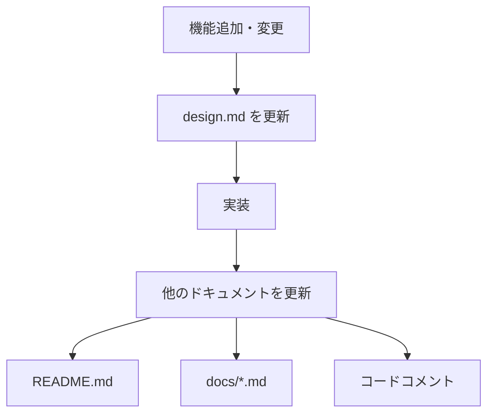

# スペック管理ガイドライン

## 基本原則

**design.md は Single Source of Truth である**

すべての設計情報は `design.md` に集約し、他のドキュメントはこれを参照する。

## スペックディレクトリ構造

### 単一スペック原則

このプロジェクトでは、**単一のスペックディレクトリ**を使用します：

```
.kiro/specs/
└── dynamodb-client/          # プロジェクト全体の統合スペック
    ├── requirements.md       # 全要件を統合
    ├── design.md            # 全設計を統合（Single Source of Truth）
    └── tasks.md             # 全タスクを統合（完了後は削除可）
```

### 機能別スペックの禁止

- ❌ **禁止**: 機能ごとに別々のスペックディレクトリを作成する
  - 例: `auto-shadow-simplification/`, `oss-migration/` など
- ✅ **推奨**: すべての機能を `dynamodb-client/` スペックに統合する

### 理由

1. **一貫性**: すべての要件・設計・タスクが一箇所に集約
2. **追跡性**: 機能間の依存関係が明確
3. **保守性**: ドキュメントの重複を避け、更新が容易
4. **検索性**: 全体を通して検索・参照が簡単

## design.md の役割

### Single Source of Truth

`design.md` は、プロジェクトの設計に関する**唯一の真実の情報源**です。

**ルール**:

1. **すべての設計情報は design.md に記載する**
   - アーキテクチャ
   - コンポーネント設計
   - データモデル
   - API設計
   - アルゴリズム
   - 実装の詳細

2. **他のドキュメントは design.md を参照する**
   - README.md
   - docs/*.md
   - コードコメント

3. **design.md と他のドキュメントが矛盾する場合、design.md が正しい**
   - 他のドキュメントを design.md に合わせて更新する
   - design.md を変更する場合は、関連ドキュメントも更新する

### design.md の更新フロー



**重要**: 実装前に必ず design.md を更新する。

## 新機能追加時のワークフロー

### 1. 要件の追加・更新

```bash
# requirements.md を編集
# - 新しい要件セクションを追加、または
# - 既存の要件セクションを更新
```

### 2. 設計の追加・更新（最重要）

```bash
# design.md を編集
# - 新しい設計セクションを追加、または
# - 既存の設計セクションを更新
```

**注意**: design.md は Single Source of Truth なので、最も重要なステップです。

### 3. タスクの追加

```bash
# tasks.md を編集
# - 新しいタスクを追加
```

### 4. 実装

```bash
# design.md に基づいて実装
```

### 5. ドキュメントの更新

```bash
# design.md の内容を反映
# - README.md
# - docs/*.md
# - コードコメント
```

## ドキュメント間の整合性チェック

### チェックリスト

新機能を追加・変更した場合、以下を確認してください：

- [ ] design.md に設計情報を記載した
- [ ] README.md が design.md と一致している
- [ ] docs/*.md が design.md と一致している
- [ ] コードコメントが design.md と一致している
- [ ] 矛盾する情報がない

### 矛盾を発見した場合

1. **design.md を確認**: design.md が正しいか確認
2. **design.md が正しい場合**: 他のドキュメントを更新
3. **design.md が間違っている場合**: design.md を修正し、他のドキュメントも更新

## 完了したタスクの管理

### tasks.md の扱い

- **実装中**: tasks.md を使用してタスクを管理
- **完了後**: tasks.md は削除または archived/ に移動可能
- **理由**: 完了したタスクは Git履歴で追跡できる

### 完了後のドキュメント

完了した機能の情報は以下に残す：

- ✅ **requirements.md**: 要件は残す（仕様として重要）
- ✅ **design.md**: 設計は残す（Single Source of Truth）
- ⚠️ **tasks.md**: 削除または archived/ に移動可能

## 例外ケース

### Incubatorプロジェクト

将来的に独立したOSSライブラリとして切り出す可能性があるプロジェクトは、別スペックで管理できます：

```
.kiro/specs/
├── dynamodb-client/          # メインプロジェクト
│   ├── requirements.md
│   ├── design.md            # Single Source of Truth
│   └── tasks.md
└── incubator-project/        # 独立ライブラリ候補
    ├── requirements.md
    ├── design.md            # Single Source of Truth
    ├── evaluation.md
    └── improvements.md
```

**条件**:

- 独立したOSSライブラリとして公開予定
- メインプロジェクトとは異なるライフサイクル
- 独立した評価・改善プロセスが必要

## まとめ

### 重要な原則

1. **design.md は Single Source of Truth**
2. **単一スペック原則**: 機能ごとにスペックを分けない
3. **design.md → 実装 → ドキュメント更新** の順序を守る
4. **矛盾を発見したら design.md を基準に修正**

### 禁止事項

- ❌ 機能ごとに別々のスペックディレクトリを作成
- ❌ design.md を更新せずに実装
- ❌ design.md と他のドキュメントの矛盾を放置
- ❌ 他のドキュメントを Single Source of Truth として扱う

### 推奨事項

- ✅ すべての設計情報を design.md に集約
- ✅ 実装前に design.md を更新
- ✅ 定期的にドキュメント間の整合性をチェック
- ✅ 矛盾を発見したら即座に修正
