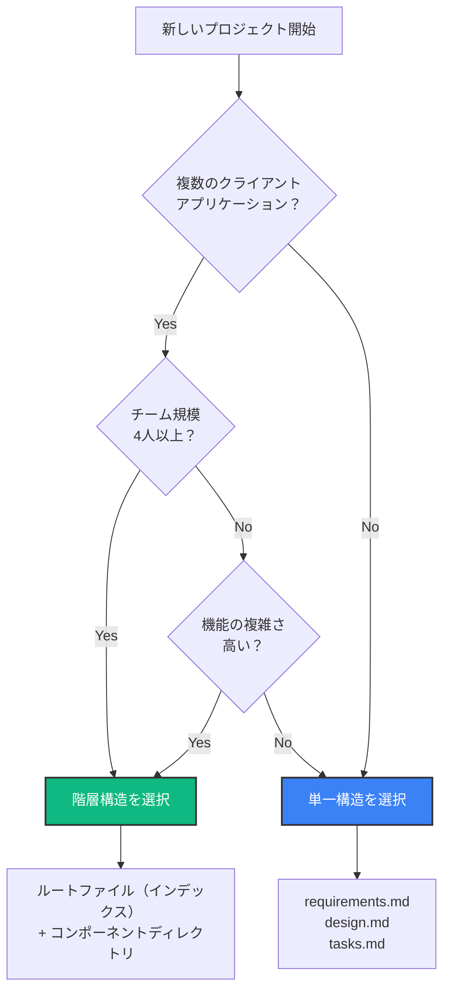
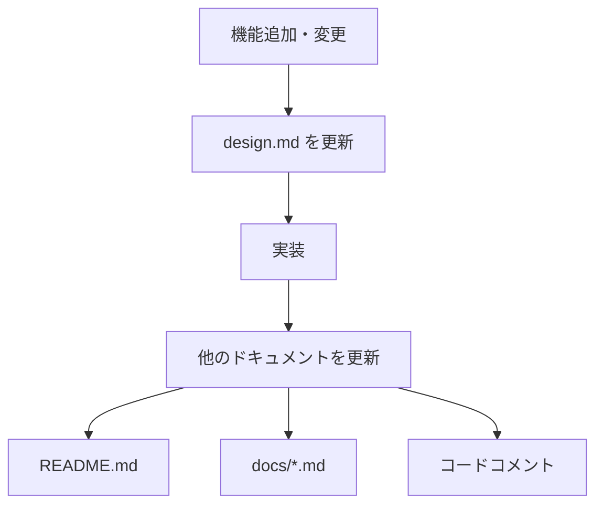

# スペック管理ガイドライン

## 基本原則

**design.md は Single Source of Truth である**

すべての設計情報は `design.md` に集約し、他のドキュメントはこれを参照する。

## スペックディレクトリ構造

### 構造選択の基準

プロジェクトの複雑さに応じて、適切な構造を選択する：

#### 1. 単一構造（シンプルなプロジェクト）

**適用条件**:
- 単一のクライアントアプリケーション
- 機能が限定的
- チーム規模が小さい（1-3人）

```
.kiro/specs/
└── project-name/
    ├── requirements.md       # 全要件を統合
    ├── design.md            # 全設計を統合（Single Source of Truth）
    └── tasks.md             # 全タスクを統合
```

**例**: `dynamodb-client` プロジェクト

#### 2. 階層構造（複雑なプロジェクト）

**適用条件**:
- 複数のクライアントアプリケーション（モバイル、Web、管理画面など）
- 大規模な機能セット
- チーム規模が大きい（4人以上）
- コンポーネント間の独立性が重要

```
.kiro/specs/
└── project-name/
    ├── requirements.md       # 共通要件とインデックス
    ├── design.md            # 共通設計とインデックス（Single Source of Truth）
    ├── tasks.md             # 全体計画とインデックス
    ├── component-a/         # コンポーネントA（例: モバイルアプリ）
    │   ├── requirements.md  # コンポーネント固有要件
    │   ├── design.md        # コンポーネント固有設計
    │   └── tasks.md         # コンポーネント固有タスク
    ├── component-b/         # コンポーネントB（例: 管理画面）
    │   ├── requirements.md
    │   ├── design.md
    │   └── tasks.md
    └── shared-component/    # 共有コンポーネント（例: 認証システム）
        ├── requirements.md
        ├── design.md
        └── tasks.md
```

**例**: `asanowa` プロジェクト

### 階層構造の実装ガイドライン

#### ルートファイルの役割

**ルートファイル**（`requirements.md`, `design.md`, `tasks.md`）は**インデックス・概要**として機能する：

1. **システム全体の概要**: プロジェクトの目的、アーキテクチャ原則
2. **コンポーネント間の関係**: 各コンポーネントの役割と相互関係
3. **共通要件・設計**: 全コンポーネントに適用される共通事項
4. **詳細への参照**: 各コンポーネントの詳細仕様へのリンク

#### コンポーネントディレクトリの役割

**コンポーネントディレクトリ**は**詳細仕様**を管理する：

1. **コンポーネント固有の要件**: そのコンポーネントのみに適用される要件
2. **詳細設計**: 技術スタック、実装詳細、API仕様
3. **実装タスク**: コンポーネント固有の開発タスク

#### 成功事例: asanowaプロジェクト

```
.kiro/specs/asanowa/
├── requirements.md (102行)     # システム概要、共通要件、インデックス
├── design.md (201行)          # アーキテクチャ概要、設計原則、インデックス
├── tasks.md (204行)           # 全体計画、進捗状況、インデックス
├── mobile/ (1,125行)          # Flutterモバイルアプリ
│   ├── requirements.md (171行) # モバイル固有要件
│   ├── design.md (603行)      # Flutter技術仕様
│   └── tasks.md (351行)       # モバイル実装タスク
├── admin-ui/ (591行)          # React Admin管理画面
│   ├── requirements.md (81行)  # 管理画面固有要件
│   ├── design.md (290行)      # React Admin技術仕様
│   └── tasks.md (220行)       # 管理画面実装タスク
└── authentication/ (1,239行)  # 認証・認可システム
    ├── requirements.md (218行) # 認証固有要件
    ├── design.md (738行)      # AWS Cognito技術仕様
    └── tasks.md (283行)       # 認証実装タスク
```

**効果**:
- **文書肥大化の解決**: 単一ファイル3,242行 → 階層構造3,462行（適切な分割）
- **保守性向上**: コンポーネント固有の変更が他に影響しない
- **並行開発支援**: チームメンバーが独立してコンポーネントを開発可能
- **検索性向上**: 関連する情報が適切にグループ化

### 構造選択の決定フロー


```mermaid
graph TD
    A[新しいプロジェクト開始] --> B{複数のクライアント<br/>アプリケーション？}
    B -->|Yes| C{チーム規模<br/>4人以上？}
    B -->|No| D[単一構造を選択]
    C -->|Yes| E[階層構造を選択]
    C -->|No| F{機能の複雑さ<br/>高い？}
    F -->|Yes| E
    F -->|No| D
    
    D --> G[requirements.md<br/>design.md<br/>tasks.md]
    E --> H[ルートファイル（インデックス）<br/>+ コンポーネントディレクトリ]
    
    style E fill:#10b981,stroke:#333,stroke-width:2px,color:#fff
    style D fill:#3b82f6,stroke:#333,stroke-width:2px,color:#fff
```

### 階層構造への移行

**単一構造から階層構造への移行タイミング**:

1. **複数クライアントの追加**: モバイルアプリに加えて管理画面を開発する場合
2. **文書肥大化**: 単一ファイルが1,000行を超えた場合
3. **チーム拡大**: 開発チームが4人以上になった場合
4. **並行開発の必要性**: 複数のコンポーネントを並行して開発する場合

**移行手順**:

1. **コンポーネント分析**: 既存の仕様をコンポーネントごとに分類
2. **ディレクトリ作成**: 各コンポーネント用のサブディレクトリを作成
3. **内容分割**: 既存ファイルの内容をコンポーネント別に分割
4. **インデックス化**: ルートファイルをインデックス・概要に変更
5. **相互参照**: コンポーネント間の参照リンクを追加

## 階層構造のベストプラクティス

### 命名規則

**コンポーネントディレクトリ名**:
- **kebab-case**を使用: `mobile-app`, `admin-ui`, `authentication`
- **機能を表す名前**: `user-management`, `notification-system`
- **技術名は避ける**: `react-app` ではなく `admin-ui`

**ファイル名**:
- **統一**: 全コンポーネントで `requirements.md`, `design.md`, `tasks.md`
- **追加ファイル**: 必要に応じて `api.md`, `testing.md` などを追加可能

### 相互参照の管理

**ルートファイルからコンポーネントへ**:
```markdown
**詳細要件**: [mobile/requirements.md](./mobile/requirements.md)
**詳細設計**: [admin-ui/design.md](./admin-ui/design.md)
```

**コンポーネント間の参照**:
```markdown
**関連コンポーネント**: [../authentication/design.md](../authentication/design.md)
**共通設計**: [../design.md](../design.md)
```

**外部文書への参照**:
```markdown
**ADR**: [../../adr/001-unified-architecture.md](../../adr/001-unified-architecture.md)
```

### 内容の重複回避

**共通事項の管理**:
- **ルートファイル**: システム全体に適用される共通事項
- **コンポーネントファイル**: そのコンポーネント固有の事項のみ

**重複を避ける例**:
```markdown
# ❌ 悪い例: 各コンポーネントで同じ内容を重複記載
## 認証方式
AWS Cognitoを使用... (同じ内容を複数箇所に記載)

# ✅ 良い例: 共通事項はルートで定義、詳細は参照
## 認証方式
認証方式の詳細は[authentication/design.md](./authentication/design.md)を参照。
```

## design.md の役割（Single Source of Truth）

### 階層構造における design.md の管理

**ルート design.md**:
- **システム全体のアーキテクチャ**: 統一アーキテクチャ、設計原則
- **コンポーネント間の関係**: API設計、データフロー
- **共通技術スタック**: 認証、データベース、インフラ
- **詳細設計への参照**: 各コンポーネントの詳細設計へのリンク

**コンポーネント design.md**:
- **コンポーネント固有の設計**: 技術スタック、実装詳細
- **API仕様**: エンドポイント、データモデル
- **UI/UX設計**: 画面設計、ユーザーフロー
- **技術制約**: パフォーマンス要件、制限事項

### Single Source of Truth の維持

**階層構造でも design.md は Single Source of Truth**:

1. **設計情報の一意性**: 同じ設計情報を複数箇所に記載しない
2. **参照による統一**: 共通設計はルートで定義、詳細は各コンポーネントで定義
3. **矛盾の回避**: 設計変更時は関連する全ファイルを同時更新

**設計情報の配置原則**:
```markdown
# ルート design.md
## システムアーキテクチャ
統一アーキテクチャに基づき... (共通事項)

## コンポーネント設計
### モバイルアプリケーション
詳細設計: [mobile/design.md](./mobile/design.md)

# mobile/design.md  
## Flutter技術スタック
Flutter 3.24+を使用... (モバイル固有事項)

## API統合
Records Lambda APIとの統合... (モバイル固有事項)
```

`design.md` は、プロジェクトの設計に関する**唯一の真実の情報源**です。

**ルール**:

1. **すべての設計情報は design.md に記載する**
   - アーキテクチャ
   - コンポーネント設計
   - データモデル
   - API設計
   - アルゴリズム
   - 実装の詳細

2. **他のドキュメントは design.md を参照する**
   - README.md
   - docs/*.md
   - コードコメント

3. **design.md と他のドキュメントが矛盾する場合、design.md が正しい**
   - 他のドキュメントを design.md に合わせて更新する
   - design.md を変更する場合は、関連ドキュメントも更新する

### design.md の更新フロー


```mermaid
graph TD
    A[機能追加・変更] --> B[design.md を更新]
    B --> C[実装]
    C --> D[他のドキュメントを更新]
    D --> E[README.md]
    D --> F[docs/*.md]
    D --> G[コードコメント]
```

**重要**: 実装前に必ず design.md を更新する。

## 新機能追加時のワークフロー

### 1. 要件の追加・更新

```bash
# requirements.md を編集
# - 新しい要件セクションを追加、または
# - 既存の要件セクションを更新
```

### 2. 設計の追加・更新（最重要）

```bash
# design.md を編集
# - 新しい設計セクションを追加、または
# - 既存の設計セクションを更新
```

**注意**: design.md は Single Source of Truth なので、最も重要なステップです。

### 3. タスクの追加

```bash
# tasks.md を編集
# - 新しいタスクを追加
```

### 4. 実装

```bash
# design.md に基づいて実装
```

### 5. ドキュメントの更新

```bash
# design.md の内容を反映
# - README.md
# - docs/*.md
# - コードコメント
```

## ドキュメント間の整合性チェック

### チェックリスト

新機能を追加・変更した場合、以下を確認してください：

- [ ] design.md に設計情報を記載した
- [ ] README.md が design.md と一致している
- [ ] docs/*.md が design.md と一致している
- [ ] コードコメントが design.md と一致している
- [ ] 矛盾する情報がない

### 矛盾を発見した場合

1. **design.md を確認**: design.md が正しいか確認
2. **design.md が正しい場合**: 他のドキュメントを更新
3. **design.md が間違っている場合**: design.md を修正し、他のドキュメントも更新

## 完了したタスクの管理

### tasks.md の扱い

- **実装中**: tasks.md を使用してタスクを管理
- **完了後**: tasks.md は削除または archived/ に移動可能
- **理由**: 完了したタスクは Git履歴で追跡できる

### 完了後のドキュメント

完了した機能の情報は以下に残す：

- ✅ **requirements.md**: 要件は残す（仕様として重要）
- ✅ **design.md**: 設計は残す（Single Source of Truth）
- ⚠️ **tasks.md**: 削除または archived/ に移動可能

## 例外ケース

### Incubatorプロジェクト

将来的に独立したOSSライブラリとして切り出す可能性があるプロジェクトは、別スペックで管理できます：

```
.kiro/specs/
├── dynamodb-client/          # メインプロジェクト
│   ├── requirements.md
│   ├── design.md            # Single Source of Truth
│   └── tasks.md
└── incubator-project/        # 独立ライブラリ候補
    ├── requirements.md
    ├── design.md            # Single Source of Truth
    ├── evaluation.md
    └── improvements.md
```

**条件**:

- 独立したOSSライブラリとして公開予定
- メインプロジェクトとは異なるライフサイクル
- 独立した評価・改善プロセスが必要

## まとめ

### 重要な原則

1. **design.md は Single Source of Truth**
2. **単一スペック原則**: 機能ごとにスペックを分けない
3. **design.md → 実装 → ドキュメント更新** の順序を守る
4. **矛盾を発見したら design.md を基準に修正**

### 禁止事項

- ❌ 機能ごとに別々のスペックディレクトリを作成
- ❌ design.md を更新せずに実装
- ❌ design.md と他のドキュメントの矛盾を放置
- ❌ 他のドキュメントを Single Source of Truth として扱う

### 推奨事項

- ✅ すべての設計情報を design.md に集約
- ✅ 実装前に design.md を更新
- ✅ 定期的にドキュメント間の整合性をチェック
- ✅ 矛盾を発見したら即座に修正
