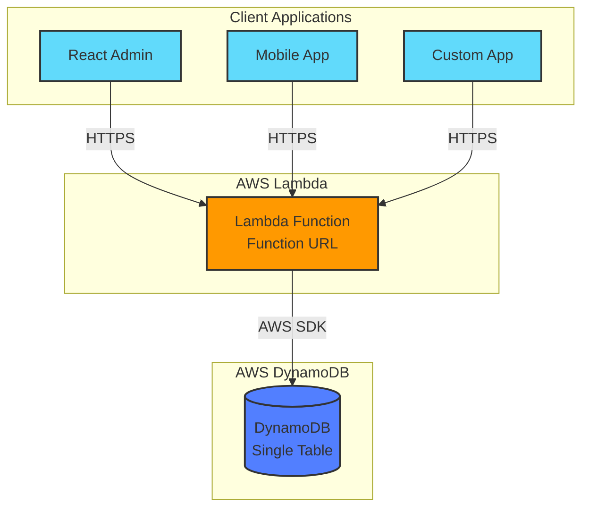

<div align="center">

# 🚀 DynamoDB Client SDK

**MongoDB-like API for DynamoDB with Single-Table Design**

[](https://github.com/exabugs/dynamodb-client/actions/workflows/ci.yml)
[](https://codecov.io/gh/exabugs/dynamodb-client)
[](https://www.npmjs.com/package/@exabugs/dynamodb-client)
[](https://opensource.org/licenses/MIT)
[](https://nodejs.org/)

[Features](#-features) •
[Installation](#-installation) •
[Quick Start](#-quick-start) •
[Documentation](#-documentation) •
[Contributing](#-contributing)

</div>

---

## ✨ Features

<table>
<tr>
<td width="50%">

### 🎯 Developer Experience

- **MongoDB-like API** - Familiar syntax for DynamoDB
- **TypeScript First** - Full type safety out of the box
- **Zero Config** - Works with sensible defaults
- **Terraform Ready** - Infrastructure as Code included

</td>
<td width="50%">

### ⚡ Performance & Scale

- **Single-Table Design** - Optimized data modeling
- **Shadow Records** - Efficient sorting without GSIs
- **Lambda Native** - Serverless-first architecture
- **ARM64 Support** - Cost-optimized compute

</td>
</tr>
<tr>
<td width="50%">

### 🔐 Authentication

- **IAM Roles** - Native AWS authentication
- **Cognito** - User pool integration
- **Custom Tokens** - Flexible auth strategies
- **OIDC + PKCE** - Secure browser flows

</td>
<td width="50%">

### 🎨 Integrations

- **react-admin** - Admin UI out of the box
- **REST API** - Lambda Function URLs
- **Terraform** - Complete IaC modules

</td>
</tr>
</table>

---

## 📦 Installation

```bash
# npm
npm install @exabugs/dynamodb-client

# pnpm (recommended)
pnpm add @exabugs/dynamodb-client

# yarn
yarn add @exabugs/dynamodb-client
```

---

## 🏗️ Architecture



---

## 🚀 Quick Start & Examples

Get started in 3 steps: **Schema Definition → Deploy Infrastructure → Use Client**

### Complete Examples Available

We provide complete, working examples for every step:

| Example                                    | What You'll Learn                                    | Time   |
| ------------------------------------------ | ---------------------------------------------------- | ------ |
| **[Schema](./examples/schema/)**           | Define TypeScript schemas and generate shadow config | 5 min  |
| **[Terraform](./examples/terraform/)**     | Deploy Lambda + DynamoDB + Cognito to AWS            | 10 min |
| **[Client](./examples/client/)**           | Node.js CRUD operations with MongoDB-like API        | 10 min |
| **[React Admin](./examples/react-admin/)** | Build complete admin UI with authentication          | 15 min |

### Quick Example

```typescript
// 1. Define schema
export const MySchema: SchemaRegistryConfig = {
  database: { name: 'myapp' },
  resources: {
    articles: {
      resource: 'articles',
      type: {} as Article,
      shadows: { sortableFields: { title: { type: 'string' } } },
    },
  },
};

// 2. Deploy with Terraform (see examples/terraform/)
// terraform apply

// 3. Use the client
const client = new DynamoClient(FUNCTION_URL);
const articles = client.db().collection('articles');

await articles.insertOne({ title: 'Hello DynamoDB' });
const article = await articles.findOne({ title: 'Hello DynamoDB' });
```

### 📚 Full Documentation

👉 **[Complete Examples Guide →](./examples/)** - Step-by-step tutorials with full source code

Each example includes:

- ✅ Complete source code
- ✅ Step-by-step instructions
- ✅ Terraform integration
- ✅ Configuration templates

---
## 🏗️ Architecture


---

## 📚 Documentation

### Available Documentation

- **[Architecture](docs/ARCHITECTURE.md)** - System architecture and design
- **[Client Usage](docs/CLIENT_USAGE.md)** - Client-side API guide
- **[React Admin Integration](docs/react-admin-integration.md)** - Admin UI setup
- **[Deployment](docs/DEPLOYMENT.md)** - Production deployment guide
- **[Terraform Modules](terraform/README.md)** - Infrastructure as Code

### GitHub Actions

- **[GitHub Actions Setup](docs/GITHUB_ACTIONS_SETUP.md)** - CI/CD configuration
- **[Troubleshooting](docs/GITHUB_ACTIONS_TROUBLESHOOTING.md)** - Common issues and solutions

---

## 🛠️ Development

### Prerequisites

- Node.js >= 18.0.0
- npm, pnpm, or yarn
- AWS Account (for deployment)

### Setup

```bash
# Clone repository
git clone https://github.com/exabugs/dynamodb-client.git
cd dynamodb-client

# Install dependencies
npm install

# Run tests
npm test

# Build
npm run build
```

### Available Commands

```bash
npm test              # Run tests
npm run test:coverage # Run tests with coverage
npm run lint          # Lint code
npm run format        # Format code
npm run build         # Build package
npm run clean         # Clean build artifacts
```

---

## 🚢 Deployment

### Using Terraform

```bash
cd terraform
terraform init
terraform plan -var-file=envs/dev.tfvars
terraform apply -var-file=envs/dev.tfvars
```

### Using Make

```bash
make deploy-dev    # Deploy to dev environment
make deploy-stg    # Deploy to staging
make deploy-prd    # Deploy to production
```

---

## 🤝 Contributing

We welcome contributions!

### Development Workflow

1. Fork the repository
2. Create a feature branch (`git checkout -b feature/amazing-feature`)
3. Commit your changes (`git commit -m 'Add amazing feature'`)
4. Push to the branch (`git push origin feature/amazing-feature`)
5. Open a Pull Request

### Guidelines

- Follow the existing code style
- Add tests for new features
- Update documentation as needed
- Ensure all tests pass before submitting

---

## 📄 License

This project is licensed under the MIT License - see the [LICENSE](LICENSE) file for details.

---

## 🙏 Acknowledgments

- Built with [AWS SDK for JavaScript](https://aws.amazon.com/sdk-for-javascript/)
- Inspired by [MongoDB](https://www.mongodb.com/) API design
- Powered by [TypeScript](https://www.typescriptlang.org/)

---

<div align="center">

**[⬆ back to top](#-dynamodb-client-sdk)**

Made with ❤️ by [exabugs](https://github.com/exabugs)

</div>
