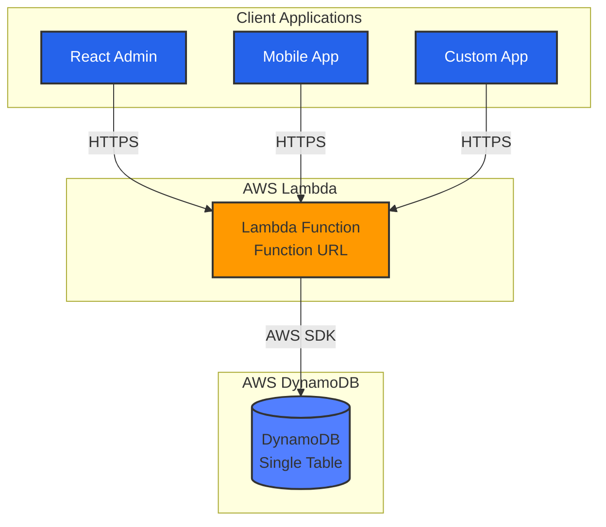

<div align="center">

# 🚀 DynamoDB Client SDK

**MongoDB-like API for DynamoDB with Single-Table Design**

[](https://github.com/exabugs/dynamodb-client/actions/workflows/ci.yml)
[](https://codecov.io/gh/exabugs/dynamodb-client)
[](https://www.npmjs.com/package/@exabugs/dynamodb-client)
[](https://opensource.org/licenses/MIT)
[](https://nodejs.org/)

[Features](#-features) •
[Installation](#-installation) •
[Quick Start](#-quick-start) •
[Documentation](#-documentation) •
[Contributing](#-contributing)

</div>

---

## 📖 Overview

**DynamoDB Client SDK** is a TypeScript-first library that brings MongoDB-like simplicity to AWS DynamoDB. Built for modern serverless applications, it provides a familiar API while leveraging DynamoDB's single-table design patterns for optimal performance and cost efficiency.

### Why DynamoDB Client SDK?

- **🎯 Familiar API**: Use MongoDB-style queries with DynamoDB's power
- **⚡ Single-Table Design**: Optimized data modeling without the complexity
- **🔄 Shadow Records**: Efficient sorting without expensive Global Secondary Indexes
- **🛡️ Type Safety**: Full TypeScript support with compile-time validation
- **🚀 Serverless Ready**: Built for AWS Lambda with ARM64 optimization
- **🎨 Admin UI**: Integrated react-admin interface for content management
- **🏗️ Infrastructure**: Complete Terraform modules for production deployment

Perfect for building scalable web applications, content management systems, and serverless APIs that need the performance of DynamoDB with the developer experience of MongoDB.

---

## ✨ Features

<table>
<tr>
<td width="50%">

### 🎯 Developer Experience

- **MongoDB-like API** - Familiar syntax for DynamoDB
- **TypeScript First** - Full type safety out of the box
- **Zero Config** - Works with sensible defaults
- **Terraform Ready** - Infrastructure as Code included

</td>
<td width="50%">

### ⚡ Performance & Scale

- **Single-Table Design** - Optimized data modeling
- **Shadow Records** - Efficient sorting without GSIs
- **Lambda Native** - Serverless-first architecture
- **ARM64 Support** - Cost-optimized compute

</td>
</tr>
<tr>
<td width="50%">

### 🔐 Authentication

- **IAM Roles** - Native AWS authentication
- **Cognito** - User pool integration
- **Custom Tokens** - Flexible auth strategies
- **OIDC + PKCE** - Secure browser flows

</td>
<td width="50%">

### 🎨 Integrations

- **react-admin** - Admin UI out of the box
- **REST API** - Lambda Function URLs
- **Terraform** - Complete IaC modules

</td>
</tr>
</table>

---

## 📦 Installation

```bash
# npm
npm install @exabugs/dynamodb-client

# pnpm (recommended)
pnpm add @exabugs/dynamodb-client

# yarn
yarn add @exabugs/dynamodb-client
```

---

## 🏗️ Architecture



---

## 🚀 Quick Start & Examples

Get started in 3 steps: **Schema Definition → Deploy Infrastructure → Use Client**

### Complete Example Project

We provide a complete, working example project that demonstrates all features:

👉 **[dynamodb-client-example](https://github.com/exabugs/dynamodb-client-example)** - Full-stack example with React Admin

This example includes:

- ✅ Complete TypeScript schemas (Articles, Tasks)
- ✅ Terraform infrastructure (DynamoDB, Lambda, Cognito)
- ✅ React Admin UI with authentication
- ✅ Shadow Records for efficient sorting
- ✅ Production-ready configuration
- ✅ Step-by-step QUICKSTART guide

**Use it as a template** for your own projects!

### Quick Example

```typescript
// 1. Define your data types
interface Article {
  id: string;
  title: string;
  content: string;
  createdAt: string;
  updatedAt: string;
}

// 2. Deploy with Terraform (see dynamodb-client-example)
// terraform apply

// 3. Use the client
const client = new DynamoClient(FUNCTION_URL);
const articles = client.db().collection<Article>('articles');

await articles.insertOne({ title: 'Hello DynamoDB', content: 'Getting started...' });
const article = await articles.findOne({ title: 'Hello DynamoDB' });
```

### 📚 Getting Started

1. **Clone the example project**: `git clone https://github.com/exabugs/dynamodb-client-example.git`
2. **Follow the QUICKSTART guide**: See [QUICKSTART.md](https://github.com/exabugs/dynamodb-client-example/blob/main/QUICKSTART.md)
3. **Customize for your needs**: Modify schemas, add resources, deploy to AWS

---

## 📚 Documentation

### Available Documentation

- **[Architecture](docs/ARCHITECTURE.md)** - System architecture and design
- **[Client Usage](docs/CLIENT_USAGE.md)** - Client-side API guide
- **[React Admin Integration](docs/react-admin-integration.md)** - Admin UI setup
- **[Deployment](docs/DEPLOYMENT.md)** - Production deployment guide
- **[Terraform Modules](terraform/README.md)** - Infrastructure as Code

### GitHub Actions

- **[GitHub Actions Setup](docs/GITHUB_ACTIONS_SETUP.md)** - CI/CD configuration
- **[Troubleshooting](docs/GITHUB_ACTIONS_TROUBLESHOOTING.md)** - Common issues and solutions

---

## 🛠️ Development

### Prerequisites

- Node.js >= 18.0.0
- npm, pnpm, or yarn
- AWS Account (for deployment)

### Setup

```bash
# Clone repository
git clone https://github.com/exabugs/dynamodb-client.git
cd dynamodb-client

# Install dependencies
npm install

# Run tests
npm test

# Build
npm run build
```

### Available Commands

```bash
npm test              # Run tests
npm run test:coverage # Run tests with coverage
npm run lint          # Lint code
npm run format        # Format code
npm run build         # Build package
npm run clean         # Clean build artifacts
```

---

## 🚢 Deployment

### Using the Example Project

The easiest way to deploy is using the [dynamodb-client-example](https://github.com/exabugs/dynamodb-client-example) project:

```bash
# Clone the example
git clone https://github.com/exabugs/dynamodb-client-example.git
cd dynamodb-client-example

# Deploy to dev environment
make deploy-dev

# Deploy to other environments
make deploy-stg    # Staging
make deploy-prd    # Production
```

See the [example project's documentation](https://github.com/exabugs/dynamodb-client-example) for detailed deployment instructions.

---

## 🔧 Configuration Management

### Parameter Store Integration

The library supports AWS Parameter Store for flexible configuration management, eliminating the need for Terraform outputs in application code.

#### Parameter Structure

Parameters are organized hierarchically:

```
/{project_name}/{environment}/
├── app/
│   ├── records-api-url          # Lambda Function URL
│   └── admin-ui/
│       ├── cognito-user-pool-id
│       ├── cognito-client-id
│       └── cognito-domain
├── infra/
│   └── dynamodb-table-name
└── lambda/
    └── records-function-arn
```

#### Benefits

- **🔄 Dynamic Configuration**: Update settings without redeployment
- **🔐 Secure Storage**: All parameters encrypted with AWS managed KMS keys
- **💰 Cost Effective**: Standard tier is free for typical usage
- **📊 Audit Trail**: Complete change history via CloudTrail
- **🎯 Environment Separation**: Clear dev/stg/prd isolation

#### Usage in Applications

**React Admin UI**:

```typescript
// Read configuration from Parameter Store
const config = await getParametersByPath(`/${PROJECT_NAME}/${ENV}/app/admin-ui/`);

const cognitoConfig = {
  userPoolId: config['cognito-user-pool-id'],
  clientId: config['cognito-client-id'],
  domain: config['cognito-domain'],
};
```

**Lambda Functions**:

```typescript
// Read specific parameters
const recordsApiUrl = await getParameter(`/${PROJECT_NAME}/${ENV}/app/records-api-url`);
```

#### IAM Permissions

The Terraform module automatically creates appropriate IAM policies:

- **Admin UI**: Read access to `/app/admin-ui/*` parameters
- **Fetch Lambda**: Read access to specific required parameters
- **Minimal Permissions**: Following least privilege principle

#### Migration from Terraform Outputs

1. **Deploy Parameter Store module** (included in v0.6.0+)
2. **Update application code** to read from Parameter Store
3. **Remove Terraform output dependencies**
4. **Enjoy flexible configuration management**

---

## 🔧 Shadow Configuration

### Overview

The shadow feature automatically makes all fields sortable without requiring JSON configuration files. Configuration is managed entirely through environment variables.

### Environment Variables

| Variable                  | Default     | Description                                         |
| ------------------------- | ----------- | --------------------------------------------------- |
| `SHADOW_CREATED_AT_FIELD` | `createdAt` | Field name for creation timestamp                   |
| `SHADOW_UPDATED_AT_FIELD` | `updatedAt` | Field name for update timestamp                     |
| `SHADOW_STRING_MAX_BYTES` | `100`       | Max bytes for primitive types (array/object use 2x) |
| `SHADOW_NUMBER_PADDING`   | `15`        | Padding digits for numbers                          |

### Supported Types

- **string**: Strings (truncated at 100 bytes)
- **number**: Numbers (offset method, range: -10^15 to +10^15)
- **boolean**: Booleans (true=1, false=0)
- **datetime**: ISO 8601 datetime strings
- **array**: Arrays (JSON stringified, truncated at 200 bytes)
- **object**: Objects (JSON stringified, truncated at 200 bytes)

### Automatic Shadow Generation

Only fields that exist in each record are automatically shadowed:

```typescript
const record = {
  id: '01HQXYZ123',
  title: 'Article',
  viewCount: 123,
  published: true,
  tags: ['tech', 'aws'],
  metadata: { category: 'tech' },
};

// Automatically generates shadow records:
// - title#Article#id#01HQXYZ123
// - viewCount#1000000000000123#id#01HQXYZ123
// - published#1#id#01HQXYZ123
// - tags#["aws","tech"]#id#01HQXYZ123
// - metadata#{"category":"tech"}#id#01HQXYZ123
//
// Note: 'id' field does NOT generate a shadow record
// Main record (SK = id#01HQXYZ123) is used for id-based sorting
```

### Exclusion Rules

- **`id` field is excluded** - Main record (`SK = id#{ULID}`) is used for id-based sorting
- Fields starting with `__` are excluded (internal metadata)
- `null` or `undefined` values are excluded

### Important Notes

- Records without a specific field won't appear in sort results for that field
- Primitive types are truncated at 100 bytes, complex types at 200 bytes
- Number range is -10^15 to +10^15 (within JavaScript's safe integer range)

---

## 🤝 Contributing

We welcome contributions!

### Development Workflow

1. Fork the repository
2. Create a feature branch (`git checkout -b feature/amazing-feature`)
3. Commit your changes (`git commit -m 'Add amazing feature'`)
4. Push to the branch (`git push origin feature/amazing-feature`)
5. Open a Pull Request

### Guidelines

- Follow the existing code style
- Add tests for new features
- Update documentation as needed
- Ensure all tests pass before submitting

---

## 📄 License

This project is licensed under the MIT License - see the [LICENSE](LICENSE) file for details.

---

## 🙏 Acknowledgments

- Built with [AWS SDK for JavaScript](https://aws.amazon.com/sdk-for-javascript/)
- Inspired by [MongoDB](https://www.mongodb.com/) API design
- Powered by [TypeScript](https://www.typescriptlang.org/)

---

<div align="center">

**[⬆ back to top](#-dynamodb-client-sdk)**

Made with ❤️ by [exabugs](https://github.com/exabugs)

</div>
