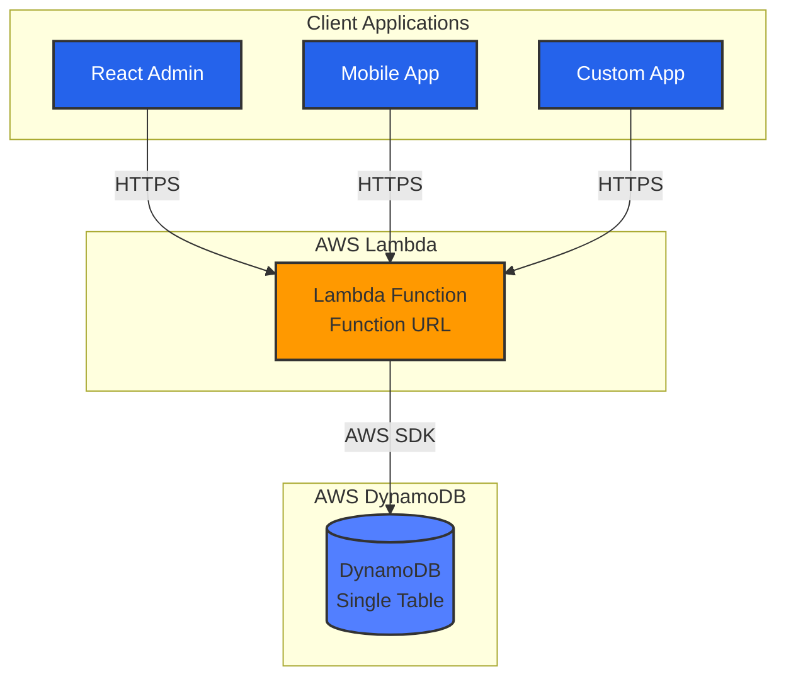

<div align="center">

# 🚀 DynamoDB Client SDK

**MongoDB-like API for DynamoDB with Single-Table Design**

[](https://github.com/exabugs/dynamodb-client/actions/workflows/ci.yml)
[](https://codecov.io/gh/exabugs/dynamodb-client)
[](https://www.npmjs.com/package/@exabugs/dynamodb-client)
[](https://opensource.org/licenses/MIT)
[](https://nodejs.org/)

[Features](#-features) •
[Installation](#-installation) •
[Quick Start](#-quick-start) •
[Documentation](#-documentation) •
[Contributing](#-contributing)

</div>

---

## 📖 Overview

**DynamoDB Client SDK** is a TypeScript-first library that brings MongoDB-like simplicity to AWS DynamoDB. Built for modern serverless applications, it provides a familiar API while leveraging DynamoDB's single-table design patterns for optimal performance and cost efficiency.

### Why DynamoDB Client SDK?

- **🎯 Familiar API**: Use MongoDB-style queries with DynamoDB's power
- **⚡ Single-Table Design**: Optimized data modeling without the complexity
- **🔄 Shadow Records**: Efficient sorting without expensive Global Secondary Indexes
- **🛡️ Type Safety**: Full TypeScript support with compile-time validation
- **🚀 Serverless Ready**: Built for AWS Lambda with ARM64 optimization
- **🎨 Admin UI**: Integrated react-admin interface for content management
- **🏗️ Infrastructure**: Complete Terraform modules for production deployment

Perfect for building scalable web applications, content management systems, and serverless APIs that need the performance of DynamoDB with the developer experience of MongoDB.

---

## ✨ Features

<table>
<tr>
<td width="50%">

### 🎯 Developer Experience

- **MongoDB-like API** - Familiar syntax for DynamoDB
- **TypeScript First** - Full type safety out of the box
- **Zero Config** - Works with sensible defaults
- **Terraform Ready** - Infrastructure as Code included

</td>
<td width="50%">

### ⚡ Performance & Scale

- **Single-Table Design** - Optimized data modeling
- **Shadow Records** - Efficient sorting without GSIs
- **Lambda Native** - Serverless-first architecture
- **ARM64 Support** - Cost-optimized compute

</td>
</tr>
<tr>
<td width="50%">

### 🔐 Authentication

- **IAM Roles** - Native AWS authentication
- **Cognito** - User pool integration
- **Custom Tokens** - Flexible auth strategies
- **OIDC + PKCE** - Secure browser flows

</td>
<td width="50%">

### 🎨 Integrations

- **react-admin** - Admin UI out of the box
- **REST API** - Lambda Function URLs
- **Terraform** - Complete IaC modules

</td>
</tr>
</table>

---

## 📦 Installation

```bash
# npm
npm install @exabugs/dynamodb-client

# pnpm (recommended)
pnpm add @exabugs/dynamodb-client

# yarn
yarn add @exabugs/dynamodb-client
```

---

## 🏗️ Architecture


```mermaid
graph TB
    subgraph "Client Applications"
        A[React Admin]
        B[Mobile App]
        C[Custom App]
    end

    subgraph "AWS Lambda"
        D[Lambda Function<br/>Function URL]
    end

    subgraph "AWS DynamoDB"
        E[(DynamoDB<br/>Single Table)]
    end

    A -->|HTTPS| D
    B -->|HTTPS| D
    C -->|HTTPS| D
    D -->|AWS SDK| E

    style A fill:#2563eb,stroke:#333,stroke-width:2px,color:#fff
    style B fill:#2563eb,stroke:#333,stroke-width:2px,color:#fff
    style C fill:#2563eb,stroke:#333,stroke-width:2px,color:#fff
    style D fill:#ff9900,stroke:#333,stroke-width:2px
    style E fill:#527fff,stroke:#333,stroke-width:2px
```

---

## 🚀 Quick Start & Examples

Get started in 3 steps: **Schema Definition → Deploy Infrastructure → Use Client**

### Complete Example Project

We provide a complete, working example project that demonstrates all features:

👉 **[dynamodb-client-example](https://github.com/exabugs/dynamodb-client-example)** - Full-stack example with React Admin

This example includes:

- ✅ Complete TypeScript schemas (Articles, Tasks)
- ✅ Terraform infrastructure (DynamoDB, Lambda, Cognito)
- ✅ React Admin UI with authentication
- ✅ Shadow Records for efficient sorting
- ✅ Production-ready configuration
- ✅ Step-by-step QUICKSTART guide

**Use it as a template** for your own projects!

### Quick Example

```typescript
// 1. Define your data types
interface Article {
  id: string;
  title: string;
  content: string;
  createdAt: string;
  updatedAt: string;
}

// 2. Deploy with Terraform (see dynamodb-client-example)
// terraform apply

// 3. Use the client
const client = new DynamoClient(FUNCTION_URL);
const articles = client.db().collection<Article>('articles');

await articles.insertOne({ title: 'Hello DynamoDB', content: 'Getting started...' });
const article = await articles.findOne({ title: 'Hello DynamoDB' });
```

### 📚 Getting Started

1. **Clone the example project**: `git clone https://github.com/exabugs/dynamodb-client-example.git`
2. **Follow the QUICKSTART guide**: See [QUICKSTART.md](https://github.com/exabugs/dynamodb-client-example/blob/main/QUICKSTART.md)
3. **Customize for your needs**: Modify schemas, add resources, deploy to AWS

---

## 📚 Documentation

### Available Documentation

- **[Architecture](docs/ARCHITECTURE.md)** - System architecture and design
- **[Client Usage](docs/CLIENT_USAGE.md)** - Client-side API guide
- **[React Admin Integration](docs/react-admin-integration.md)** - Admin UI setup and many-to-many relationships
- **[Deployment](docs/DEPLOYMENT.md)** - Production deployment guide
- **[Terraform Modules](terraform/README.md)** - Infrastructure as Code

### GitHub Actions

- **[GitHub Actions Setup](docs/GITHUB_ACTIONS_SETUP.md)** - CI/CD configuration
- **[Troubleshooting](docs/GITHUB_ACTIONS_TROUBLESHOOTING.md)** - Common issues and solutions

---

## 🛠️ Development

### Prerequisites

- Node.js >= 18.0.0
- npm, pnpm, or yarn
- AWS Account (for deployment)

### Setup

```bash
# Clone repository
git clone https://github.com/exabugs/dynamodb-client.git
cd dynamodb-client

# Install dependencies
npm install

# Run tests
npm test

# Build
npm run build
```

### Available Commands

```bash
npm test              # Run tests
npm run test:coverage # Run tests with coverage
npm run lint          # Lint code
npm run format        # Format code
npm run build         # Build package
npm run clean         # Clean build artifacts
```

---

## 🚢 Deployment

### Using the Example Project

The easiest way to deploy is using the [dynamodb-client-example](https://github.com/exabugs/dynamodb-client-example) project:

```bash
# Clone the example
git clone https://github.com/exabugs/dynamodb-client-example.git
cd dynamodb-client-example

make infra-apply
```

See the [example project's documentation](https://github.com/exabugs/dynamodb-client-example) for detailed deployment instructions.

---

## 🔧 Configuration Management

### Parameter Store Integration

The library supports AWS Parameter Store for flexible configuration management, eliminating the need for Terraform outputs in application code.

#### Parameter Structure

Parameters are organized hierarchically:

```
/{project_name}/{environment}/
├── app/
│   ├── records-api-url          # Lambda Function URL
│   └── admin-ui/
│       ├── cognito-user-pool-id
│       ├── cognito-client-id
│       └── cognito-domain
├── infra/
│   └── dynamodb-table-name
└── lambda/
    └── records-function-arn
```

#### Benefits

- **🔄 Dynamic Configuration**: Update settings without redeployment
- **🔐 Secure Storage**: All parameters encrypted with AWS managed KMS keys
- **💰 Cost Effective**: Standard tier is free for typical usage
- **📊 Audit Trail**: Complete change history via CloudTrail
- **🎯 Environment Separation**: Clear dev/stg/prd isolation

#### Usage in Applications

**React Admin UI**:

```typescript
// Read configuration from Parameter Store
const config = await getParametersByPath(`/${PROJECT_NAME}/${ENV}/app/admin-ui/`);

const cognitoConfig = {
  userPoolId: config['cognito-user-pool-id'],
  clientId: config['cognito-client-id'],
  domain: config['cognito-domain'],
};
```

**Lambda Functions**:

```typescript
// Read specific parameters
const recordsApiUrl = await getParameter(`/${PROJECT_NAME}/${ENV}/app/records-api-url`);
```

#### IAM Permissions

The Terraform module automatically creates appropriate IAM policies:

- **Admin UI**: Read access to `/app/admin-ui/*` parameters
- **Fetch Lambda**: Read access to specific required parameters
- **Minimal Permissions**: Following least privilege principle

#### Migration from Terraform Outputs

1. **Deploy Parameter Store module** (included in v0.6.0+)
2. **Update application code** to read from Parameter Store
3. **Remove Terraform output dependencies**
4. **Enjoy flexible configuration management**

---

## 🔧 Shadow Configuration

### Overview

The shadow feature automatically makes all fields sortable without requiring JSON configuration files. Configuration is managed entirely through environment variables.

### Environment Variables

| Variable                  | Default     | Description                                         |
| ------------------------- | ----------- | --------------------------------------------------- |
| `SHADOW_CREATED_AT_FIELD` | `createdAt` | Field name for creation timestamp                   |
| `SHADOW_UPDATED_AT_FIELD` | `updatedAt` | Field name for update timestamp                     |
| `SHADOW_STRING_MAX_BYTES` | `100`       | Max bytes for primitive types (array/object use 2x) |
| `SHADOW_NUMBER_PADDING`   | `15`        | Padding digits for numbers                          |

### Supported Types

- **string**: Strings (truncated at 100 bytes)
- **number**: Numbers (offset method, range: -10^15 to +10^15)
- **boolean**: Booleans (true=1, false=0)
- **datetime**: ISO 8601 datetime strings
- **array**: Arrays (JSON stringified, truncated at 200 bytes)
- **object**: Objects (JSON stringified, truncated at 200 bytes)

### Automatic Shadow Generation

Only fields that exist in each record are automatically shadowed:

```typescript
const record = {
  id: '01HQXYZ123',
  title: 'Article',
  viewCount: 123,
  published: true,
  tags: ['tech', 'aws'],
  metadata: { category: 'tech' },
};

// Automatically generates shadow records:
// - title#Article#id#01HQXYZ123
// - viewCount#1000000000000123#id#01HQXYZ123
// - published#1#id#01HQXYZ123
// - tags#["aws","tech"]#id#01HQXYZ123
// - metadata#{"category":"tech"}#id#01HQXYZ123
//
// Note: 'id' field does NOT generate a shadow record
// Main record (SK = id#01HQXYZ123) is used for id-based sorting
```

### Exclusion Rules

- **`id` field is excluded** - Main record (`SK = id#{ULID}`) is used for id-based sorting
- Fields starting with `__` are excluded (internal metadata)
- `null` or `undefined` values are excluded

### Important Notes

- Records without a specific field won't appear in sort results for that field
- Primitive types are truncated at 100 bytes, complex types at 200 bytes
- Number range is -10^15 to +10^15 (within JavaScript's safe integer range)

---

## 💰 Cost Tracking

### Overview

DynamoDB Client SDK provides built-in cost tracking for all DynamoDB operations. This feature helps you monitor and optimize your DynamoDB usage by tracking Read Capacity Units (RCU) and Write Capacity Units (WCU) consumed by each operation.

### Features

- **Automatic Tracking**: All operations automatically include consumed capacity information
- **Aggregated Costs**: Multiple operations (pagination, bulk operations) are automatically aggregated
- **Zero Overhead**: Minimal performance impact (< 5ms)
- **Type Safe**: Full TypeScript support with `AggregatedCost` type

### Usage Examples

#### Single Operations

All single operations (`insertOne`, `updateOne`, `deleteOne`) return consumed capacity information:

```typescript
// Insert operation
const result = await collection.insertOne({
  title: 'New Article',
  content: 'Content here...',
});

console.log('Inserted ID:', result.insertedId);
console.log('Cost:', result.consumedCapacity);
// Output: { totalRCU: 0, totalWCU: 1.0, operationCount: 1 }
```

```typescript
// Update operation
const result = await collection.updateOne(
  { id: '01HQXYZ123' },
  { $set: { title: 'Updated Title' } }
);

console.log('Modified:', result.modifiedCount);
console.log('Cost:', result.consumedCapacity);
// Output: { totalRCU: 0.5, totalWCU: 1.0, operationCount: 1 }
```

```typescript
// Delete operation
const result = await collection.deleteOne({ id: '01HQXYZ123' });

console.log('Deleted:', result.deletedCount);
console.log('Cost:', result.consumedCapacity);
// Output: { totalRCU: 0.5, totalWCU: 1.0, operationCount: 1 }
```

#### Bulk Operations

Bulk operations automatically aggregate costs across all chunks:

```typescript
// Insert many documents
const result = await collection.insertMany([
  { title: 'Article 1', content: '...' },
  { title: 'Article 2', content: '...' },
  { title: 'Article 3', content: '...' },
  // ... 100 documents
]);

console.log('Inserted:', result.insertedCount);
console.log('Cost:', result.consumedCapacity);
// Output: { totalRCU: 0, totalWCU: 100.0, operationCount: 4 }
// Note: 100 documents processed in 4 chunks (25 per chunk)
```

```typescript
// Update many documents
const result = await collection.updateMany({ status: 'draft' }, { $set: { status: 'published' } });

console.log('Modified:', result.modifiedCount);
console.log('Cost:', result.consumedCapacity);
// Output: { totalRCU: 25.0, totalWCU: 50.0, operationCount: 10 }
```

#### Find Operations with Pagination

Find operations aggregate costs across all pages:

```typescript
// Find with pagination
const cursor = collection.find({ status: 'active' }).limit(100);
const results = await cursor.toArray();

// Get aggregated cost for all pages
const cost = await cursor.getConsumedCapacity();

console.log('Found:', results.length);
console.log('Cost:', cost);
// Output: { totalRCU: 15.5, totalWCU: 0, operationCount: 3 }
// Note: 3 pages fetched to retrieve all results
```

### Cost Information Structure

The `consumedCapacity` field contains:

```typescript
interface AggregatedCost {
  /** Total Read Capacity Units consumed */
  totalRCU: number;

  /** Total Write Capacity Units consumed */
  totalWCU: number;

  /** Number of DynamoDB operations performed */
  operationCount: number;
}
```

### Cost Optimization Tips

1. **Monitor High-Cost Operations**: Operations with `totalRCU > 100` or `totalWCU > 50` may need optimization
2. **Use Pagination**: Large result sets are automatically paginated to avoid high costs
3. **Batch Operations**: Use `insertMany`, `updateMany`, `deleteMany` for bulk operations
4. **Shadow Records**: Efficient sorting without expensive Global Secondary Indexes

### Logging

Cost information is automatically logged for all operations:

```typescript
// Info log for normal operations
logger.info('Operation completed', {
  operation: 'find',
  resource: 'articles',
  consumedCapacity: { totalRCU: 5.5, totalWCU: 0, operationCount: 2 },
});

// Warning log for high-cost operations
logger.warn('High cost operation detected', {
  operation: 'updateMany',
  resource: 'articles',
  consumedCapacity: { totalRCU: 150.0, totalWCU: 200.0, operationCount: 50 },
});
```

### Backward Compatibility

Cost tracking is fully backward compatible:

- Existing code works without changes
- `consumedCapacity` field is optional
- No breaking changes to existing APIs

---

## 🤝 Contributing

We welcome contributions!

### Development Workflow

1. Fork the repository
2. Create a feature branch (`git checkout -b feature/amazing-feature`)
3. Commit your changes (`git commit -m 'Add amazing feature'`)
4. Push to the branch (`git push origin feature/amazing-feature`)
5. Open a Pull Request

### Guidelines

- Follow the existing code style
- Add tests for new features
- Update documentation as needed
- Ensure all tests pass before submitting

### OpenAPI-Driven Development

This project uses OpenAPI specification as the Single Source of Truth (SSOT) for MCP tool definitions.

#### Workflow

1. **Update OpenAPI Specification**

   ```bash
   # Edit the OpenAPI spec
   vim docs/specs/openapi.yaml
   ```

2. **Generate MCP Tools**

   ```bash
   # Regenerate MCP tool definitions from OpenAPI spec
   npm run generate-mcp-tools
   ```

3. **Verify Changes**
   ```bash
   # Build and test
   npm run build
   npm test
   ```

#### OpenAPI Specification

- **Location**: `docs/specs/openapi.yaml`
- **Components**: `docs/specs/components/schemas/`
- **Generator**: `scripts/generate-mcp-tools-v2.ts`
- **Output**: `src/mcp/tools/generated.ts` (auto-generated, do not edit manually)

#### Key Design Principles

- **OpenAPI as SSOT**: All MCP tool definitions are derived from OpenAPI spec
- **Minimal Inference**: Generator extracts information directly from OpenAPI, avoiding complex inference logic
- **Type Safety**: Generated TypeScript code maintains full type safety
- **Consistency**: All tools follow the same structure and naming conventions

For more details, see the [OpenAPI to MCP Generator Spec](.kiro/specs/openapi-to-mcp-generator/design.md).

---

## 📄 License

This project is licensed under the MIT License - see the [LICENSE](LICENSE) file for details.

---

## 🙏 Acknowledgments

- Built with [AWS SDK for JavaScript](https://aws.amazon.com/sdk-for-javascript/)
- Inspired by [MongoDB](https://www.mongodb.com/) API design
- Powered by [TypeScript](https://www.typescriptlang.org/)

---

<div align="center">

**[⬆ back to top](#-dynamodb-client-sdk)**

Made with ❤️ by [exabugs](https://github.com/exabugs)

</div>
